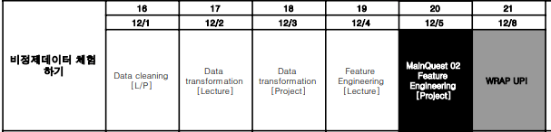

## 레포 정리 시 참고할 노드 학습 범위
1. Data cleaning - 타이타닉 데이터 다루기
2. 미니 프로젝트: 택시요금 데이터 다루기
3. Data transformation - 연봉 데이터 다루기
4. 미니 프로젝트: 영국시장의 중고 자동차 가격 데이터 다루기
5. Feature Engineering - 스피드 데이팅 데이터 다루기
6. 프로젝트: 신용거래 이상탐지 데이터 다루기