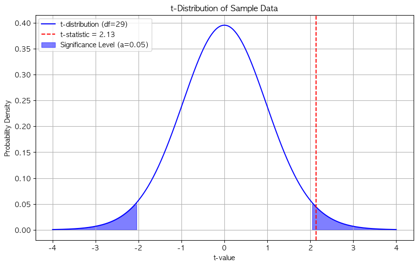
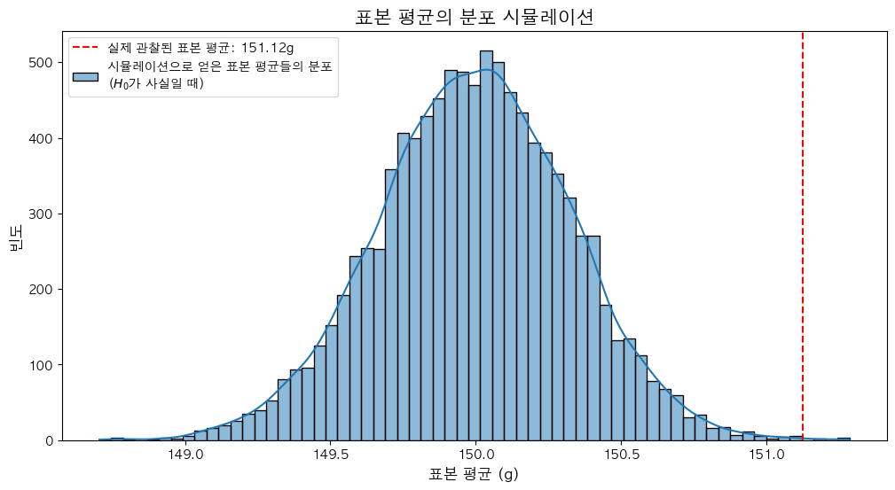
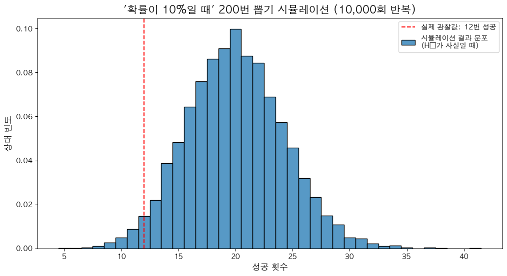
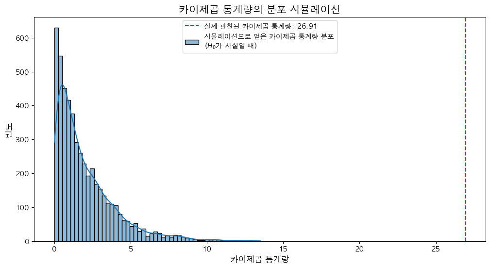
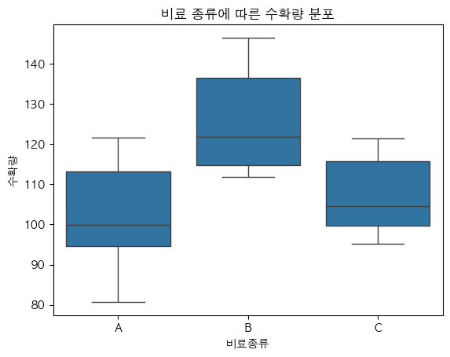
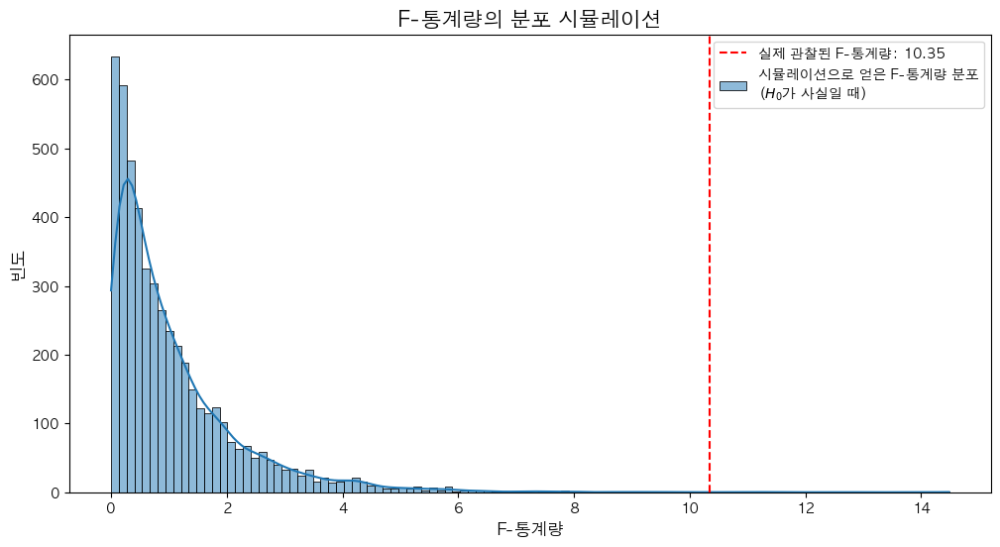
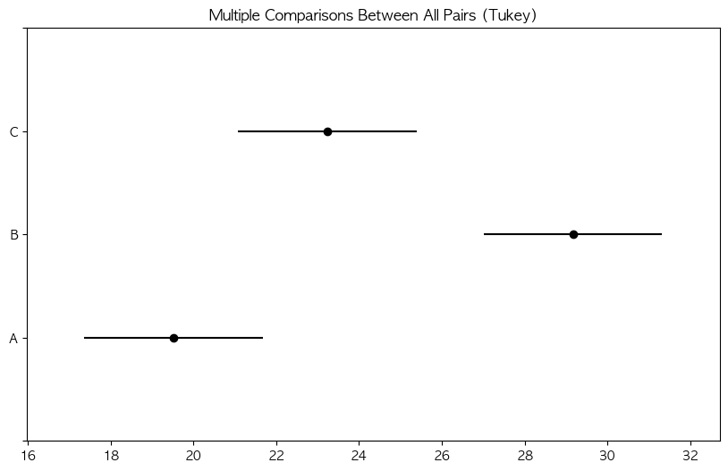

# DAY2 통계학 정리 (5~6장, 9장)

> 「통계X101 데이터분석」 교재의 5~6장, 9장 내용 + [DAY2 실습 코드](https://github.com/Chankyu99/ModuLABS/blob/master/03_Statistics/DAY2_Statistics.ipynb)

---

## 5장 가설검정

> 추론통계의 원리로서 설정한 가설이 맞는지 확인하는 과정

### 5.1 가설검정의 원리

**군(group)** : 특정 동일 조건 집단
- 실험군 : 실험하고자 하는 대상군
- 대조군 : 실험군과 비교하고자 하는 대상군

**대립가설($H_1$)** : 실험군과 대조군의 차이가 존재할 가능성이 있는 가설, 즉 **우리가 밝히고자 하는 가설**

**귀무가설($H_0$)** : 실험군과 대조군의 차이가 존재하지 않는 가설, 즉 우리가 밝히고자 하는 가설을 **부정**한 가설

$$ \begin{cases} H_0 : \mu_A = \mu_B\\ H_1 : \mu_A \neq \mu_B \end{cases}$$

> 모집단평균과 표본평균은 일치하지 않는다. 귀무가설이 옳더라도 표본오차로 인해 표본평균의 차이는 0이 될 수 없다. 따라서 표본평균의 차이가 단순한 데이터 퍼짐인지 구별할 필요가 있다.

**가설검정 FLOW**

1. 귀무가설이 옳은 세계를 가정 (두 모집단평균이 동일)
2. 모집단A와 모집단B에서 각각 표본을 추출 → 여러번 반복
3. 히스토그램을 통해 표본평균차이의 분포를 확인
4. 해당 분포에서 실제 표본평균차이가 나타날 확률을 구한다

**p값 (p-value)** : 귀무가설이 옳다고 가정했을 때, 관찰한 값 이상으로 극단적인 값이 나올 확률

- p값은 **유의수준 $\alpha$**를 기준으로 귀무가설과 현실 데이터 간의 괴리를 판단
- $p < \alpha = 0.05$ → 귀무가설을 **기각**, 대립가설을 **채택** → "**통계적으로 유의미한 차이가 있다**"
- $p \ge \alpha = 0.05$ → 대립가설을 채택할 수 없다

### 5.2 이표본 t검정

**이표본 t검정(two-sample t-test)** : 2개의 집단 간의 **평균값**을 비교하는 검정

(1) 두 집단의 평균값을 비교: $(\bar{x}_A - \bar{x}_B) - (\mu_A - \mu_B)$

(2) 귀무가설($\mu_A = \mu_B$) 가정하에: $\bar{x}_A - \bar{x}_B$

(3) 이 표본평균차이 분포는 평균 $0$, 표준편차 $s\sqrt{\frac{1}{n_A}+\frac{1}{n_B}}$ 인 정규분포를 근사적으로 따른다

(4) **t값**을 사용해 표준화

**기각역** : 양 끝 2.5%씩의 영역 (유의수준 5%). 관찰 값이 기각역에 포함되면 $p < 0.05$

> 양쪽을 모두 고려 → **양측검정**, 하나만 고려 → **단측검정**

**신뢰구간과 가설검정의 관계** : $\mu_A - \mu_B$의 95% 신뢰구간이 0을 포함하는가? = p값이 0.05를 밑도는가?

### 5.3 오차 막대와 유의미성 표기

- 평균값의 확률 → 평균값 ± 표준오차(SEM)
- 신뢰구간 → 평균값 중심 95% 신뢰구간
- 데이터 퍼짐 → 평균값 ± 표준편차(SE)

| 표기 | p-value |
| :---: | :---: |
| $\ast$ | $p < 0.05$ |
| $\ast\ast$ | $p < 0.01$ |
| $\ast\ast\ast$ | $p < 0.001$ |

### 5.4 제1종 오류와 제2종 오류

|   | 귀무가설이 옳다 | 대립가설이 옳다 |
| :---: | :---: | :---: |
| 귀무가설 기각X | 옳은 판단 | 제2종 오류 확률 $\beta$ |
| 귀무가설 기각 | 제1종 오류 확률 $\alpha$ | 옳은 판단 |

- **제1종 오류** : 차이가 없는데 있다고 판단. 유의수준 $\alpha$로 통제
- **제2종 오류** : 차이가 있는데 없다고 판단. 검정력 $1-\beta \ge 0.8$ 목표

**효과크기(effect size)** : $d = \frac{\mu_A - \mu_B}{\sigma}$

| 효과 크기 ($d$) | 의미 |
| :---: | :---: |
| $d = 0.2$ | 작은 효과 |
| $d = 0.5$ | 중간 효과 |
| $d = 0.8$ | 큰 효과 |

---

## 6장 다양한 가설검정

> 다양한 가설검정 방법이 존재하지만, 목적과 데이터 성질에 맞는 적절한 방법을 선택해야 한다.

### 6.1 가설검정 방법 선택

**모든 가설검정의 공통된 FLOW**
1. 귀무가설 설정
2. 데이터로 검정통계량 계산 ($t, F, \chi^2$ 등)
3. 귀무가설이 옳다는 가정하에 통계량의 분포 확인
4. 통계량의 분포상 위치를 구하여 $p$값 계산

선택 기준:
- **데이터 유형** : 양적 변수인가? 질적 변수인가?
- **표본의 수** : 1개, 2개, 3개 이상
- **양적 변수의 성질** : 모수검정(정규성 가정) vs 비모수검정, 등분산성

### 6.2 대푯값 비교 : 일표본/이표본 t검정

**일표본 t검정** : 표본이 1개인 경우, 모집단의 평균이 특정 값인지를 검정

> $H_0$ : "모집단의 평균이 $\mu = ?$ 이다." / $H_1$ : "모집단의 평균이 $\mu \neq ?$ 이다."

#### 코드 구현 : Z검정

모집단의 표준편차를 알고 있을 때, Z-score를 이용해 가설을 검정한다.

```python
from scipy.stats import norm

mu_0, sigma, n, x_bar = 8, 1.5, 100, 8.2
SE = sigma / np.sqrt(n)
z_stat = (x_bar - mu_0) / SE
p_value = 2 * (1 - norm.cdf(abs(z_stat)))  # 양측 검정

# Z-통계량: 1.33, P-value: 0.1824
# → 귀무가설을 기각하지 못합니다.
```

코드 실행 시 아래와 같은 t-분포 시각화를 확인할 수 있다.



> Z-통계량이 1.33이고 p-value가 0.1824로 유의수준 0.05보다 크므로, 새로운 서비스 정책이 고객 만족도에 유의미한 영향을 미친다는 증거가 부족하다.

#### 코드 구현 : 일표본 t검정

모집단의 표준편차를 모를 때, `stats.ttest_1samp`을 사용한다.

```python
# 과자 봉지 무게 검정 (모평균 150g)
np.random.seed(42)
sample_weights = np.random.normal(loc=151.5, scale=2, size=30)

t_statistic, p_value = stats.ttest_1samp(a=sample_weights, popmean=150)
alpha = 0.05

# p-value < 0.05 → 귀무가설 기각
# → 과자 봉지의 평균 중량은 150g과 유의미한 차이가 있다.
```

아래 시뮬레이션은 일표본 t검정에서 귀무가설이 사실일 때의 검정통계량 분포를 보여준다.



> **핵심**: 모집단 표준편차를 아는 경우 Z검정, 모르는 경우 일표본 t검정을 사용한다.

#### 코드 구현 : 이표본 t검정 (독립표본)

두 그룹(A, B)의 시험 점수 비교 시, 먼저 **전제 조건**(정규성, 등분산성)을 확인한 뒤 검정을 수행한다.

```python
# 1. 정규성 검정 (Shapiro-Wilk)
shapiro_a_pvalue = stats.shapiro(group_a_scores).pvalue  # 0.8766
shapiro_b_pvalue = stats.shapiro(group_b_scores).pvalue  # 0.8366

# 2. 등분산성 검정 (Levene's test)
levene_pvalue = stats.levene(group_a_scores, group_b_scores).pvalue  # 0.0150

# 3. 이표본 t검정
t_statistic, p_value = stats.ttest_ind(a=group_a_scores, b=group_b_scores, equal_var=True)
# t-statistic: 4.0426, p-value: 0.0001
# → 두 그룹의 평균에 유의미한 차이가 있다
```

**등분산성 검정 주의점**

- `stats.shapiro` : 정규성 검정 ($p \ge 0.05 → $ 정규성 있음)
- `stats.levene` : 등분산성 검정 ($p \ge 0.05 → $ 등분산 가정)
- 등분산성이 성립되지 않을 때 → **웰치의 t검정** (`equal_var=False`)

#### 코드 구현 : 시뮬레이션으로 이해하는 p값

귀무가설이 사실이라면(두 그룹 차이 없음), 데이터를 무작위로 섞어 나누었을 때 평균 차이는 0에 가까울 것이다. 이 시뮬레이션은 p값의 의미를 시각적으로 보여준다.

```python
combined_scores = np.concatenate([group_a_scores, group_b_scores])
simulated_diffs = []

for _ in range(10000):
    np.random.shuffle(combined_scores)
    sim_group_a = combined_scores[:50]
    sim_group_b = combined_scores[50:]
    simulated_diffs.append(np.mean(sim_group_a) - np.mean(sim_group_b))
```

아래 시뮬레이션 결과에서 빨간 점선(실제 관찰된 평균 차이)이 분포의 극단에 위치해 있음을 확인할 수 있다.



> **핵심**: 실제 관찰된 평균 차이가 시뮬레이션 분포에서 극단적인 위치에 있다면, "우연"으로는 설명하기 어려운 차이라는 시각적 근거가 된다.

---

### 6.3 비율 비교 : 이항검정과 카이제곱검정

**이항검정** : 하나의 범주가 발생할 확률 $P$에 대한 검정

$$\frac{N!}{k!(N-k)!}P^k(1-P)^{N-k}$$

**카이제곱검정** : 범주가 2개 이상인 이산확률분포에 대한 검정

**(1) 적합도검정** : 데이터와 모집단 확률분포를 비교

$$ \chi^2 = \sum \frac{(\text{실제 출현도수}-\text{기대도수})^2}{\text{기대도수}} $$

**(2) 독립성검정** : 범주형 변수 사이의 관계 조사

> $H_0$ : "두 변수 사이의 관계는 독립이다." / $H_1$ : "독립이 아니다."

$$ \text{기대도수} = \frac{\text{행의 합} \times \text{열의 합}}{\text{전체 합}} $$

#### 코드 구현 : 카이제곱 독립성 검정

연령대(20대/30대/40대)와 선호 장르(액션/로맨스) 사이의 연관성 검정:

```python
data = {'액션': [70, 50, 30], '로맨스': [30, 60, 60]}
observed = pd.DataFrame(data, index=['20대', '30대', '40대'])

chi2, p_value, dof, expected = stats.chi2_contingency(observed)
# Chi-squared statistic: 26.9091
# p-value: 0.0000
# → 연령대와 선호 장르는 독립이 아니다 (유의미한 연관성 존재)
```

아래 시뮬레이션은 귀무가설이 사실일 때의 카이제곱 통계량 분포를 보여준다. 실제 관찰된 값(빨간 점선)이 분포의 극단에 위치한다.



> **핵심**: '관측 빈도'와 '기대 빈도'의 차이가 클수록 두 변수가 독립이라는 가정이 현실과 맞지 않으며, 카이제곱 통계량이 커진다.

---

### 6.4 분산분석 (ANOVA)

**분산분석(ANOVA)** : 3개 이상 집단의 평균값을 비교하는 방법

> $H_0$ : "모든 집단의 평균이 같다." / $H_1$ : "적어도 한 쌍에는 차이가 있다."

$$x_i - \bar x = \underbrace{(x_i - \bar x_j)}_{\text{집단내 변동}} + \underbrace{(\bar x_j - \bar x)}_{\text{집단간 변동}}$$

**F값** : $F = \frac{\text{평균적인 집단간 변동}}{\text{평균적인 집단내 변동}}$

**다중비교(사후검정)** : ANOVA에서 대립가설이 채택되면, 어느 집단 쌍에 차이가 있는지 확인
- **튜키 검정** : 모든 가능한 쌍을 1:1로 비교
- **본페로니 검정** : 가장 보수적, 비교 횟수만큼 유의수준을 보정
- **던넷 검정** : 하나의 대조군과 나머지 실험군 비교

#### 코드 구현 : 일원분산분석 + Tukey HSD

비료 3종류(A, B, C)의 수확량 비교:

```python
# ANOVA
f_statistic, p_value = stats.f_oneway(fertilizer_a, fertilizer_b, fertilizer_c)
# F-statistic: 10.3455, p-value: 0.0005

# Tukey's HSD 사후분석
if p_value < 0.05:
    tukey_result = pairwise_tukeyhsd(endog=df['수확량'], groups=df['비료종류'], alpha=0.05)
    print(tukey_result)
```

비료 종류별 수확량 분포를 박스플롯으로 확인할 수 있다.



F-통계량 시뮬레이션을 통해 귀무가설 하에서 실제 관찰된 F값이 얼마나 극단적인지 확인할 수 있다.



Tukey HSD 사후분석 시각화 결과는 아래와 같다. 신뢰구간이 0을 포함하지 않는 쌍에서 유의미한 차이가 존재한다.



**사후분석 결과 해석**
- A vs B : reject=True → 유의미한 차이 (B가 약 23.68 더 높음)
- A vs C : reject=False → 유의미한 차이 없음
- B vs C : reject=True → 유의미한 차이 (B가 약 18.83 더 높음)

> **비즈니스 관점**: 비료 B가 가장 높은 생산성을 보여 도입을 추천하되, 가격 등 비용 대비 효율을 고려하면 C도 합리적 대안이 될 수 있다.

---

## 9장 가설검정의 주의점

> 가설검정은 코드 한 줄이면 끝나지만, 원리를 이해하지 않으면 심각한 문제가 발생한다.

### 9.1 재현성 위기

- 2015년 심리학 분야에서 본래 97%가 유의미했던 연구의 추시에서 36%만 유의미
- 원인 1 : 실험 조건 동일 조성의 어려움
- 원인 2 : $p$값의 잘못된 사용 → **$p$-해킹**

### 9.2 $p$값의 진실

**왜 $\alpha = 0.05$인가?**
- 평균 20번에 1번꼴로 귀무가설을 기각하는 오류를 허용한다는 의미
- 놀랍게도 이 기준을 세운 **근거는 없다**
- 최근 $\alpha = 0.005$로 낮추자는 의견도 제시됨

**피셔류 vs 네이만-피어슨류**
- **피셔류** : $p$값의 크기에 따라 증거의 강력함을 평가 (기각 개념 없음)
- **네이만-피어슨류** : $p < \alpha$이면 기각, $p \ge \alpha$이면 채택 (이분법적)

**표본크기와 $p$값**
- 표본크기가 클수록 $p$값이 작아지므로, 사전에 효과크기를 설정하고 표본크기를 설계해야 함
- $p$값이 작다고 맹목적으로 큰 차이라고 판단하면 안 된다

### 9.3 효과크기

$$d = \frac{\bar{x}_A - \bar{x}_B}{s}, \quad s = \sqrt{\frac{n_A s_A^2 + n_B s_B^2}{n_A + n_B}}$$

| 분석 | 효과크기 | 소 | 중 | 대 |
| :---: | :---: | :---: | :---: | :---: |
| $t$검정 | $d$ | 0.2 | 0.5 | 0.8 |
| 상관 | $r$ | 0.1 | 0.3 | 0.5 |
| ANOVA | $\eta^2$ | 0.01 | 0.06 | 0.14 |
| 카이제곱검정 | $\phi$ | 0.1 | 0.3 | 0.5 |

### 9.4 베이즈 인수

- $p$값의 한계 : 귀무가설이 옳을 때의 확률만 다루므로, 귀무가설을 "지지"할 수는 없다
- **베이즈 인수** : 두 모형이 데이터를 설명하는 정도의 비율

$$ B = \frac{P(x|M_1)}{P(x|M_2)} $$

- $B > 1$ → $M_1$이 데이터를 더 잘 설명 / $B < 1$ → $M_2$가 더 잘 설명
- 10을 넘는 큰 수치일수록 강하게 지지

### 9.5 $p$-해킹

**$p$-해킹** : 의도하든 아니든 $p < 0.05$가 되도록 조작하는 행위

예시:
1. 결과를 보며 표본크기를 늘림
2. 마음에 드는 해석만 보고 (HARKing)

**방지를 위한 노력:**
- 가설검증형 연구와 탐색형 연구의 구분
- 사전등록제도 도입
- $p$값 자체를 제대로 이해하고 사용

### 9.6 $p$값에 대한 흔한 오해들

- ❌ "$p$값이란 귀무가설이 옳을 확률" → **틀림**
- ❌ "$p=0.01$이면 귀무가설이 옳을 가능성은 1%뿐" → **틀림**
- ❌ "$p$값이 클수록 귀무가설을 지지" → **틀림**
- ❌ "유의미한 결과란 귀무가설이 틀리다는 뜻" → **틀림**
- ❌ "$p \ge 0.05$는 효과가 없음을 입증" → **틀림**
- ❌ "통계적으로 유의미 = 과학적으로 매우 중요한 관계" → **틀림**

> **핵심**: 가설검정의 결과는 **확률적 판단**이지 절대적 진리가 아니다. $p$값, 효과크기, 신뢰구간, 재현 가능성을 종합적으로 고려해야 올바른 분석 결론을 도출할 수 있다!
