# DAY3 통계학 정리 (7~8장)

> 「통계X101 데이터분석」 교재의 7~8장 내용 + [DAY3 실습 코드](https://github.com/Chankyu99/ModuLABS/blob/master/03_Statistics/DAY3_Statistics.ipynb)

---

## 7장 상관과 회귀

> 양적 변수 사이의 관계를 분석하는 또 다른 방법인 **상관**과 **회귀**에 대해 알아본다.

### 7.1 양적 변수 사이의 관계를 밝히다

**산점도(scatter plot)** : 두 변수 사이의 관계를 시각적으로 나타내기 위해 사용한다. x축과 y축으로 두 변수를 각각 표시하고, 각 데이터 포인트를 좌표평면에 점으로 표시한다.

**상관관계(correlation)** : 산점도를 보았을 때, 두 변수 간 어떤 관계를 파악할 수 있는가?

- 증가 : 한 쪽이 큰 값이면 다른 쪽도 큰 값이 나타난다.
- 감소 : 한 쪽이 큰 값이면 다른 쪽은 작은 값이 나타난다.
- 무관(독립) : 한 쪽이 크거나 작은 값이어도 다른 쪽 값에 영향을 주지 않는다.

**회귀(regression)** : $y = f(x)$라는 함수를 통해 변수 사이의 관계를 공식화한다.

- $x$ : 독립변수(설명변수)
- $y$ : 종속변수(반응변수)

### 7.2 상관관계

#### 상관계수

**피어슨 상관계수 $r$** : 2개의 양적 변수 간 관계의 강도를 정량화한다.

$$ r = \frac {\frac 1n \sum_{i=1}^{n}(x_i-\bar x)(y_i-\bar y)}{\sqrt{\frac 1n \sum_{j=1}^{n}(x_j-\bar x)^2} \sqrt{\frac 1n \sum_{k=1}^{n}(y_k-\bar y)^2}} $$

- 분자는 $x$와 $y$의 **공분산(covariance)** : $(x_i - \bar x)(y_i - \bar y)$에서 각 데이터가 평균과의 대소비교를 통해 $x,y$의 연동성 여부를 알 수 있다.
- 분모는 $x_i$와 $y_i$의 **표준편차** : $r$을 -1에서 1까지의 범위에 머무르게 한다.
- $r$이 양수(**양의 상관관계**) : $x$가 커지면 $y$도 커지는 경향
- $r$이 음수(**음의 상관관계**) : $x$가 커지면 $y$는 작아지는 경향

> ⚠️ 주의할 점
> 1. 상관계수는 두 변수간 **선형**관계를 나타내므로 비선형 관계는 상관계수로 적절하게 정량화할 수 없다.
> 2. 상관계수가 같더라도, 각기 다른 산점도 패턴이 존재하므로 상관계수로 산점도를 예측하기에는 불충분하다.
> 3. 이상값에 영향을 많이 받으므로 각 변수에 대해 정규성 검사가 이루어져야 한다.

정규성 검사로 정규성이 없다고 판단되는 데이터에는 피어슨 상관계수 대신 비모수 상관계수인 **스피어만 순위상관계수** $\rho$를 사용한다. 스피어만 순위상관계수는 양적 데이터의 값 자체가 아닌 **순위**를 기반으로 상관관계를 측정한다.

#### 코드 구현 : 산점도 & 상관계수

가상 주택 데이터셋을 생성하여 **주택 크기와 가격**, **주택 연식과 가격** 사이의 상관관계를 산점도와 피어슨 상관계수를 통해 분석하였다.

```python
# 주택 크기와 가격의 상관관계
r, p = stats.pearsonr(df['House_Size_sqm'], df['Price_in_USD'])
# → 상관계수: 0.990, p값: 0.000 → 매우 강한 양의 선형 상관관계
```

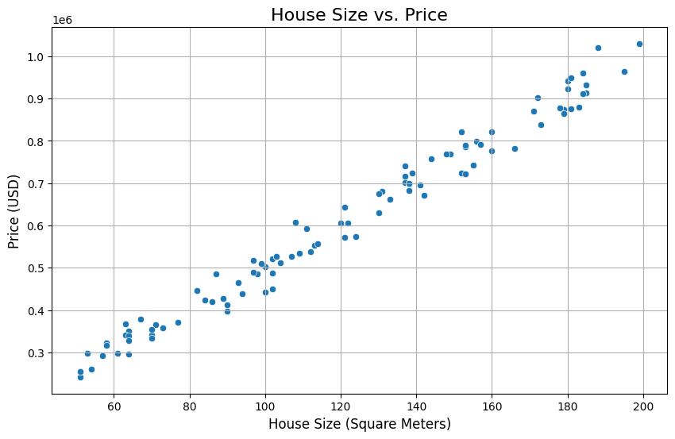

> **주택 크기(sqm)와 가격(USD)** 사이에는 매우 강한 양의 선형 상관관계가 확인된다.

```python
# 주택 연식과 가격의 상관관계
r, p = stats.pearsonr(df['Years_Old'], df['Price_in_USD'])
# → 상관계수: -0.151, p값: 0.133 → 약한 음의 상관관계, 통계적으로 유의미하지 않음
```

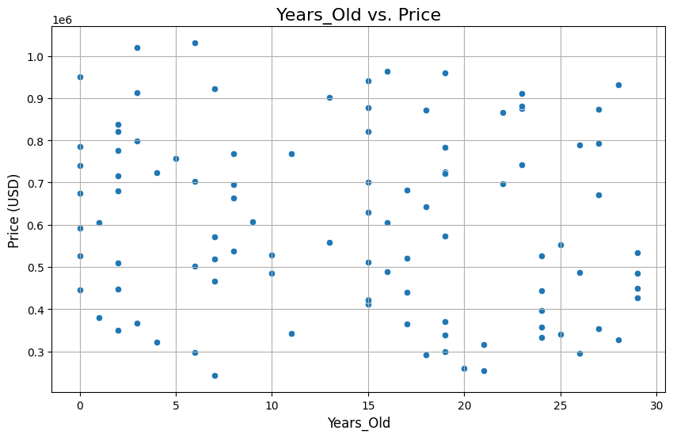

> **주택 연식(Years_Old)과 가격** 사이에는 약한 음의 상관관계가 보이지만, p값이 0.133으로 통계적으로 유의미하지 않다.

#### 코드 구현 : Pairplot & 히트맵

`pairplot`으로 여러 양적 변수 간의 산점도를 한눈에 확인하고, 상관계수 행렬을 히트맵으로 시각화하였다.

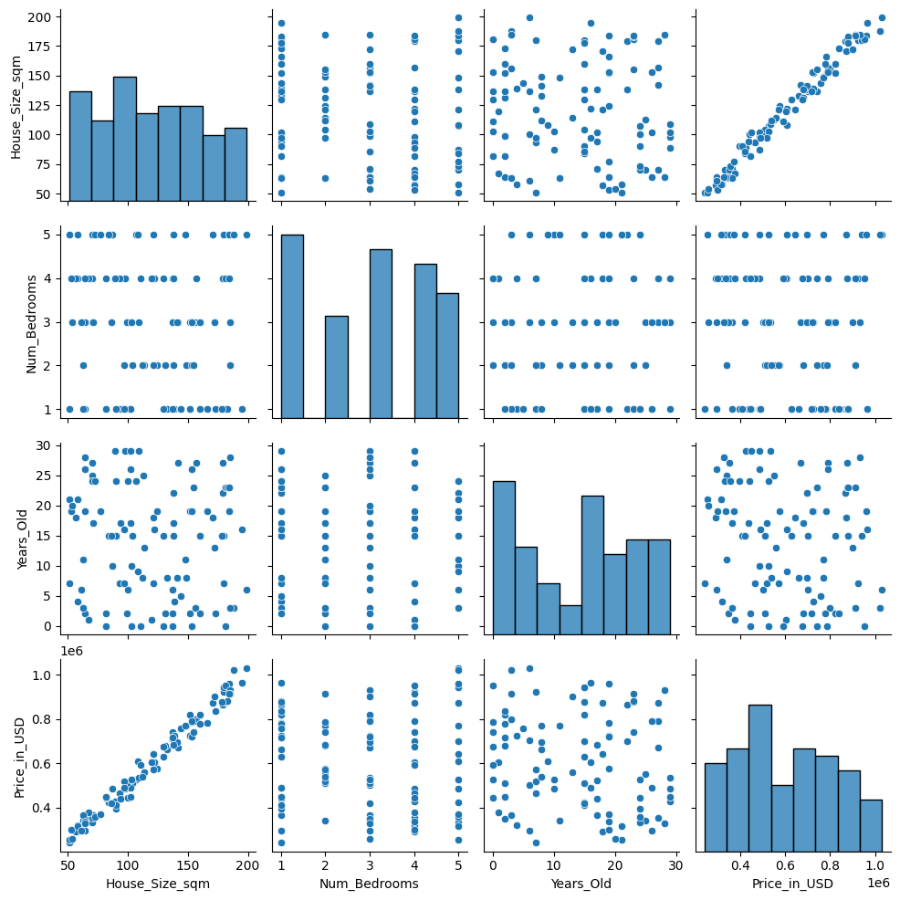

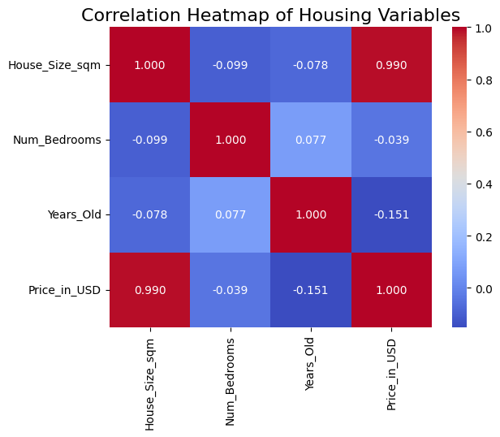

> **핵심**: 상관계수 행렬과 히트맵은 다수의 변수 간 관계를 시각적으로 빠르게 파악하는 데 매우 유용하다.

#### 코드 구현 : 피어슨 vs 스피어만

세 가지 시나리오를 통해 피어슨 상관계수와 스피어만 상관계수의 차이를 비교하였다.

**시나리오 1: 완벽한 선형 관계**

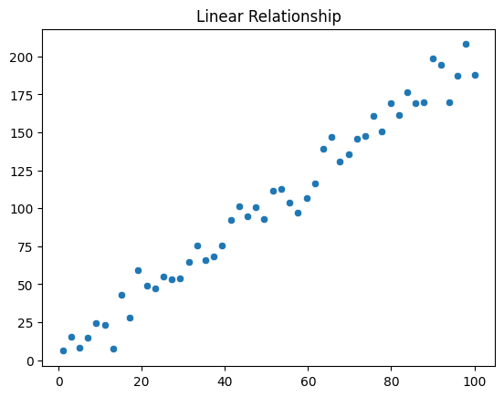

> 선형 관계에서는 피어슨과 스피어만 모두 높은 값을 보인다.

**시나리오 2: 비선형이지만 단조 관계 (곡선 형태)**

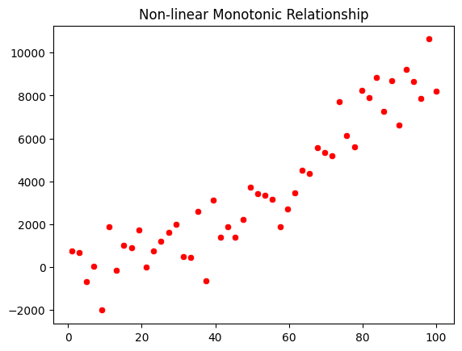

> 비선형 단조 관계에서는 **스피어만이 피어슨보다 더 높은 값**을 보인다. 순위 기반이므로 비선형 관계도 잘 포착한다.

**시나리오 3: 선형 관계에 이상치(Outlier) 추가**

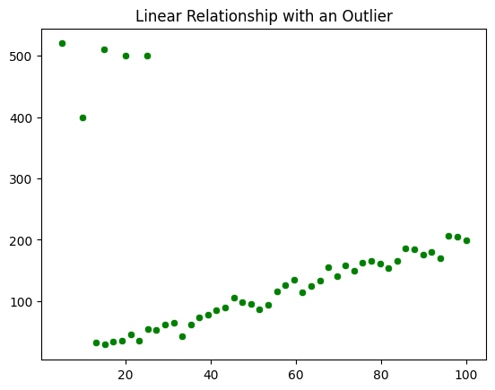

> 이상치가 있는 경우 **피어슨은 크게 영향**을 받지만, **스피어만은 상대적으로 robust**하다.

#### 상관계수와 가설검정

추론통계의 원리를 통해 상관계수와 가설검정을 수행할 수 있다.

- $H_0 : r_p = 0$ (모집단의 상관관계가 무상관)
- $H_1 : r_p \neq 0$

이때 t분포를 이용하여 p값을 계산하는데, 표본에서 얻은 $r_p$가 해당 분포 내 어디에 위치하는지를 보면 된다. $p < 0.05$임을 확인한 뒤에야 비로소 상관관계가 있다고 주장할 수 있다.

⚠️ **표본크기가 매우 클수록 가설검정의 결과 해석에 주의해야 한다.**
- 표본크기가 클수록 모집단이 귀무가설에서 아주 조금만 어긋나도 p값이 작아진다.
- 따라서 $r$과 $p$ 양쪽 모두를 보고 해석하는 것이 중요하다.

---

### 7.3 선형회귀

$y = f(x)$를 통해 설명변수와 반응변수 사이 관계성을 알고, 새롭게 얻은 설명변수에 의거한 반응변수 예측도 가능하다.

$y = ax + b$의 가장 간단한 예시에서, 회귀식 $f(x)$의 형태를 결정하는 파라미터 $a,b$를 **회귀계수**라고 한다.

**회귀모형** : $y = ax + b + \epsilon$ (확률오차 $\epsilon$ 포함)

파라미터에 관해 선형인 경우 **선형회귀**로 분류한다.

> ☝️ 회귀분석을 실행할 때 중요한 점 : ① 어떤 회귀식을 적용할 것인가? ② 어떻게 데이터에 적용할 것인가? ③ 얻은 회귀모형을 어떻게 평가할 것인가?

#### 최소제곱법(least squares)

잔차(residual) : 실제 데이터($y$)와 회귀식을 통해 얻은 값($\hat y$)의 차이

$$ E(a,b) = \sum_{i=1}^{n}(y_i - \hat y_i)^2 = \sum_{i=1}^{n}(y_i - ax_i - b)^2 $$

이 잔차의 제곱합 $E(a,b)$가 최소가 되는 $a,b$를 구하기 위해 각각에 대해 편미분하여 0으로 설정한다. 이렇게 얻은 추정량 $\hat a, \hat b$는 **최량선형비편향추정량**이 된다.

#### 코드 구현 : 단순선형회귀 (tips 데이터)

Seaborn의 `tips` 데이터셋에서 `total_bill`과 `tip`의 관계를 `statsmodels`의 OLS를 사용해 회귀분석하였다.

```python
X = sm.add_constant(tips['total_bill'])
model = sm.OLS(tips['tip'], X).fit()
print(model.summary())
```

회귀 전제 조건인 (1) 선형성, (2) 정규성, (3) 등분산성, (4) 독립성을 2×2 subplot으로 시각화하여 확인하였다.

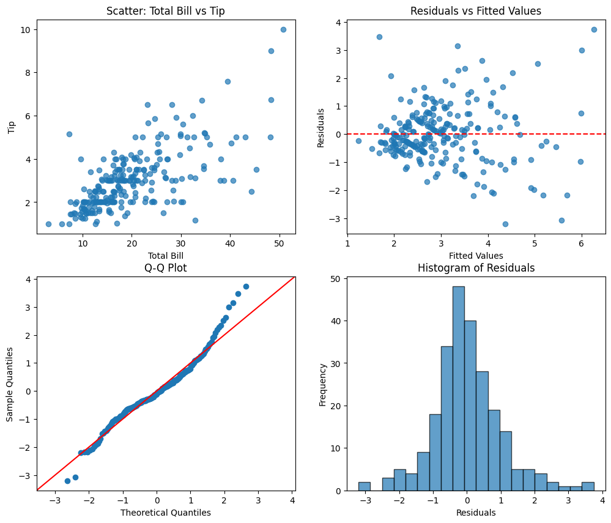

#### 회귀계수의 가설검정

기울기 $a$에 대해 가설검정을 수행할 수 있다.

- $H_0 : a = 0$ (설명변수가 반응변수에 영향을 주지 않음)
- $H_1 : a \neq 0$

#### 95%의 신뢰구간 & 예측구간

- **신뢰구간** : 모집단의 회귀계수를 추정하면 신뢰구간을 얻을 수 있다. (100번 시행 시 95번 정도는 모집단 모형이 이 범위에 포함)
- **예측구간** : 추정한 회귀모형 기반으로 데이터 그 자체가 분포하는 구간 (얻을 수 있는 데이터의 95%를 포함하는 범위)

#### 코드 구현 : 신뢰구간 & 예측구간 시각화

`statsmodels`의 `get_prediction` 메서드를 사용하여 신뢰구간과 예측구간을 함께 시각화하였다.

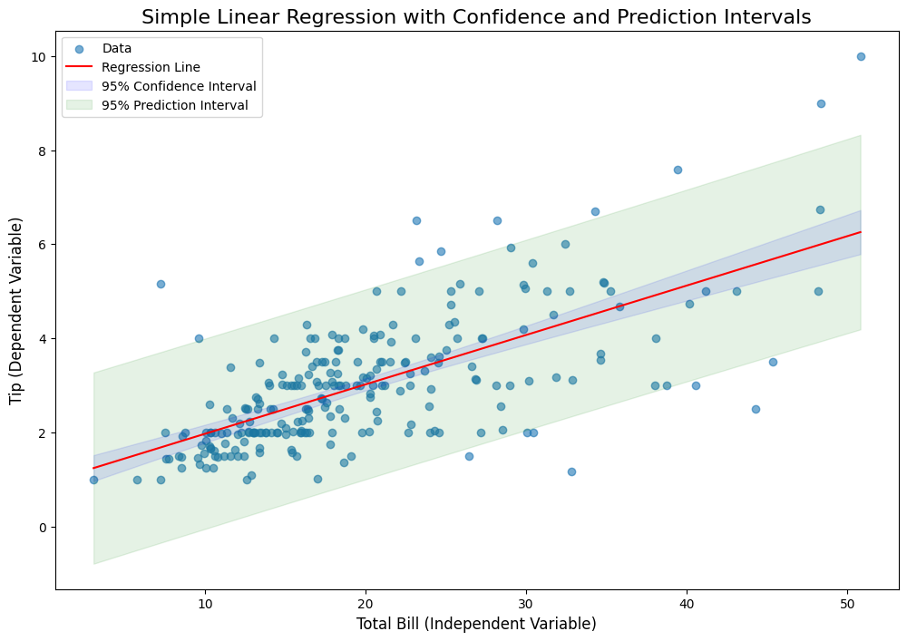

`seaborn`의 `regplot`을 사용하면 부트스트랩을 통한 신뢰구간을 간단하게 표현할 수 있다.

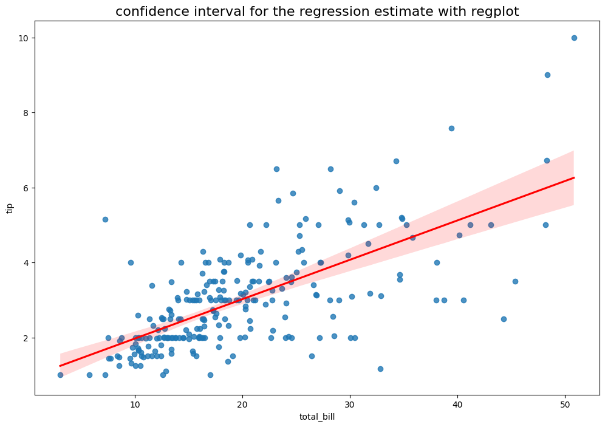

> **핵심**: 신뢰구간은 "평균 예측값이 이 범위 안에 있을 것"이고, 예측구간은 "개별 데이터가 이 범위 안에 있을 것"을 의미한다. 따라서 예측구간이 항상 신뢰구간보다 넓다.

#### 결정계수(R-squared)

$$ R^2 = 1 - \frac{\sum_{i=1}^{n}(y_i - f(x_i))^2}{\sum_{j=1}^{n}(y_j - \bar y_j)^2} $$

잔차의 비율을 1에서 빼줌으로써 데이터에 의해 설명된 비율을 나타낸다.

설명변수가 1개인 단순선형회귀에서는 결정계수가 상관계수의 제곱($r^2$)과 같다. 하지만 설명변수가 늘어날수록 결정계수가 커지는 성질이 있으므로, **조정 결정계수** $R'^2$를 사용하여 보정한다.

$$ R'^2 = 1 - \frac {\frac {1}{n-k-1} \sum_{i=1}^{n}(y_i - f(x_i))^2}{\frac {1}{n-1} \sum_{j=1}^{n}(y_j - \bar y_j)^2} $$

#### 오차의 등분산성과 정규성

가설검정이나 신뢰구간을 얻기 위한 조건:

1. 오차항 $\epsilon$의 확률분포가 평균 0, 분산 $\sigma^2$의 정규분포를 따른다 → **샤피로-윌크 검정**으로 확인
2. 등분산성을 가진다 → **브루쉬-페이건 검정**으로 확인

#### 코드 구현 : 폐활량 vs 먼지노출 회귀분석

실제 데이터(폐활량과 먼지노출)를 사용한 단순선형회귀 결과와 가정 검정(선형성, 정규성, 등분산성, 독립성)을 시각화하였다.

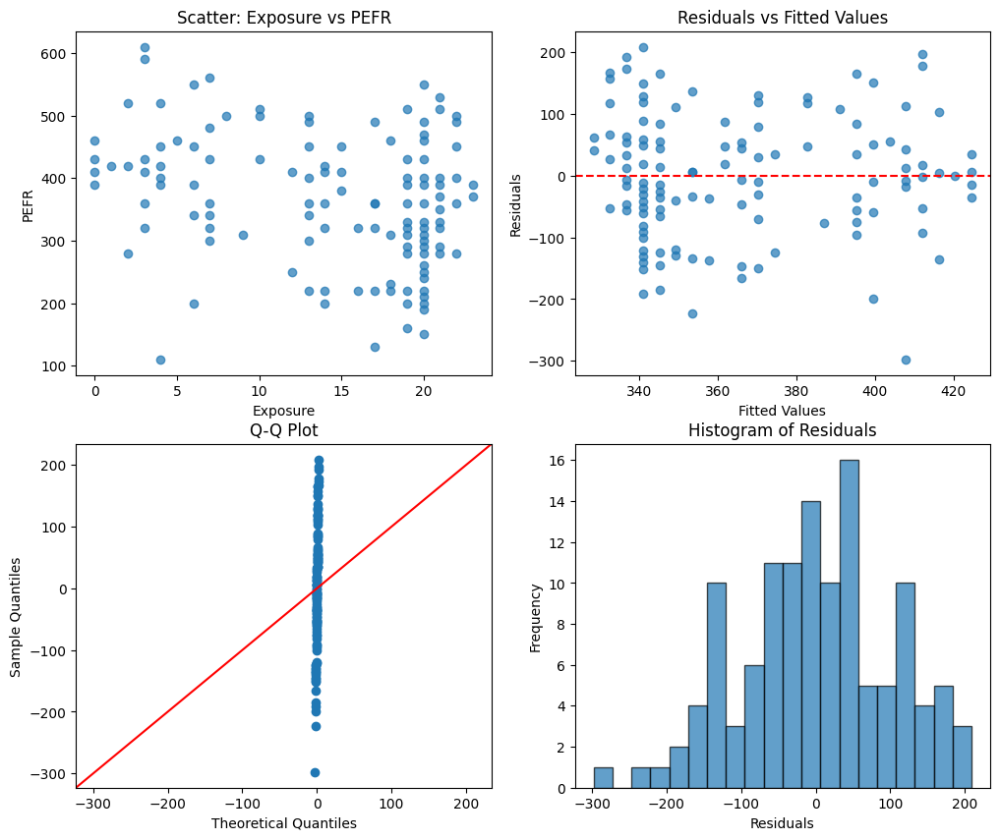

#### 설명변수와 반응변수

상관과 달리 회귀에는 설명변수 $x$와 반응변수 $y$라는 **비대칭성**이 존재한다.

- **설명 목적** : 설명하는 쪽을 설명변수, 설명할 대상을 반응변수로 설정
- **인과효과** : 원인을 설명변수, 결과를 반응변수로 설정
- **예측 목적** : 예측의 근거가 될 변수를 설명변수, 예측하고자 하는 변수를 반응변수로 설정

---

## 8장 통계 모형화

> 선형회귀의 원리를 확장하여 다양한 데이터와 상황에 적용하는 방법을 배운다.

### 8.1 선형회귀 원리의 확장

확장의 방향성은 크게 3가지이다.

1. 설명변수의 **개수를 증가**시키거나 **유형을 변경**
2. 반응변수의 **유형을 변경**
3. 회귀모형의 **형태를 변경**

#### 다중회귀(Multiple Regression)

설명변수가 여러 개인 것을 **다중회귀**라고 한다.

$$ y = a + b_1x_1 + b_2x_2 + \cdots + b_kx_k + \epsilon $$

각 $x_i$축에 대한 기울기 $b_i$를 **편회귀계수**라고 한다.
- 편회귀계수의 의미 : $x_i$ 이외의 다른 설명변수들을 고정한 채로, $x_i$가 1 증가할 때의 $y$ 증가량
- 편회귀계수의 크기만으로는 변수 간의 중요도를 직접 비교할 수 없다 → **표준화편회귀계수** 사용

#### 코드 구현 : 다중선형회귀 (마케팅 매출 예측)

TV, Radio, Newspaper 광고비가 매출에 미치는 영향을 다중선형회귀로 분석하였다.

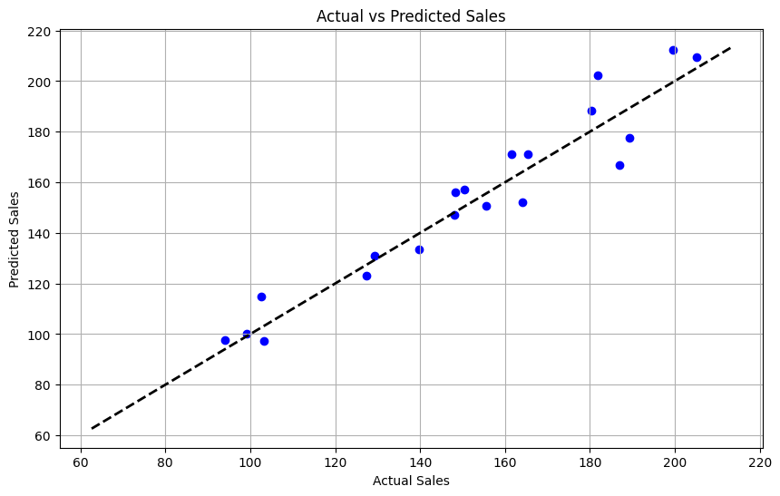

잔차 분석을 통해 모델의 가정(선형성, 정규성, 등분산성, 독립성)을 검증하고, **VIF**(분산팽창인수)를 통해 다중공선성도 확인하였다.

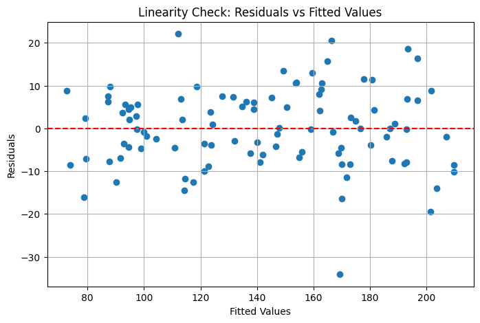

#### 범주형 변수를 설명변수로

범주형 변수(성별, 혈액형 등)를 회귀분석의 설명변수로 이용하려면 **가변수**(dummy variable)로 변환하여 사용한다.

- **범주 2개인 경우** : 남자=0, 여자=1로 할당
- **범주 3개 이상인 경우** : **(범주 개수 - 1)개**의 가변수를 준비 (다중공선성 회피)

#### 다중공선성(Multicollinearity)

다중회귀에서 설명변수들 사이에 강한 상관관계가 존재하는 경우를 말한다. 이 경우 회귀계수의 추정 오차가 커져 추정값의 신뢰성이 급격히 떨어진다.

**VIF(분산팽창인수)** :

$$ VIF_i = \frac {1}{1-R^2_i} $$

- $VIF \ge 10$ 이면 다중공선성이 있다고 판단
- **해결책** : 상관이 강한 변수 중 하나를 제거하거나, PCA(주성분분석) 등을 통해 차원 축소

---

### 8.2 회귀모형의 형태 바꾸기

#### 상호작용(Interaction)

기존 선형회귀모형에서 각 변수가 독립적으로 $y$에 영향을 준다고 가정하지만, 변수 간에 시너지 효과(**상호작용**)가 있다면 곱셈항($c x_i x_j$)을 도입하여 모델링한다.

#### 비선형회귀

$x$에 관해서는 $x^2, \log x$ 등을 사용하더라도, 파라미터에 관해서 1차식이라면 여전히 **선형모형**의 범주에 포함된다. 파라미터 자체가 비선형적으로 결합된 경우를 **비선형회귀**라고 한다.

---

### 8.3 일반화선형모형(GLM)의 개념

#### 선형회귀 원리의 확장

**일반화선형모형(GLM, Generalized Linear Model)** : 정규분포 가정에 얽매이지 않고, 데이터의 성질(이항분포, 푸아송분포 등)을 고려하여 유연하게 모형화하는 방법

- 기존 : 최소제곱법(거리 기반)
- GLM : 확률분포에 기반한 **최대가능도 방법**(Maximum Likelihood Method)으로 추정

#### 가능도와 최대가능도 방법

$$P(x|\theta) = P(x_1 | \theta) \times P(x_2 | \theta) \times \cdots \times P(x_n | \theta)$$

이것을 **가능도(Likelihood) 함수**라고 하며, 이 가능도 $L(\theta|x)$를 최대화하는 $\theta$를 찾아 추정값으로 삼는 것을 **최대가능도 방법**이라고 한다.

#### 로지스틱 회귀(Logistic Regression)

반응변수가 **2개의 범주(0 또는 1)**로 나뉘는 경우 사용한다.

$$p_i = \frac {1}{1 + \exp(-(a+bx_i))}$$

위 식의 우변이 **로지스틱 함수**(Sigmoid)다. 선형함수 $ax+b$의 값($-\infty \sim \infty$)을 확률의 범위인 **0 ~ 1** 사이로 변환해 준다.

식을 변형하면 **로짓(logit) 함수**(GLM에서의 **연결함수**)를 얻는다:

$$\log \left( \frac {p}{1-p} \right) = a + bx$$

- **오즈(Odds)** : 사건이 일어날 확률과 일어나지 않을 확률의 비율 ($\frac {p}{1-p}$)
- **오즈비(Odds Ratio, OR)** : 두 집단의 오즈 비율
    - $OR > 1$ : 해당 사건 발생 확률이 높음
    - ⚠️ 오즈비가 2라고 해서 발생 확률($p$)이 2배라는 뜻은 아니다 (오즈가 2배인 것)

#### 코드 구현 : 로지스틱 회귀

공부 시간과 시험 합격 여부의 관계를 `sklearn`과 `statsmodels`를 사용해 로지스틱 회귀로 분석하였다.

```python
# sklearn 로지스틱 회귀
model = LogisticRegression()
model.fit(X, y)
```

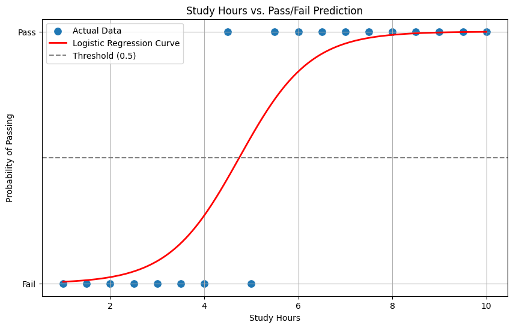

`statsmodels`의 `Logit`을 사용하면 오즈비를 계산하여 해석할 수 있다:

```python
logit_model = sm.Logit(y, X)
result = logit_model.fit()
odds_ratios = np.exp(result.params)
# → 공부 시간이 1시간 늘어날 때마다 시험에 합격할 오즈가 1.26배 증가
```

> **핵심**: 로지스틱 회귀에서 계수(coefficient)의 지수 변환($e^b$)이 곧 오즈비이며, 이를 통해 "설명변수가 1단위 증가할 때 오즈가 몇 배 변하는지"를 직관적으로 해석할 수 있다.

#### 푸아송 회귀(Poisson Regression)

반응변수가 **0 이상의 정수**일 때 사용하는 모형이다. **푸아송 분포**를 따른다고 가정한다.

$$p(x=k) = \frac {\lambda^k e^{-\lambda}}{k!}$$

연결함수는 로그함수 : $\lambda_i = \exp(a+bx_i)$

#### 다양한 일반화선형모형 정리

$$ \text{GLM} : \underbrace{f(z)}_{\text{연결함수}} = \underbrace{a+bx}_{\text{선형예측변수}}$$

| 확률분포 | 반응변수 | 연결함수 | 특징 |
| :---: | :---: | :---: | :--- |
| **이항분포** | 0 이상 정수 | 로짓함수 | 0 또는 1, 상한이 있는 개수 데이터 |
| **푸아송분포** | 0 이상 정수 | 로그함수 | 상한이 없는 개수 데이터, **평균=분산** |
| **음이항분포** | 0 이상 정수 | 로그/역함수 | 상한이 없는 개수 데이터, **평균 < 분산** (과분산 대처) |
| **정규분포** | 실수 | 항등함수 | 범위 제한 없음, 분산 일정 (일반 선형회귀) |
| **감마분포** | 양의 실수 | 로그/역함수 | 분산이 평균에 따라 변화 |

- **과분산(Overdispersion)** : 데이터의 분산이 확률분포가 가정한 분산보다 큰 경우 → 음이항 회귀 또는 **GLMM** 사용

---

### 8.4 통계 모형의 평가와 비교

#### 왈드 검정(Wald Test)

최대가능도 방법으로 얻은 **추정값**을 **표준오차**로 나눈 값(왈드 통계량)을 이용하여 회귀계수의 유의성을 검정한다.

#### 가능도비 검정(Likelihood Ratio Test)

두 모형의 **가능도(Likelihood)** 비율을 비교하는 방법이다. 비교할 두 모형은 **내포 관계**여야 한다.

$$ \Delta D_{1,2} = -2 \times (\log L_{1}^{*} - \log L_{2}^{*}) $$

#### AIC (아카이케 정보기준)

**새로운 데이터를 얼마나 잘 예측할 것인가**를 기준으로 모형을 선택한다.

$$\text{AIC} = -2\log L^* + 2k$$

- **AIC가 작을수록 좋은 모형**
- 과적합 방지를 위해 파라미터 수에 페널티 부여
- 내포 관계가 아닌 모형끼리도 비교 가능

#### BIC (베이지안 정보기준)

AIC와 비슷하지만, **모형의 복잡함에 더 큰 페널티**를 부여한다.

$$\text{BIC} = -2\log L^* + k\log n$$

- **BIC가 작을수록 좋은 모형**
- 표본 크기가 클수록 파라미터 수에 대한 페널티가 강해짐

> 💡 **AIC** : 복잡한 현실에서 **예측**이 중요할 때 / **BIC** : 간단한 현상에서 **올바른 설명**이 중요할 때

> **핵심**: 회귀분석은 단순한 직선 맞추기가 아니라, 데이터의 성질(양적/질적, 정규분포 여부, 변수 간 관계)에 따라 적절한 모형을 선택하고, 과적합을 방지하며, 결과를 정확하게 해석하는 일련의 체계적 과정이다.
