# DAY4 통계학 정리 (11~12장)

> 「통계X101 데이터분석」 교재의 11~12장 내용 + [DAY4 실습 코드](https://github.com/Chankyu99/ModuLABS/blob/master/03_Statistics/DAY4_Statistics.ipynb)

---

## 11장 베이즈 통계

> 빈도주의 통계의 한계를 넘어, **사전 지식과 데이터를 결합**하여 확률적 의사결정을 내리는 베이지안 접근법을 배운다.

### 11.1 빈도주의의 한계 : p-value 0.058의 딜레마

A/B 테스트를 진행했다. 결과는 다음과 같다.
- **A안** : 1000명 중 76명 전환 (7.6%)
- **B안** : 1000명 중 100명 전환 (10.0%)

직관적으로는 B안이 훨씬 좋아 보인다. 하지만 빈도주의 통계(Z-test)를 돌려보니 결과가 애매하다.

- **p-value** : 0.0582

유의수준 $\alpha = 0.05$로 잡았다면, $p > 0.05$이므로 **귀무가설을 기각할 수 없다**는 결론이 나온다. 즉, **통계적으로 유의미한 차이가 있다고 말할 수 없다**는 소극적인 결론에 갇히게 된다.

> 의사결정자는 답답하다. "그래서 B안이 좋다는 거야, 아니라는 거야?"

### 11.2 해결책 : 베이지안 분석

같은 데이터를 두고 베이지안 관점(MCMC 시뮬레이션)으로 접근해보았다. 베이지안의 핵심은 두 집단의 차이를 **'확률분포'** 그 자체로 본다는 점이다.

**베이즈 정리** :

$$P(\theta|D) = \frac{P(D|\theta) \cdot P(\theta)}{P(D)}$$

- $P(\theta)$ : **사전분포(Prior)** — 데이터를 보기 전의 믿음
- $P(D|\theta)$ : **가능도(Likelihood)** — 파라미터가 주어졌을 때 데이터가 관측될 확률
- $P(\theta|D)$ : **사후분포(Posterior)** — 데이터를 본 후 업데이트된 믿음

#### Delta($\delta$)의 위력

`pm.Deterministic('delta', p_B - p_A)`를 통해 두 집단 간 전환율 차이($\delta$)의 분포를 직접 구했다. 이것이 A/B 테스트와 같이 두 모델의 비교 분석을 위해 가장 중요한 지표가 되는 차이를 구하는 역할을 한다.

B안의 전환율에서 A안의 전환율의 차이를 구해 B안 도입 시 얼만큼의 성능을 기대할 수 있는지 **정량적으로** 확인이 가능하다. 따라서 빈도주의 관점에서의 해석의 한계를 극복할 수 있다.

#### 코드 구현 : 베이지안 혈압 분석

`PyMC`를 사용하여 신약과 위약 집단의 혈압 차이에 대한 사후분포를 추정하였다.

```python
with pm.Model() as blood_pressure_model:
    mu_drug = pm.Normal('mu_drug', mu=120, sigma=20)
    mu_placebo = pm.Normal('mu_placebo', mu=120, sigma=20)
    mean_diff = pm.Deterministic('mean_difference', mu_drug - mu_placebo)
    trace = pm.sample(2000, tune=1000, cores=1)
```

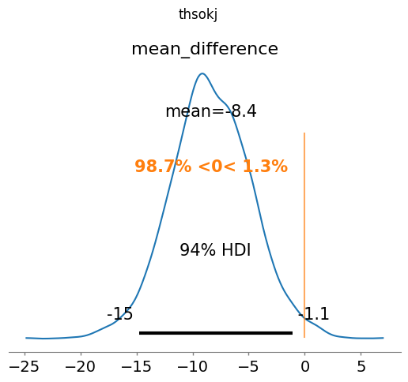

> **핵심**: 사후분포를 직접 시각화함으로써, "두 집단 간 차이가 0인 기준선(ref_val=0)에 비해 실제로 얼마나 떨어져 있고, 어느 쪽이 더 높은 확률인지"를 시각적으로 파악할 수 있다.

### 11.3 사전분포(Prior)의 설정

베이지안이 만능은 아니다. **데이터가 적을 때**, 사전분포의 설정이 결과를 좌우할 수 있다.

**Beta 분포** $\text{Beta}(\alpha, \beta)$는 확률(0~1 범위)에 대한 사전분포로 자주 사용된다.

- **평균** : $\frac{\alpha}{\alpha + \beta}$
- **$\alpha + \beta$의 크기** : 가상의 샘플 수 → 합이 클수록 분산이 작아져 첨도가 오르고, 확신이 매우 강하다는 의미이다. 새로운 데이터가 들어와도 이 강한 믿음이 쉽게 꺾이지 않는다.
- **$\text{Beta}(1, 1)$** : 무정보적 사전분포 (아무것도 모른다)
- **$\text{Beta}(8, 92)$** : 기존 A안의 전환율 8%라는 강한 믿음 (100번 중 8번 성공에 해당)

#### 코드 구현 : 사전분포 비교 시각화

낙관적 사전분포, 무정보적 사전분포, 나만의 사전분포(9%)를 시각화하여 비교하였다.

```python
optimistic_prior_params = (12, 88)   # 12%를 기대
neutral_prior_params = (1, 1)         # 아무 정보 없음
my_prior_params = (9, 91)            # 9%로 좀 강한 믿음
```

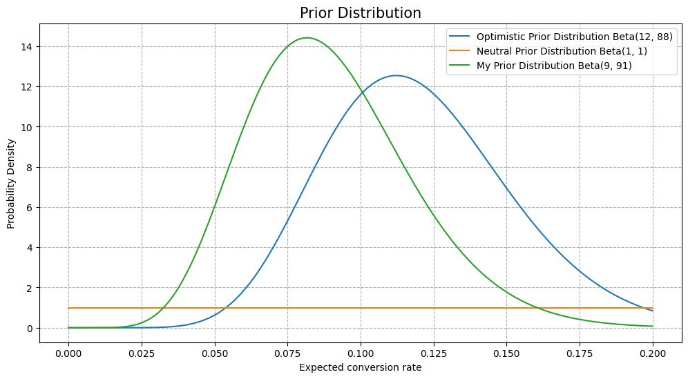

> 본래 가지고 있는 합리적인 사전 지식을 모델에 융합해 적은 데이터의 노이즈를 잡아주는 것이 베이지안 통계학의 핵심이다.

### 11.4 베이지안 A/B 테스트 모델링

#### 코드 구현 : PyMC 베이지안 A/B 테스트

```python
with pm.Model() as ab_test_model:
    p_A = pm.Beta('p_A', alpha=1, beta=1)
    p_B = pm.Beta('p_B', alpha=1, beta=1)
    delta = pm.Deterministic('delta', p_B - p_A)
    obs_A = pm.Binomial('obs_A', n=nobs[0], p=p_A, observed=conversions[0])
    obs_B = pm.Binomial('obs_B', n=nobs[1], p=p_B, observed=conversions[1])
    trace = pm.sample(4000, tune=1000, cores=1)
```

#### 코드 구현 : 사후분포 해석 & 의사결정

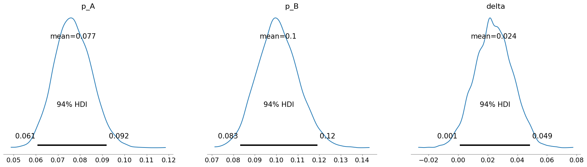

결과:
- **B안이 A안보다 좋을 확률** : **약 97%**
- **전환율 차이의 95% 구간(HDI)** : [0.001, 0.049] (0보다 큼)

빈도주의가 "차이가 0인지 아닌지"에 집착할 때, 베이지안은 다음과 같이 구체적인 답을 준다.
1. **확신(Certainty)** : B안이 A안보다 나을 확률이 약 97%이다.
2. **크기(Magnitude)** : 그 차이는 약 0.1%p에서 4.9%p 사이일 가능성이 가장 높다.

### 11.5 빈도주의 vs 베이지안 비교

| 구분 | 빈도주의 (Frequentist) | 베이지안 (Bayesian) |
| :--- | :--- | :--- |
| **질문** | "차이가 0인가? (Yes/No)" | "B가 A보다 얼마나, 어떤 확률로 더 좋은가?" |
| **결과물** | p-value, 점추정 | 사후확률분포 (Posterior) |
| **장점** | 계산이 빠르고 객관적임 | 직관적 해석, 구체적 의사결정 가능 |
| **단점** | 해석이 난해함, 이분법적 사고 | 계산 비용 큼, 사전분포의 주관성 |

> **핵심**: 빈도주의는 "차이가 있냐/없냐"를 O/X 퀴즈처럼 판정해 준다면, 베이지안은 "얼마나 더 좋고, 우리가 그 사실을 몇 %나 확신할 수 있는지"를 풍부하고 입체적인 확률 분포로 보여준다. 단, 사전분포의 타당성에 항상 경계해야 한다.

---

## 12장 통계분석과 관련된 그 밖의 방법

> 주성분 분석을 통한 차원 축소, 그리고 통계학과 맞닿아 있는 기계학습의 핵심 개념들을 학습한다.

### 12.1 주성분 분석

#### 변수의 차원

'차원이 높다'는 것이 정보량이 많으니 좋은 것처럼 생각되지만, 사실은 '쓸데없이 많기만'한 상황이 종종 발생한다. 데이터의 특징을 유지하며 분석이나 결과 해석에 도움을 줄 수 있게끔 압축하는 것이 중요하며, 이를 **차원 축소**라고 한다.

**변수의 수를 줄이는 이유** :

1. **고차원 데이터 해석의 어려움** : 2차원 평면에 나타내는 게 가장 직관적이고 알기 쉽다. 다중회귀에서 설명변수끼리 강한 상관이 있으면 다중공선성이 발생하여 회귀계수 추정이 불안정해진다.
2. **차원의 저주** : 변수가 많아지면 파라미터 수가 증가하고, 표본크기가 충분하지 않으면 회귀계수를 올바르게 추정할 수 없다.

#### 주성분분석의 원리

상관이 있는 변수끼리는 하나로 정리될 수 있다는 아이디어에 기반한다. 데이터 퍼짐(분산)이 가장 커지는 방향으로 새로운 축을 설정한다.

- **제1주성분(PC1)** : 데이터 퍼짐이 가장 큰 방향
- **제2주성분(PC2)** : PC1에 수직이면서 데이터 퍼짐이 가장 큰 방향

$$ Z_1 = a_1 x_1 + a_2 x_2 + \cdots + a_M x_M $$

분산이 최대가 되도록 계수 $a_1, a_2, \ldots, a_M$을 정하고, PC2는 PC1과 직교하도록 설정한다.

- **기여율** : 각 주성분이 가진 정보의 비율
- **누적기여율** : 제1~제k주성분까지 전체 정보의 포함 비율
- 계수는 분산공분산행렬(또는 상관행렬)의 **고유벡터**, 기여율은 **고유값**을 총합으로 나눈 값

#### 코드 구현 : 손글씨 숫자 데이터 시각화

`sklearn`의 digits 데이터셋을 사용하여 원본 이미지와 PCA/t-SNE 차원 축소 결과를 비교하였다.

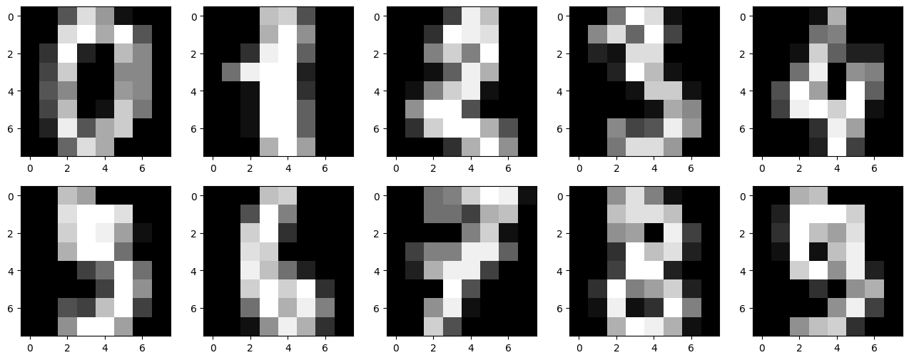

#### 코드 구현 : PCA 2차원 축소

```python
pca = PCA(n_components=2)
X_pca = pca.fit_transform(X_scaled)
```

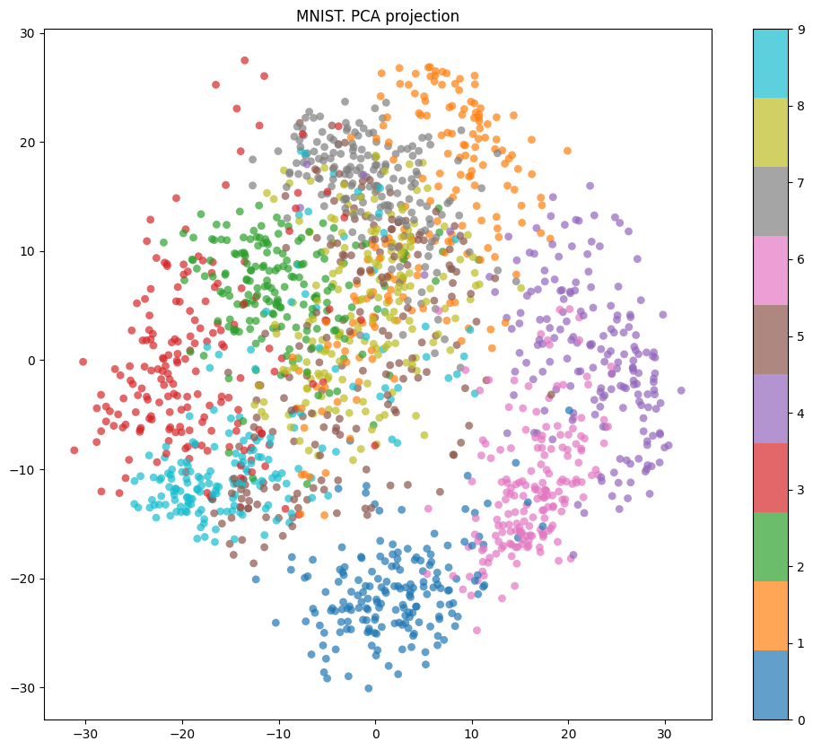

> PCA로 2차원에 투영하면 숫자 군집이 보이긴 하지만 상당 부분 겹쳐 있다.

#### 코드 구현 : t-SNE 2차원 축소

```python
tsne = TSNE(n_components=2, random_state=42, perplexity=30)
X_tsne = tsne.fit_transform(X_scaled)
```

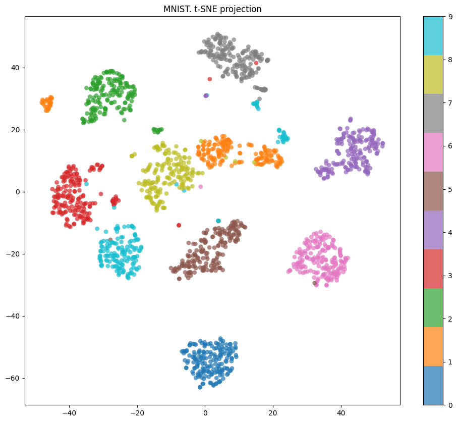

> t-SNE는 비선형 관계를 잘 포착하여 각 숫자별 군집이 PCA보다 훨씬 명확하게 분리된다.

#### 코드 구현 : 누적 기여율 & 주성분 부하량

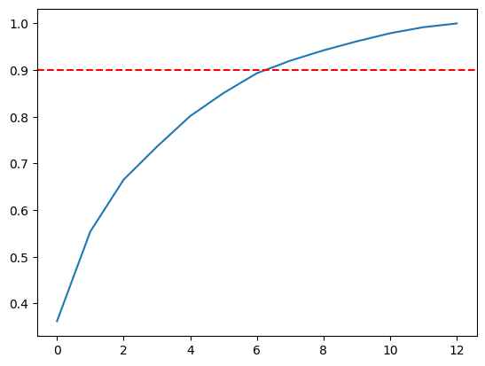

> 누적 기여율 그래프를 통해 몇 개의 주성분으로 원본 데이터의 대부분을 설명할 수 있는지 확인한다.

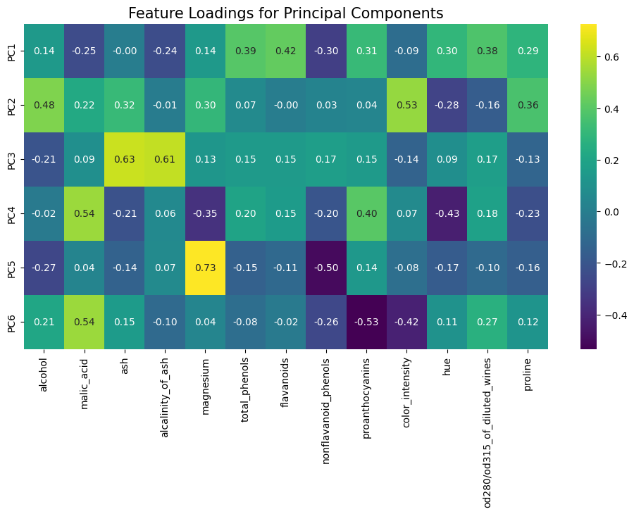

> 주성분 부하량 히트맵을 통해 각 주성분이 원래 어떤 변수와 강한 상관관계를 가지는지 해석할 수 있다.

#### 인자분석(Factor Analysis) vs PCA

인자분석은 "관측되는 여러 변수들의 바탕에는 그것들을 지배하는 소수의 **공통 인자**가 존재한다"는 아이디어에서 출발한다. 데이터를 바라보는 방향이 PCA와 정반대이다.

| 구분 | 주성분 분석 (PCA) | 인자 분석 (FA) |
| :---: | :---: | :---: |
| **방향** | 변수들의 합 → 주성분 | 공통 인자 → 변수들 |
| **목적** | 정보 손실 최소화하며 차원 축소 | 변수 간 상관관계를 만드는 잠재 원인 파악 |
| **구조** | $Z = a_1 x_1 + a_2 x_2 + \cdots$ | $x_1 = b_1(\text{인자}) + \text{오차}$ |

---

### 12.2 기계학습 입문

기계학습은 컴퓨터가 데이터를 통해 학습하여 성능을 개선하는 기술로, 통계학과 밀접한 관련이 있다.

**기계학습의 3대 분류** :

- **비지도 학습** : 정답(레이블) 없이 데이터의 숨겨진 구조를 찾음 (PCA, 군집 분석)
- **지도 학습** : 정답이 있는 데이터를 학습하여 예측 모델을 만듦 (회귀, 분류)
- **강화 학습** : 환경과 상호작용하며 보상을 최대화하는 행동을 학습

**통계학과 기계학습의 차이** :

| 구분 | 통계학 | 기계학습 |
| :---: | :---: | :---: |
| **데이터 규모** | 상대적으로 작은 표본 | 대량의 데이터 (빅데이터) |
| **목적** | 데이터의 설명 및 해석 중시 | 높은 예측 성능 중시 |
| **특징** | 엄격한 가정 하에 원인 규명 | 복잡한 데이터 속 패턴 발견 |

---

### 12.3 비지도 학습

정답 데이터가 없는 상태에서 데이터의 배후에 있는 구조를 파악하는 학습 방식이다.

#### 군집 분석(Cluster Analysis)

데이터 간의 유사성을 측정하여 비슷한 개체들을 하나의 그룹(군집)으로 묶는 방법이다.

**k-평균법(k-means)** : $k$개의 중심점을 임의로 정하고, 각 데이터를 가장 가까운 중심점에 할당 → 중심점 이동 → 반복. 빠르고 효율적이지만 $k$를 직접 지정해야 한다.

**계층적 군집화(Hierarchical Clustering)** : 데이터를 순차적으로 가까운 것끼리 묶어가며, 덴드로그램(Dendrogram)으로 결합 과정을 시각화한다.

#### 코드 구현 : K-means & 계층적 군집화

와인 데이터셋에 대해 K-means와 계층적 군집화(Agglomerative)를 각각 수행하고, 덴드로그램으로 시각화하였다.

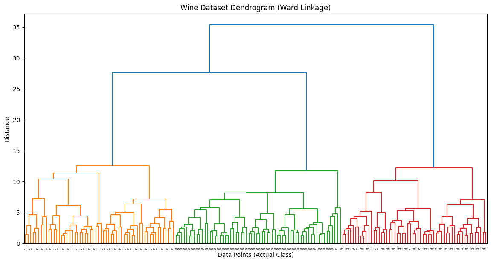

> 덴드로그램을 통해 데이터가 결합되는 과정을 트리 형태로 확인할 수 있다. 원하는 단계에서 절단하면 군집 수를 유연하게 결정할 수 있다.

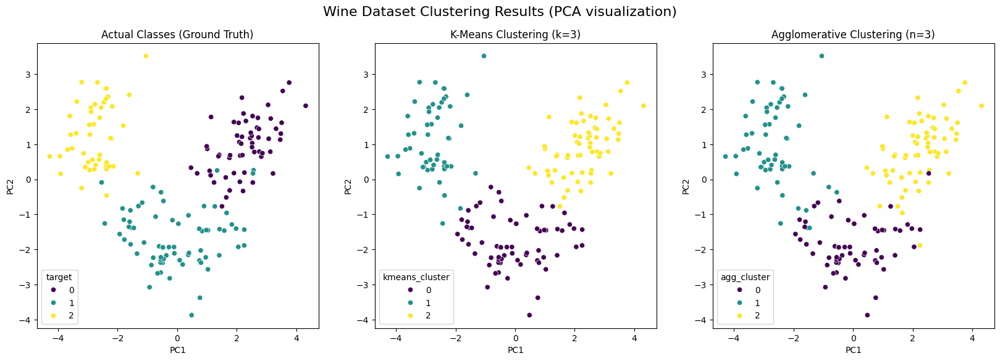

> PCA로 2차원에 투영한 뒤 실제 라벨(Ground Truth)과 K-means, 계층적 군집화 결과를 비교하였다.

#### 비선형 차원 축소 : t-SNE와 UMAP

PCA는 선형 상관관계만 파악하지만, **t-SNE**와 **UMAP**은 비선형 관계를 가진 데이터의 구조를 잘 보존하며 시각화한다.

---

### 12.4 지도 학습

정답이 있는 데이터를 바탕으로 설명변수 $x$와 반응변수 $y$ 사이의 관계를 나타내는 함수를 구하는 과정이다.

- **회귀(Regression)** : $y$가 연속적인 수치(양적 변수)일 때 (예: 주가 예측)
- **분류(Classification)** : $y$가 카테고리(질적 변수)일 때 (예: 스팸 메일 여부)

#### 과대적합(Overfitting)과 정칙화(Regularization)

- **과대적합** : 모델이 학습 데이터의 사소한 노이즈까지 외워버려 새로운 데이터에 대한 예측력이 떨어지는 현상
- **정칙화** : 손실 함수에 제약을 걸어 모델의 복잡도를 조절하고 과대적합을 방지

#### 교차 검증(Cross Validation)

학습에 사용하지 않은 미지의 데이터를 얼마나 잘 맞히는지가 핵심이다.

- **K-분할 교차 검증** : 데이터를 $K$개로 나눈 뒤 돌아가며 검증
- **LOOCV** : 데이터 하나만 검증용으로 남기는 극단적 형태

---

### 12.5 분류 모델 학습과 성능 측정

#### 혼동 행렬(Confusion Matrix)

| | 예측: 양성 | 예측: 음성 |
| :---: | :---: | :---: |
| **실제: 양성** | 진양성(TP) | 위음성(FN) — 2종 오류 |
| **실제: 음성** | 위양성(FP) — 1종 오류 | 진음성(TN) |

**주요 성능 평가 지표** :

- **정확도(Accuracy)** : $\frac{TP + TN}{TP + FP + FN + TN}$
- **민감도(Recall)** : $\frac{TP}{TP + FN}$ — 실제 양성 중 양성으로 맞힌 비율
- **특이도(Specificity)** : $\frac{TN}{FP + TN}$ — 실제 음성 중 음성으로 맞힌 비율
- **정밀도(Precision)** : $\frac{TP}{TP + FP}$ — 양성 예측 중 실제 양성 비율

#### ROC 곡선과 AUC

- **ROC 곡선** : 가로축을 위양성률(1-특이도), 세로축을 민감도로 나타낸 그래프. 왼쪽 위에 가까울수록 우수하다.
- **AUC** : ROC 곡선 아래 면적. 1에 가까울수록 완벽한 모델, 0.5는 무작위 추측 수준.

#### 코드 구현 : 유방암 데이터 분류

`sklearn`의 breast cancer 데이터셋으로 4가지 분류 모델을 학습하고 성능을 비교하였다.

**로지스틱 회귀** (정확도: 0.9825, AUC: 0.9954)


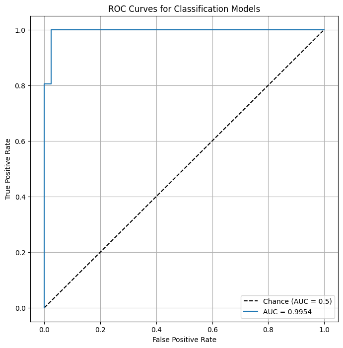

**결정 트리** (정확도: 0.9123, AUC: 0.9157)

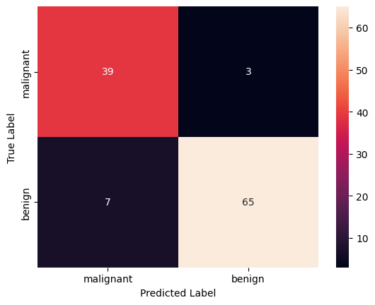

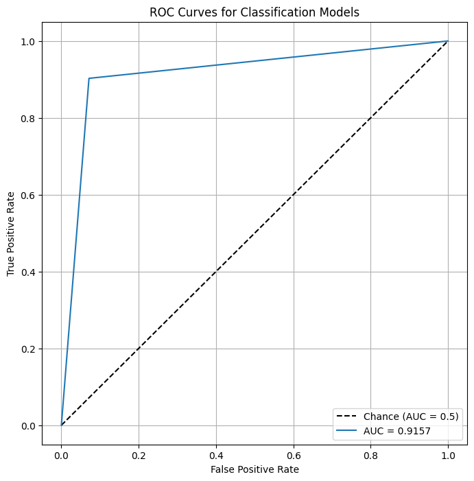

**랜덤 포레스트** (정확도: 0.9561, AUC: 0.9939)

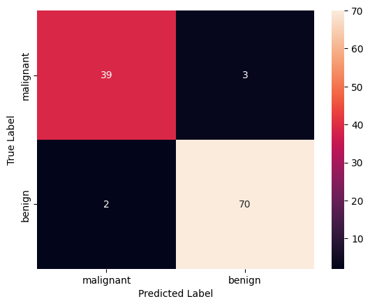


**SVM** (정확도: 0.9825, AUC: 0.9950)

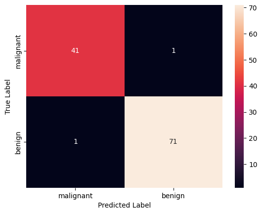

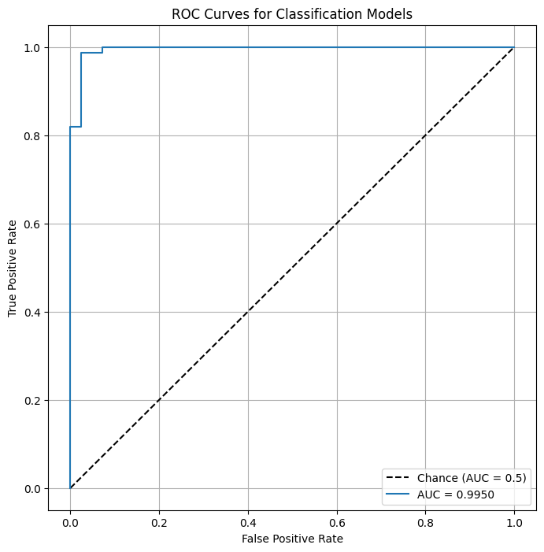

#### 코드 구현 : 모델 비교 종합

모든 분류 모델의 ROC 곡선을 하나의 그래프에 겹쳐 비교하였다.

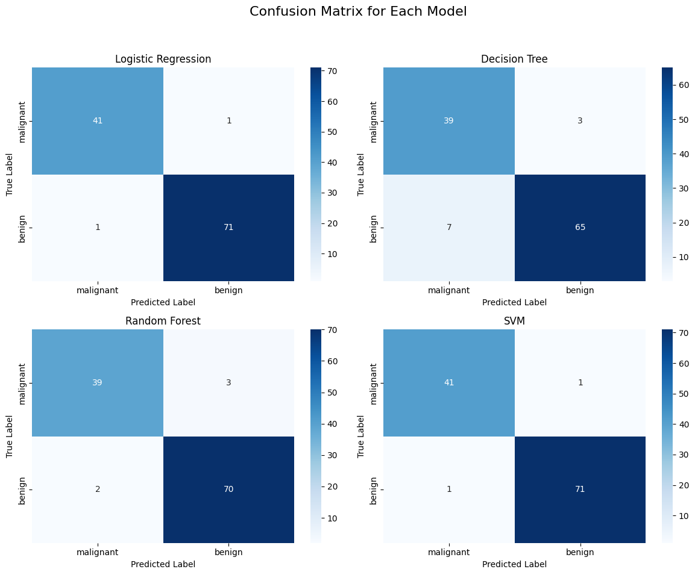

> **핵심**: 로지스틱 회귀와 SVM이 가장 높은 정확도(0.9825)와 AUC를 보였고, 결정 트리는 과적합 경향이 있어 상대적으로 낮은 성능을 보였다. 랜덤 포레스트는 결정 트리의 앙상블로 과적합을 효과적으로 완화하였다.

---

### 12.6 회귀 모델 학습과 성능 측정

#### 회귀 오차 측정 지표

- **MSE(평균제곱오차)** : 오차의 제곱을 평균한 값
- **RMSE(제곱근 평균제곱오차)** : MSE에 루트를 씌워 단위의 스케일을 맞춘 지표
- **MAE(평균절대오차)** : 오차의 절댓값을 평균한 것. 이상치에 더 robust하다.
- **$R^2$(결정계수)** : 모델이 데이터의 분산을 얼마나 잘 설명하는지. 1에 가까울수록 좋다.

#### 코드 구현 : 캘리포니아 주택 가격 회귀

```python
model = LinearRegression()
model.fit(X_train, y_train)
y_pred = model.predict(X_test)
```

```
MSE: 0.5559 | RMSE: 0.7456 | MAE: 0.5332 | R²: 0.5758
```

> $R^2 = 0.5758$로, 모델이 전체 분산의 약 57.6%를 설명한다. 나머지 42.4%는 선형모형으로 포착하지 못한 비선형 패턴이나 누락된 변수에 기인할 수 있다.

---

### 12.7 주요 기계학습 알고리즘 정리

| 알고리즘 | 유형 | 특징 |
| :--- | :---: | :--- |
| **로지스틱 회귀** | 분류 | 선형 경계로 클래스를 나눔. 해석이 쉬움 |
| **결정 트리** | 분류/회귀 | 조건 분기로 분류. 직관적이지만 과적합 위험 |
| **랜덤 포레스트** | 분류/회귀 | 여러 결정 트리의 앙상블. 과적합 방지 |
| **SVM** | 분류 | 데이터 간 거리를 최대화하는 경계면. 비선형 분류 가능 |
| **신경망(딥러닝)** | 분류/회귀 | 복잡한 패턴 파악에 강력. 블랙박스 특성 |

**분석 목적에 따른 알고리즘 선택** :

- **해석이 중요할 때** : 로지스틱 회귀, 결정 트리
- **예측 성능이 중요할 때** : SVM, 신경망(딥러닝)

> **핵심**: 통계학은 엄격한 가정 하에 데이터의 관계를 **설명**하는 데 초점을 두고, 기계학습은 복잡한 데이터 속 패턴을 발견하여 **예측 성능**을 극대화하는 데 초점을 둔다. 두 접근법은 상호 보완적이며, 문제의 성격에 따라 적절히 선택해야 한다.
