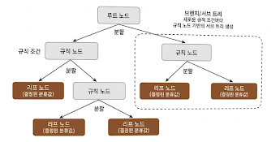

# 4. 분류

지도학습은 레이블, 즉 명시적인 정답이 있는 데이터가 주어진 상태에서 학습하는 머신러닝 방식이다.

대표 유형인 분류(Classification)은 학습 데이터로 주어진 데이터의 피처와 레이블값을 ML 알고리즘으로 학습해 모델을 생성, 그것을 기반으로 새로운 데이터 값에 대해 레이블을 예측하는 것

분류는 나이브 베이즈, 로지스틱 회귀, 결정 트리, 서포트 벡터 머신, 최소 근접, 신경망, 앙상블 등 다양한 머신러닝 알고리즘으로 구현 가능

여기서는 앙상블을 주로 다루어 보았다. 

## 4-1. 결정 트리 

ML 알고리즘 중 직관적으로 이해하기 쉬운 알고리즘. 데이터를 분석하여 규칙을 만들고, 이 규칙을 기반으로 분류를 수행하는 알고리즘. 

데이터의 어떤 기준을 바탕으로 규칙을 만들어야 가장 효율적인 분류가 될 것인가가 성능을 좌우한다

규칙 노드 : 규칙 조건,보통 if&else 구조
리프 노드 : 결정된 클래스 값
서브 트리 : 새로운 규칙 조건마다 생성

규칙이 많아짐 -> 방식이 복잡해짐 -> 트리가 깊어짐 -> 과적합

가능한 한 적은 결정 노드로 높은 예측 정확도를 가지려면 데이터 분류시 최대한 많은 데이터 세트가 해당 분류에 속할 수 있도록 결정 노드의 규칙이 정해져야 함

결정 노드는 정보 균일도가 높은 데이터 세트를 먼저 선택할 수 있도록 규칙 조건을 만든다. 
즉 정보 규닝ㄹ도가 데이터 세트로 쪼개질 수 있또록 조건을 찾아 서브 데이터 세트를 만들고, 다시 이 서브 데이터 세트에서 균일도가 높은 자식 데이터 세트 쪼개는 방식을 자식 트리로 내려가면서 반복하는 방식으로 데이터 값 예측

정보 균일도를 측정하는 방법은 지니 계수와 엔트로피가 있다.

- 엔트로피는 주어진 데이터 집합의 혼잡도, 서로 다른 값이 섞여 있으면 엔트로피가 높고, 같은 값이면 낮다
- 정보 이득 지수는 1에서 엔트로피 지수를 뺀 값으로 결정 트리는 이것을 기준으로 분할 기준을 정함. (정보 이득이 높은 속성 기준 분할)
- 지니 계수는 경제학에서 불평등 지수를 의미, 0이 가장 평등하고, 1이 불평등. 지니계수가 낮을 수록 머신러닝에서는 데이터 균일도가 높은 것으로 해석 (지니 계수가 낮은 속성을 기준으로 분할)

1. 데이터 집합의 모든 아이템이 같은 분류에 속하는 지 확인
2-1. 만약 그렇다면 리프 노드로 만들어서 분류 결정
2-2. 그렇지 않다면 데이터를 분할하는 데 가장 좋은 속성과 분할 기준 탐색 (정보이득? 지니계수?)
3. 해당 속성과 분할 기준으로 데이터 분할해  Branch 노드 생성
4. Recursive하게 모든 데이터 집합의 분류가 결정될 때까지 수행

### 결정 트리 특징

- 정보의 균일도를 기반으로 하고 있어 알고리즘이 쉽고 직관적
- 그래서 피처의 스케일링과 정규화 같은 전처리가 필요없음. 
- 그러나 과적합으로 정확도가 떨어짐
- 따라서 트리 크기를 사전에 제한하는 튜닝 필요

### 결정 트리 파라미터 

사이킷런의 결정 트리 구현에서 CART(classification And Regression Trees) 알고리즘을 기반으로 하는 DecisionTreeClassifier, DecisionTreeRegressor 두 클래스의 주요 파라미터를 알아보자. 

- min_samples_split : 노드를 분할하기 위한 최소 샘플 수. 이 값보다 적은 샘플이 노드에 있으면 분할하지 않음
- min_samples_leaf : 리프 노드가 되기 위한 최소 샘플 수. 이 값보다 적은 샘플이 리프 노드에 있으면 분할하지 않음
- max_depth : 트리의 최대 깊이. 이 값보다 깊은 트리는 생성하지 않음
- max_features : 트리를 분할할 때 고려할 최대 피처 수. 이 값보다 적은 피처를 고려하지 않음
- max_leaf_nodes : 리프 노드의 최대 수. 이 값보다 많은 리프 노드는 생성하지 않음

### 결정 트리 모델 시각화

Graphviz 패키지를 이용하면 결정 트리 알고리즘이 어떤 규칙을 가지고 트리를 생성하는 지 시각적으로 파악 가능

[Graphviz 공식 홈페이지](https://graphviz.org/download/)에서 다운을 받고, 시각화 해본다.

붓꽃 데이터 세트로 결정 트리 알고리즘을 구현하고 시각화 해보자.

출력 결과를 보면 각 규칙에 따라 트리의 브랜치 노드와 말단 리프노드가 어떻게 구성되는지 한눈에 알 수 있게 시각화된다.

자식노드가 더이상 없는 노드는 리프노드 -> 최종 크래스 값이 결정되는 노드, 리프 노드가 되려면 오직 하나의 클래스 값으로 최종 데이터가 구성되거나 리프 노드가 될 수 있는 하이퍼 파라미터 조건을 만족해야 한다.

자식 노드가 있는 노드가 브랜치 노드 ->? 자식노드를 만들기 위한 분할 규칙 조건을 가짐

기술된 지표 분석

- petal length(cm) <= 2.45 : 피처 조건, 자식 노드를 만들기 위한 규칙 조건
- gini : value=[]로 주어진 데이터 분포에서 지니 계수
- value = [] : 클래스 값 기반 데이터 건수

출력된 노드의 결과의 지표에 대해 알아보자.

각 노드 색깔은 붓꽃 데이터의 레이블 값임. (0 : 주황색, 1: 초록색, 2: 보라색)

색깔이 짙어질수록 지니 계수가 낮고 해당 레이블에 속하는 샘플 데이터가 많다는 의미

하이퍼 파라미터 변경에 따른 트리변화

- max_depth  : 제약이 있다면 훨씬 간단한 결정 트리가 된다

- min_samples_splits : 마지막을 보면 min_samples_split=4인데, samples가 3개이므로 서로 Class 값이 있어도 분할되지 않는다. 파라미터 값을 키우면 분할될 수 있는 조건이 어렵게 되니 리프 노드가 될 수 있는 조건이 상대적으로 완화 

- min_samples_leaf : 분할 시 양쪽 자식 노드가 가지게 될 최소 데이터 건수를 지정 -> 둘 중 하나의 노드가 지정된 최소 데이터 건수보다 더 작은 샘플 데이터 건수를 가지면 분할하지 않고 리프노드가 된다.

사이킷런은 결정트리 알고리즘이 학습을 통해 규칙을 정하는 데 있어 피처의 중요한 역할 지표를 feature_importances_ 속성을 통해 확인 가능

ndarray형태로 값을 반환하며 피처 순서대로 값이 할당된다. 

이는 피처가 트리 분할 시 정보 이득이나 지니 계수를 얼마나 효율적으로 잘 개선시켰는지를 정규화된 값으로 표현한 것.

### 결정 트리 과적합

결정 트리의 학습 데이터 분할 & 예측 수행법과 과적합 문제를 시각화 해보았다.

일부 이상치 까지 분류하기 위해 분할이 자주 일어나 결정 기준 경계가 매우 많아짐 -> 복잡한 모델이 되어 예측 정확도가 떨어짐.

### 결정 트리 실습 - 사용자 행동 인식 데이터 세트

결정 트리를 이용해 UCI 머신러닝 리포지토리에서 제공하는 사용자 행동인식 데이터 세트 예측 분류를 해보았다.

... 코드 내용

## 4-2. 앙상블 학습

여러 개의 분류기(Classifier)를 결합하여 하나의 최종 예측 결과를 만드는 기법.

앙상블 학습은 단일 모델보다 더 높은 예측 성능을 제공하며, 특히 결정 트리의 과적합 문제를 해결하는 데 효과적이다.

보팅, 배깅, 부스팅 세 가지의 유형으로 나뉘며, 이 외에도 스태킹을 포함한 다양한 앙상블 방법 존재

### 보팅

보팅은 각기 다른 모델의 예측 결과를 투표를 통해 결합하여 최종 예측 결과를 도출하는 방식.

보팅 방법에 두 가지가 있는데 하드 보팅과 소프트 보팅이다.

하드 보팅 : 다수결 느낌
소프트 보팅 : 모든 모델의 예측 확률을 가중 평균하여 최종 예측 확률을 도출

일반적으로는 소프트 보팅이 성능이 좋다.

### 보팅 분류기 

VotingClassifier 클래스를 이용해 보팅 분류기 구현 가능

위스콘신 유방암 데이터 세트를 예측 분석해보자.

보팅 분류기가 무조건 단일 모델보다 성능이 항상 좋은 것은 아니다. 그러나 전반적으로는 단일 모델보다는 뛰어난 예측성능을 가짐.

ML 모델의 성능은 이렇게 다양한 테스트 데이터에 의해 검증되므로 어떻게 높은 유연성을 가지고 현실에 대처할 수 있는가가 중요한 ML 모델의 평가요소가 된다. 이런 관점에서 편향-분산 트레이드오프는 ML모델이 극복해야할 중요 과제이다.

## 4-3. 랜덤 포레스트

### 랜덤 포레스트의 개요 및 실습

배깅의 대표적인 예시가 랜덤 포레스트이다. 결정 트리 알고리즘을 기반으로 하는 앙상블 학습 방법 중 하나로, 여러 개의 결정 트리를 학습하여 그 결과를 결합해 예측 성능을 향상시킨다.

결정트리는 단일 모델로서 과적합이 발생하기 쉬운 단점이 있지만, 랜덤 포레스트로서 여러 개의 모델이 묶인다면 오히려 단점을 극복하고 뛰어난 예측 성능을 가지게끔 할 수 있다. 또한 연산 속도도 빠르다.

여러 개의 결정 트리가 학습되는 과정에서 각 트리는 전체 데이터 세트에서 무작위로 샘플링된 데이터 세트를 기반으로 학습된다. (부트스트래핑)

랜덤 포레스트의 서브세트 데이터는 부트스트래핑으로 만들어진다. 

앞서 진행했던 사용자 행동 인식 데이터 세트를 랜덤 포레스트로 예측 분석해보자.

### 랜덤 포레스트 하이퍼 파라미터 및 튜닝

트리 기반 앙상블 알고리즘은 대개 하이퍼 파라미터가 너무 많아 튜닝 시간이 오래걸리지만, 랜덤 포레스트는 결정 트리 기반이라 그나마 적은 편. 

- n_estimators : 랜덤 포레스트를 구성하는 결정 트리의 수. 이 값을 키우면 예측 성능이 향상되지만 연산 시간이 늘어남
- max_features : 트리를 분할할 때 고려할 최대 피처 수. 이 값보다 적은 피처를 고려하지 않음
- max_depth : 트리의 최대 깊이. 이 값보다 깊은 트리는 생성하지 않음

GridSearchCV를 이용해 하이퍼 파리미터 튜닝 시도. 생각보다 좀 걸리는 걸 알 수 있다.

### 4-4. GBM(Gradient Boosting Machine)

#### GBM의 개요 및 실습 -> 설명이 조금 부족한데 보충하기

부스팅 알고리즘은 여러 개의 약한 학습기를 순차적으로 학습-예측하며 잘못 예측한 데이터에 가중치를 부여해 오류를 개선해 나가며 학습하는 방식.

대표적으로 AdaBoost(Adaptive boosting), Gradient Boosting, XGBoost, LightGBM 등이 있다.

AdaBoost와 GBM의 차이는 오차를 보정하는 방식에 있다.

GBM은 경사 하강법을 이용해 가중치를 업데이트 한다. 5장 회귀에서 더 자세히 알아보자.
여기서는 반복 수행을 통해 오류를 최소화 할 수 있도록 가중치의 업데이트 값을 도출하는 기법 정도로만 이해하자.

GBM은 분류도 되고 회귀도 가능하다. 여기서는 사용자 행동 데이터 세트를 GBM으로 예측 분석해보자.

#### GBM 주요 하이퍼 파라미터 소개

n_estimators, max_depth, max_features는 앞전에 봤으니 다른 파라미터를 중점적으로 보았다

- loss : 경사 하강법에서 사용할 비용 함수 지정
- learning_rate : 학습률, Weak learner가 순차적으로 오류 값을 보정해 나가는 데 적용하는 계수. 적절한 값을 설정하는 것이 중요하다.
- subsample : weak learner가 학습 시 사용하는 데이터의 샘플링 비율.

GBM은 과적합에 강함. 그러나 수행 시간이 오래걸림.. 이걸 기반으로 만들어진게 XGBoost, LightGBM이다.

## 4-5. XGBoost(eXtra Gradient Boost)

### XGBoost 개요

트리 기반 앙상블 학습에서 성능이 정말 좋다. GBM의 단점인 느린 수행 시간 및 과적합 규제 부재를 해결함. 또한 병렬 CPU 환경에서 병렬 학습이 가능해 빠른 학습 가능

또한 GBM은 분할 시 부정 손실이 발생시 분할을 더 이상 수행 X. 그러나 XGBoost는 tree pruning으로 더 이상 긍정 이득이 없는 분할을 가지치기 해 분할 수를 더 줄이는 추가적인 장점 보유

자체 내장된 교차검증기능으로 XGBoosts는 반복 수행 시마다 내부적으로 교차검증을 수행해 최적의 반복 횟수를 자동으로 찾아줌. -> n_estimators를 굳이 지정하지 않아도 되며, Early_stopping을 지원

결손값을 자체 처리할 수 있는 기능도 있다.

핵심 라이브러리가 C/C++ 기반이라 파이썬 패키지를 통해 C++ 핵심 라이브러리를 호출해서 사용한다. 그래서 초기에는 사이킷런과 호환이 안되었다고.. 근데 워낙 많이쓰니까 Wrapper class로 제공

### 파이썬 래퍼 XGBoost 하이퍼 파라미터

GBM과 유사한 하이퍼 파라미터 구성으로, 조기 중단, 과적합 규제 파라미터가 추가된다.

유형별 주요 파라미터 (1.5.0 버전 기준)

1. 일반 파라미터
    - booster : 사용할 부스팅 알고리즘 지정 (gbtree, gblinear, dart)
    - nthread : 병렬 학습 시 사용할 CPU 스레드 수
    - silent : 0으로 설정 시 학습 과정 출력

2. 부스터 파라미터
    - eta : 학습률. 0.01~0.1 사이의 값을 주로 사용
    - num_boost_round : 부스팅 반복 횟수. n_estimators와 유사
    - min_child_weight : 자식 노드를 분할할 때 필요한 최소 샘플 가중치 합. 이 값보다 작으면 분할 X
    - gamma : 분할 시 손실 감소량의 최소값. 이 값보다 작으면 분할 X
    - max_depth : 트리의 최대 깊이. 이 값보다 깊은 트리는 생성하지 않음
    - sub_sample : weak learner가 학습 시 사용하는 데이터의 샘플링 비율.
    - colsample_bytree : 트리를 분할할 때 고려할 최대 피처 수. 이 값보다 적은 피처를 고려하지 않음
    - lambda : L2 규제 계수
    - alpha : L1 규제 계수
    - scale_pos_weight : 음성 클래스 샘플의 가중치. 불균형 데이터에서 유용

3. 학습 태스크 파라미터
    - objective : 최적화할 목적 함수 지정 (binary:logistic, multi:softmax, multi:softprob 등)
    - binary:logistic : 이진 분류, 로지스틱 회귀 사용
    - multi:softmax : 다중 분류, softmax 사용
    - multi:softprob : 다중 분류, softmax 사용 + 확률 출력
    - eval_metric : 교차 검증 시 사용할 평가 지표 (rmse, mae, logloss, error, merror, mlogloss 등)
        - rmse : Root Mean Squared Error
        - mae : Mean Absolute Error
        - logloss : Log Loss
        - error : 이진 분류 오차율
        - merror : 다중 분류 오차율
        - mlogloss : 다중 분류 로그 손실
        - auc : Area Under the Curve

XGBoost사용 시 과적합 문제가 심각하다면 다음과 같이 적용할 것을 고려

- eta 값을 낮추고 num_boost_round를 늘림
- max_depth 낮추기
- min_child_weight 늘리기
- gamma 늘리기
- subsample 혹은 colsample_bytree 비율 낮추기

조기 중단(Early Stopping) : 반복 횟수를 지정하지 않고, 검증 데이터의 성능이 일정 횟수 동안 개선되지 않으면 학습을 자동 중단하는 기능. 과적합 방지에 효과적. 수행시간도 효율적

### 파이썬 래퍼 XGBoost 적용 - 위스콘신 유방암 예측

코드를 통해 알아보자.

### 사이킷런 래퍼 XGBoost의 개요 및 적용

사이킷런에서 XGBoost를 사용할 수 있게 되었는데, 파이썬 래퍼 방식과 어떻게 달라졌을까?

우선 하이퍼 파라미터가 다음과 같이 변경되었다.

- eta -> learning_rate
- sub_sample -> subsample
- lambda -> reg_lambda
- alpha -> reg_alpha
- n_estimator = num_boost_round : 각 래퍼별 이름은 다르지만 똑같다.

사이킷런 래퍼 클래스로도 한번 위스콘신 유방암 데이터 세트를 분류해보자.

조기 중단도 수행해보자. 데이터 세트가 워낙 작아 성능이 약간 저조할 것이다.

너무 이른 조기 중단도 오히려 성능을 저해할 우려가 있다.

## 4-6. LightGBM

XGBoost와 함께 각광받음. XGBoost보다 학습 속도가 빠르고 메모리 사용량이 적음. 

성능상 차이는 별로 없는데, 기능사으이 다양성은 LightGBM이 살짝 더 많음.

한가지단점은 데이터 세트가 적으면 과적합이 발생하기 쉽다는 것. 일반적으로 10000건 이하에 해당

일반 GBM 계열 트리 분할 방법과 다르게 리프 중심 트리 분할(Leaf Wise) 방식 사용

기존 트리 기반 알고리즘은 트리 깊이를 효과적으로 줄이기 위해 균형 트리 분할(Level Wise) 방식 사용.
이는 과적합에 강건하나, 시간이 오래 걸림.

LightGBM이 리프 중심 트리 분할 방식을 사용함으로써 최대 손실 값(Max delta loss)을 가지는 리프 노드를 지속적으로 분할하며 트리 깊이가 깊어지고 대칭적인 규칙 트리 생성 -> 그러나 학습을 반복할 수록 예측 오류 손실을 최소화할수 있다는 것이 구현 사상

### LightGBM 하이퍼 파라미터

주요 파라미터는 다음과 같다. XGBoost와 매우 유사하다.

- num_iterations : 부스팅 반복 횟수. n_estimators와 유사
- learning_rate : 학습률. 0.01~0.1 사이의 값을 주로 사용
- max_depth : 트리의 최대 깊이. 이 값보다 깊은 트리는 생성하지 않음
- min_data_in_leaf : 리프 노드가 되기 위한 최소 샘플 수. 이 값보다 작으면 분할 X
- num_leaves : 트리의 최대 리프 수. 이 값보다 깊은 트리는 생성하지 않음
- boosting : 부스팅 트리 생성 알고리즘
- bagging_fraction : 과적합 방지를 위해 데이터 샘플링 비율 조정
- feature_fraction : 과적합 방지를 위해 피처 샘플링 비율 조정
- lambda_l2 : L2 규제 계수
- lambda_l1 : L1 규제 계수

Learning Task 파라미터

- objective : 최적화할 목적 함수 지정 (binary:logistic, multi:softmax, multi:softprob 등)

### 하이퍼 파라미터 튜닝 방안

num_leaves의 개수를 중심으로 min_child_samples, max_depth를 함께 조정
혹은 과적합 제어를 위해 reg_lambda, reg_alpha 같은 규제나 colsample_bytree, subsample 비율을 조정

### 파이썬 래퍼 LightGBM과 사이킷런 래퍼 XGBoost, LightGBM 하이퍼 파라미터 비교

표로 한번에 정리

### LightGBM 적용 - 위스콘신 유방암 예측

LightGBM으로 위스콘신 유방암 예측 수행해보자.

## 4-7. 베이지안 최적화 기반의 HyperOpt를 이용한 하이퍼 파라미터 튜닝

지금까지 하이퍼파라미터 튜닝을 GridSearch 방식 -> 너무 느린게 문제였음.

부스팅 알고리즘은 하이퍼 파라미터가 너무 많은데, GridSearch로 튜닝하기에는 시간이 너무 오래걸림.

그래서 다른 방식을 적용해보자

### 베이지안 최적화 개요

수식을 정확히 알 수 없는 블랙박스 함수의 최댓값 또는 최솟값을 찾는 기법.
적은 시도로도 빠르고 효율적으로 최적의 입력값을 찾아내는 것이 특징

데이터가 새로 들어올 때마다 사후 확률을 개선하는 베이지안 확률 방식
하이퍼 파라미터 튜닝에 적용할 경우, 입력값은 하이퍼 파라미터가 되며 최적의 조합을 점진적으로 찾아나감

핵심 구성 요소로 
대체 모델(Surrogate Model): 획득 함수가 추천한 값을 바탕으로 실제 목적 함수를 예측하고 개선해 나가는 모델
획득 함수(Acquisition Function): 대체 모델의 결과를 확인하여 다음번에 탐색할 최적의 입력값을 계산하고 추천하는 함수

작동 원리 : 획득 함수가 추천한 하이퍼 파라미터를 대체 모델이 입력받아 학습하며 모델을 개선.
이렇게 정교해진 대체 모델을 기반으로 획득 함수는 다시 더 정확한 후보 지점을 계산하는 과정을 반복

베이지안 최적화 단계

1. 랜덤하게 하이퍼 파라미터 샘플링 후 성능 결과 관측 
2. 관측된 값을 기반으로 대체 모델은 최적함수를 추정
3. 추정된 최적함수를 기반으로 획득 함수는 다음으로 관측할 하이퍼 파라미터 값 계산
4. 획득 함수로부터 전달된 하이퍼 파라미터를 수행하여 관측된 값을 기반으로 대체 모델 갱신 ->  다시 최적 함수 예측

3,4를 특정 횟수 만큼 반복하게 되면 대체 모델의 불확실성이 개선되고 점차 정확한 최적 함수 추정 가능

대체모델로 가우시안 프로세스(Gaussian Process)를 주로 사용, 뒤에 나올 HyperOpt는 트리 파르젠(Tree Parzen Estimator)을 사용

### HyperOpt 사용하기

