# 7. 군집화

본 문서는 K-평균, 평균 이동, GMM, DBSCAN 등 주요 군집화 알고리즘의 핵심 개념과 실습 결과를 바탕으로 정리한 학습 노트이다.

---

## 7-1. K-평균 알고리즘 이해

K-평균은 군집 중심점(Centroid)을 기준으로 각 데이터를 가장 가까운 중심에 할당하면서 그룹을 형성하는 대표적인 군집화 기법이다.

- **동작 과정 (6단계)**
1. **중심점 설정**: 군집 개수($k$)만큼 임의의 위치에 중심점을 배치한다.
2. **데이터 할당**: 각 데이터를 가장 가까운 중심점에 할당한다.
3. **중심점 이동**: 각 군집에 속한 데이터들의 평균 위치로 중심점을 이동시킨다.
4. **재할당**: 이동한 중심점을 기준으로 데이터를 다시 할당한다.
5. **반복**: 군집 소속이 계속 바뀌면 3번과 4번 과정을 반복한다.
6. **종료**: 더 이상 소속 변화가 없으면 군집화를 종료한다.

- **K-평균의 장단점**

**장점**
- 구조가 단순하고 구현 및 해석이 비교적 쉽다. 

**단점**
- 거리 기반 방식이라 피처 수가 많아질수록 성능이 저하될 수 있다. 
- 반복 횟수가 많으면 수행 시간이 길어진다. 
- 군집 개수($k$)를 사전에 정해야 한다. 

### 사이킷런(Scikit-learn) KMeans 클래스 활용

파이썬의 `sklearn.cluster.KMeans`를 사용할 때 자주 확인하는 주요 파라미터와 속성은 다음과 같다.

- **주요 파라미터**
  - `n_clusters`: 군집 개수, 즉 중심점 개수를 지정한다.
  - `init`: 초기 중심점 좌표를 설정하는 방식이다. 일반적으로 `k-means++`를 사용한다.
  - `max_iter`: 최대 반복 횟수이다. 이 횟수 전에 수렴하면 조기 종료된다.

- **결과 확인을 위한 속성**
  - `labels_`: 각 데이터 포인트가 최종적으로 속한 군집 레이블이다.
  - `cluster_centers_`: 각 군집 중심점의 좌표이다. Shape는 `[군집 개수, 피처 개수]` 형태이다.

### 붓꽃(Iris) 데이터 세트를 활용한 K-평균 군집화

1. **데이터 준비 및 K-평균 모델 학습**
붓꽃 데이터의 4개 피처(꽃받침, 꽃잎 길이/너비)를 사용하고, `n_clusters=3`으로 설정해 `fit()`을 수행하였다.

2. **군집화 결과 평가**
원래 품종(target)과 모델이 구분한 군집(cluster)을 비교하면 다음과 같다.

```text
target  cluster
0       1          50
1       0          47
        2           3
2       0          14
        2          36
```
- **Target 0(Setosa)**: 1번 군집으로 50개가 모두 정확히 묶였다.
- **Target 1(Versicolor), 2(Virginica)**: 전반적으로는 잘 구분되지만 일부 샘플은 서로 다른 군집에 섞여 있다. 군집화는 정답 레이블 없이 거리만으로 그룹을 나누기 때문에 실제 정답과 완전히 일치하기는 어렵다.

3. **PCA 차원 축소 및 시각화**
붓꽃 데이터는 4차원이므로 그대로는 시각화가 어렵다. PCA를 적용해 2개의 주성분(`pca_x`, `pca_y`)으로 축소한 뒤 산점도로 확인하였다.

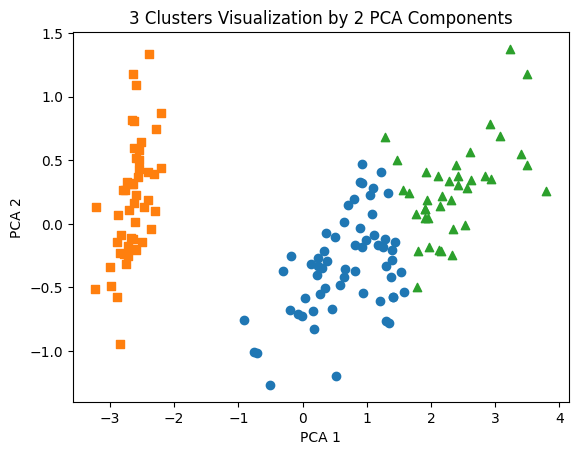
- 네모 마커: 다른 군집과 비교적 뚜렷하게 분리된다.
- 동그라미, 세모 마커: 서로 가까운 위치에 있어 일부 구간에서 겹친다.

### 가상 데이터 군집화 테스트 (`make_blobs`)

군집화 알고리즘이 유사한 데이터끼리 잘 묶는지 확인하기 위해 `make_blobs`로 가상 데이터를 생성해 시각화하였다. 아래 그림은 군집 3개를 갖는 원본 데이터이다.

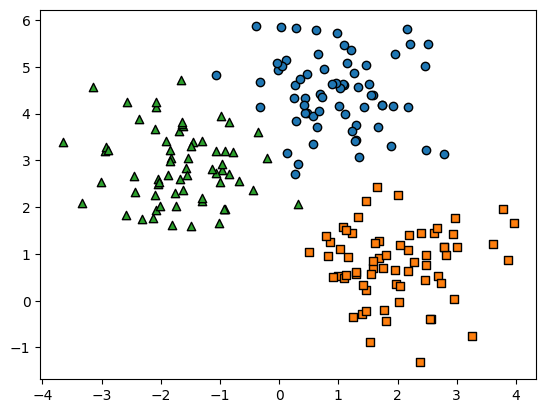

이 데이터에 K-평균을 적용하고 중심점 3개를 함께 표시하면, 군집이 비교적 잘 형성되는 것을 시각적으로 확인할 수 있다.

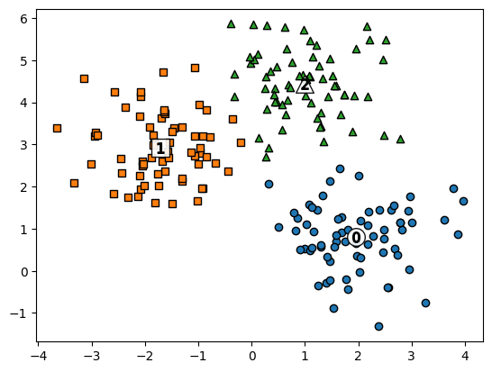

> **`cluster_std` 파라미터의 효과**: `cluster_std`(표준 편차)가 커질수록 각 군집 내부 데이터가 더 넓게 퍼지고, 군집 간 경계가 겹치기 쉬워져 군집화 성능이 저하될 수 있다.

---

## 7-2. 군집 평가 (Cluster Evaluation) - 실루엣 분석

### 군집 평가의 필요성
실전의 군집화 데이터는 대부분 정답 레이블(Target)이 없다. 따라서 분류 문제처럼 정확도를 계산하기 어렵고, 군집 간 분리 정도를 평가하는 실루엣 분석(Silhouette Analysis)을 자주 활용한다.

### 실루엣 분석의 핵심
실루엣 분석은 각 데이터가 자신이 속한 군집에 얼마나 잘 포함되어 있고, 다른 군집과는 얼마나 잘 떨어져 있는지를 계수로 나타낸다.

$$s(i) = \frac{b(i) - a(i)}{\max(a(i), b(i))}$$

- **$a(i)$ (응집도)**: 같은 군집 내 다른 데이터와의 평균 거리이다. 작을수록 좋다.
- **$b(i)$ (분리도)**: 가장 가까운 다른 군집과의 평균 거리이다. 클수록 좋다.

- **계수 범위 (-1 ~ 1)**: 1에 가까울수록 잘 군집화된 상태이고, 0에 가까우면 군집 경계에 위치한 경우이며, 음수이면 다른 군집에 잘못 할당되었을 가능성이 크다.

### 실습: 붓꽃 데이터의 실루엣 분석 결과

```text
붓꽃 데이터셋 Silhouette Analysis Score (전체 평균): 0.551

개별 군집별 평균 실루엣 계수:
cluster 0: 0.422
cluster 1: 0.798
cluster 2: 0.437
```
1번 군집은 0.8에 가까운 높은 점수를 보여 잘 분리된 반면, 0번과 2번 군집은 서로 가까워 점수가 0.4대로 낮게 나타났다. 따라서 전체 평균만 볼 것이 아니라 군집별 점수가 얼마나 고르게 분포하는지도 함께 확인해야 한다.

### 실루엣 시각화 차트를 통한 최적의 K 찾기
`make_blobs` 데이터에 대해 중심점 개수를 2, 3, 4, 5로 바꾸어가며 실루엣 분포를 시각화하면 적절한 군집 개수를 찾는 데 도움이 된다.

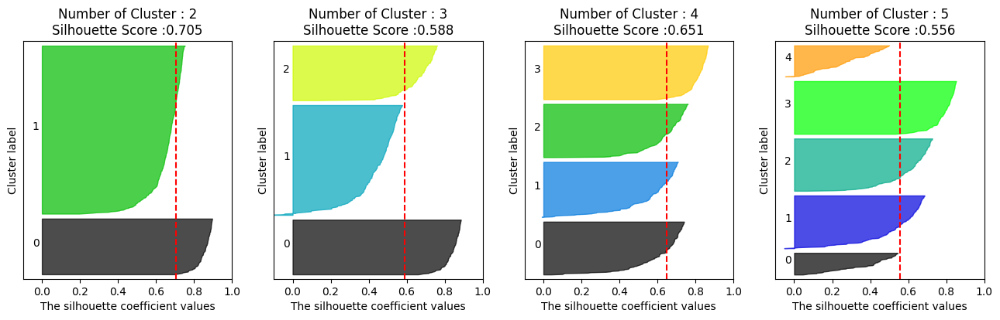
- **k=2일 때**: 평균 실루엣 점수는 높지만 특정 군집이 지나치게 큰 비중을 차지해 균형이 좋지 않다.
- **k=4일 때**: 평균 점수는 약간 낮더라도 각 군집이 비교적 고르게 형성되어 있다.

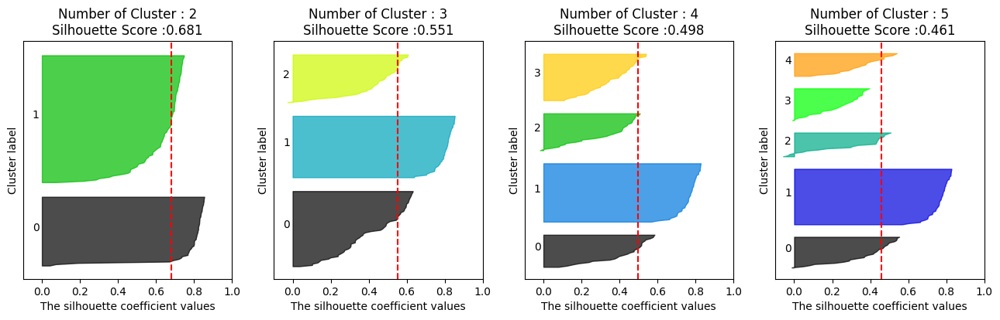
- 같은 방법으로 붓꽃 데이터에 적용하면 `k=2`일 때 평균 실루엣 값과 분포가 가장 안정적으로 나타난다. 반대로 군집 수가 늘어날수록 평균 점수는 낮아지고 분포도 불균형해진다.

> **주의사항**: 실루엣 분석은 $O(N^2)$ 복잡도를 가지므로 데이터가 많아질수록 연산량과 메모리 사용량이 크게 증가한다. 대규모 데이터에서는 샘플링과 함께 사용하는 것이 현실적이다.

---

## 7-3. 평균 이동 (Mean Shift)

K-평균이 중심점과의 거리를 기준으로 군집을 형성한다면, 평균 이동은 밀도가 높은 방향으로 중심을 이동시키며 군집을 찾는 방식이다.  
즉, **KDE**를 기반으로 확률 밀도 함수의 피크를 추적하면서 군집 중심을 결정한다.

### 특징 및 파라미터 튜닝
평균 이동은 K-평균과 달리 군집 개수($k$)를 미리 정할 필요가 없다. 대신 핵심 하이퍼파라미터로 **대역폭(Bandwidth, $h$)** 을 사용한다.

- $h$가 작을 때: 데이터의 작은 변화까지 민감하게 반영하여 군집 수가 지나치게 많아질 수 있다.
- $h$가 클 때: 전체를 너무 넓게 묶어 군집 구조를 충분히 반영하지 못할 수 있다.

결과가 대역폭에 민감하므로, 사이킷런에서는 `estimate_bandwidth()` 함수로 적절한 값을 추정할 수 있다.

```python
from sklearn.cluster import estimate_bandwidth
# 최적의 대역폭 자동 계산
bandwidth = estimate_bandwidth(X)
```
```text
bandwidth 값: 1.816
```
추정한 대역폭을 적용해 Mean Shift를 수행하면, 가상 데이터에서 의도한 3개 군집을 비교적 명확하게 구분하는 결과를 얻을 수 있다.

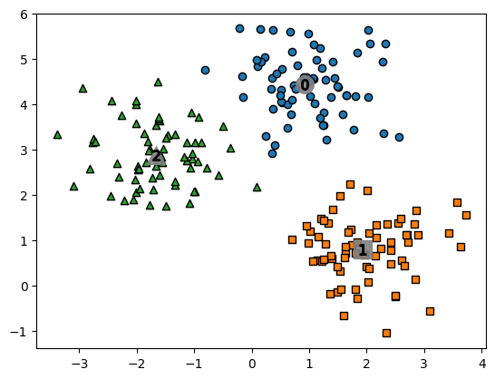

> **요약**: Mean Shift는 데이터 분포를 유연하게 반영할 수 있어 영상 처리나 세그멘테이션 같은 문제에 강점을 보이지만, 연산량이 큰 편이라 대용량 데이터에서는 부담이 크다.

---

## 7-4. GMM (Gaussian Mixture Model)

GMM은 전체 데이터가 여러 개의 정규 분포(가우시안 분포)가 섞여 생성되었다고 가정하는 모델이다. 각 군집의 평균과 분산을 추정하며, 일반적으로 EM(Expectation-Maximization) 알고리즘을 기반으로 동작한다.

기존의 거리 기반 군집화와 달리, GMM은 각 데이터가 특정 군집에 속할 확률을 바탕으로 군집을 나눈다는 점에서 차이가 있다.

### K-평균 vs GMM의 비교 (붓꽃 데이터)

```text
### GMM Clustering ###
target  gmm_cluster
0       1              50
1       0              45
        2               5
2       0               0
        2              50

### KMeans Clustering ###
target  kmeans_cluster
0       1                 50
1       0                 47
        2                  3
2       0                 14
        2                 36
```
군집 경계가 겹치는 Target 1과 Target 2를 비교하면, GMM이 KMeans보다 원래 레이블 분포에 더 가까운 결과를 보인다. 즉, 경계가 모호한 데이터에서는 GMM이 더 유리할 수 있다.

### 데이터 분포 모양에 따른 GMM의 장점

K-평균은 중심점과의 거리만 고려하기 때문에 군집을 주로 원형(Circular)으로 가정하는 경향이 있다. 반면 GMM은 분산 구조를 함께 고려하므로 타원형(Elliptical) 분포에도 더 잘 대응한다.

이를 확인하기 위해 `make_blobs`로 생성한 데이터를 일부러 타원형으로 변형해 보았다.

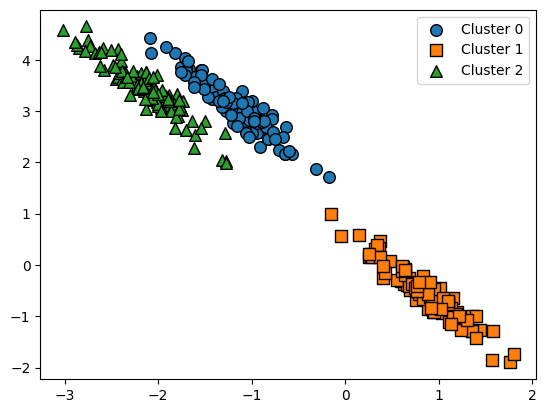

먼저 **K-평균**을 적용하면 다음과 같다.


거리 중심 기준이라 데이터가 길게 뻗은 방향을 반영하지 못하고, 경계를 단순하게 나누면서 서로 다른 군집이 섞이는 모습을 보인다.

반면 **GMM**을 적용하면 다음과 같다.

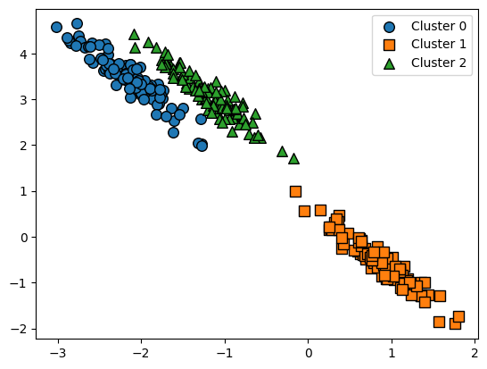

데이터의 분산 방향을 함께 고려하기 때문에 타원형 구조를 더 자연스럽게 반영하며 군집을 구분한다.

단점은 분포를 확률적으로 추정해야 하므로 K-평균보다 연산 부담이 더 크다는 점이다.

---

## 7-5. DBSCAN (밀도 기반 군집화)

DBSCAN은 이름 그대로 밀도(Density)를 기반으로 군집을 찾는 알고리즘이다. 군집의 모양이 일정하지 않더라도 잘 대응할 수 있고, 이상치(노이즈)까지 함께 식별할 수 있다는 점이 큰 장점이다.

- **두 가지 핵심 조절 파라미터**
  - **`eps` (입실론)**: 한 점 주변을 이웃으로 볼 반경 크기이다.
  - **`min_samples`**: 해당 반경 안에 포함되어야 하는 최소 이웃 수이다.

- **처리 과정**
  충분한 이웃을 가진 핵심 포인트를 기준으로 주변 점들을 연결하면서 군집을 확장한다. 어느 군집에도 속하지 못하는 점은 `-1` 레이블을 부여해 노이즈(Noise)로 분류한다.

### 파라미터 조절 시각화 비교 (붓꽃 데이터)

- **기본 설정 (`eps=0.6, min_samples=8`)**

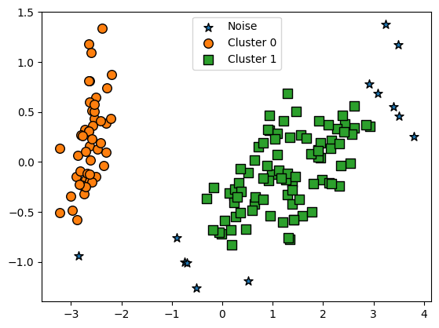

밀도가 높은 중앙 영역은 하나의 큰 군집으로 묶이고, 바깥쪽 일부 데이터는 노이즈(`-1`)로 분류된다.

- **`eps=0.8` 로 영역 증가 (`min_samples=8`)**

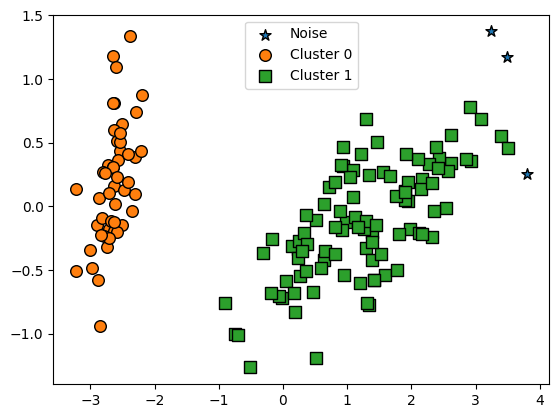

반경을 넓히면 이전에 노이즈로 분류되던 외곽 점들이 기존 군집에 포함되면서 노이즈가 줄어든다.

- **`min_samples=16` 로 최소 개수 기준 강화 (`eps=0.6`)**

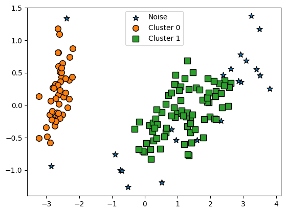

핵심 포인트가 되기 위한 조건이 더 엄격해지므로, 외곽에 있는 점들이 더 쉽게 노이즈로 분류된다.

### DBSCAN의 강점: `make_circles` 데이터 세트

동심원처럼 복잡한 구조를 갖는 `make_circles` 데이터에 여러 군집화 알고리즘을 적용해 비교해 보았다.

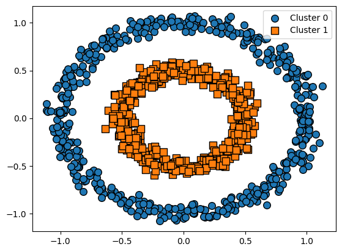

1. **KMeans의 한계**

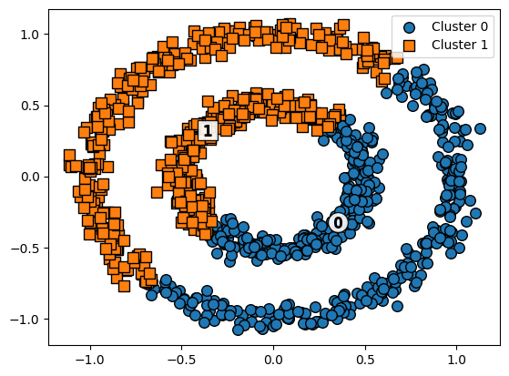

중심점 거리만 기준으로 하기 때문에 동심원 구조를 반영하지 못하고 데이터를 단순하게 분할한다.

2. **GMM의 한계**

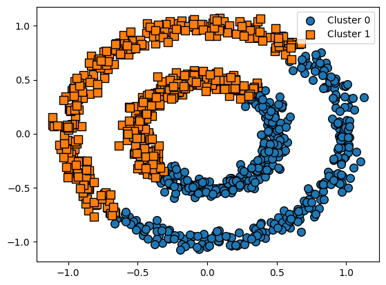

타원형 분포에는 강하지만 동심원처럼 비선형적인 구조는 충분히 설명하지 못한다.

3. **DBSCAN의 결과**

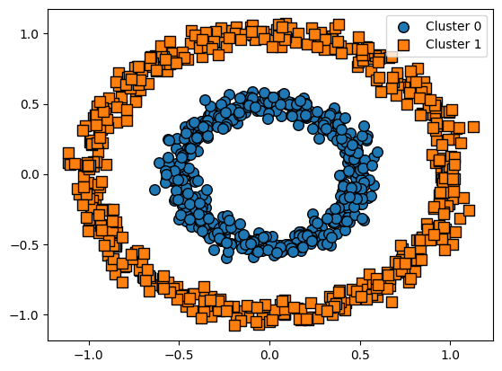

이웃한 점들의 밀도를 따라가며 군집을 확장하기 때문에 내부 원과 외부 원을 자연스럽게 구분한다.

> **최종 요약**
DBSCAN은 군집 개수를 미리 정하지 않아도 되고, 노이즈를 따로 식별할 수 있으며, 복잡한 기하학적 구조에도 비교적 강하다. 다만 데이터의 밀도 차이가 큰 경우에는 `eps`, `min_samples`를 세밀하게 조정해야 원하는 결과를 얻을 수 있다.
