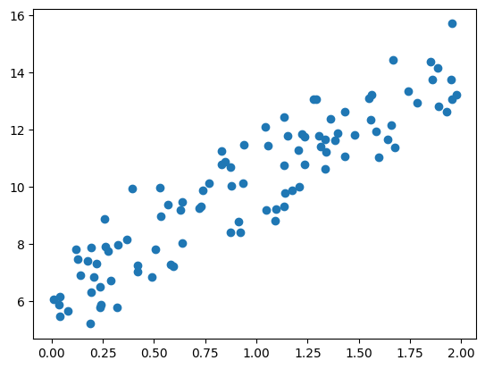
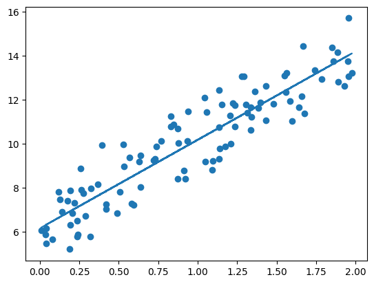
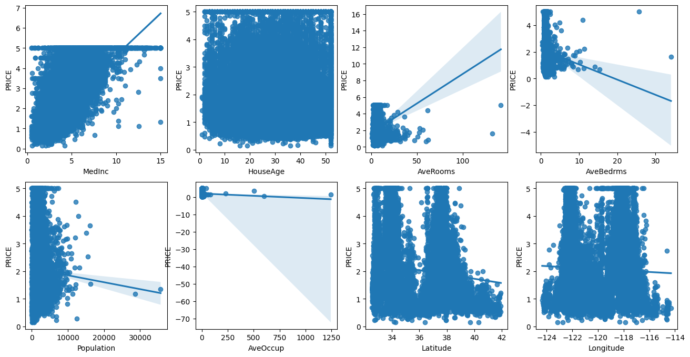
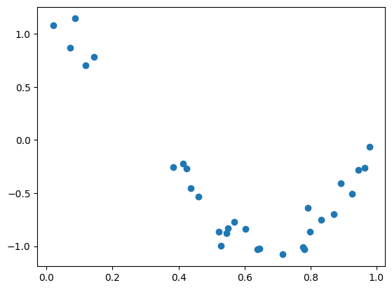
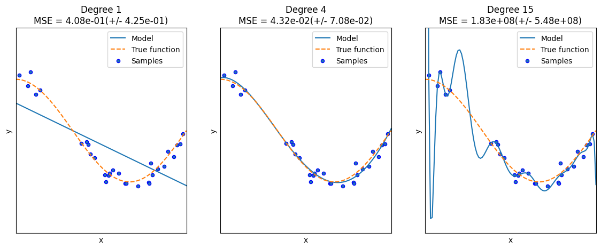
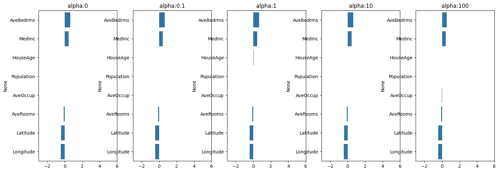
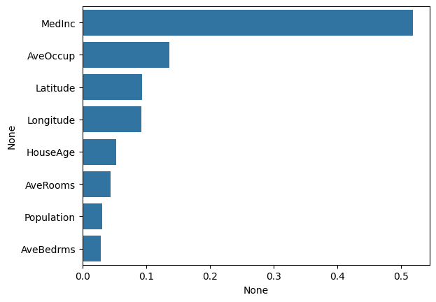
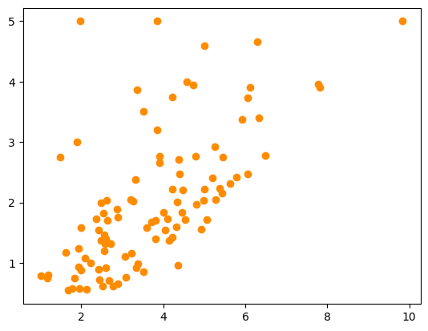
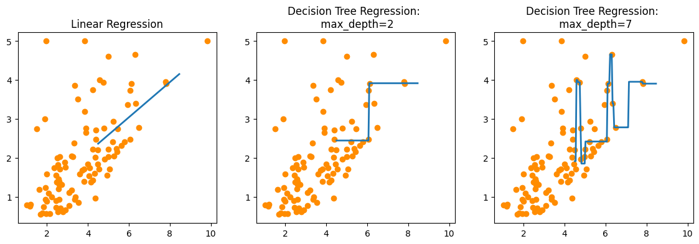

# 『파이썬 머신러닝 완벽 가이드』 5장. 회귀(Regression)

> 책 5장 내용 + [5.3~5.6 선형 모델 및 규제](https://github.com/Chankyu99/ModuLABS/blob/master/04_MachineLearning/Regression/5.3_Gradient_Descent_5.4_LinearModel_5.5_Polynomial_5.6_Regularized_model.ipynb) + [5.7~5.8 로지스틱 회귀 및 회귀 트리](https://github.com/Chankyu99/ModuLABS/blob/master/04_MachineLearning/Regression/5.7_로지스틱_회귀_5.8_회귀_트리.ipynb)
(Note: 책에서는 보스턴 주택 데이터가 사용되었으나, 사이킷런 버전 문제로 **캘리포니아 주택 데이터(California Housing)** 로 대체하여 실습을 진행함.)

---

## 5-1. 회귀 소개

회귀(Regression) : 여러 개의 독립변수와 한 개의 종속변수 간의 상관관계를 모델링하는 기법

$$ Y = W_1^{\ast}X_1 + W_2^{\ast}X_2 + \dots + W_n^{\ast}X_n $$

- $W_i$ : 가중치(Weight), 회귀계수(Coefficient) -> 선형/비선형 회귀 결정
- $X_i$ : 독립변수(Feature) -> 단일/다중 회귀 결정
- $Y$ : 종속변수(Target)

분류와 차이점 : 회귀는 연속형 숫자값을 예측, 분류는 이산형 클래스 예측

대표적인 선형 회귀 모델 
- 일반 선형 회귀
- 릿지 (Ridge)
- 라쏘 (Lasso)
- 엘라스틱넷 (ElasticNet)

## 5-2. 단순 선형 회귀를 통한 회귀 이해

독립변수, 종속변수가 각각 하나인 선형회귀. 

실제 값과 회귀 모델의 차이에 따른 오류값이 잔차 -> 이 잔차의 합이 최소가 되는 모델을 만드는 것 혹은 오류 값 합이 최소가 될 수 있는 최적의 회귀 계수를 찾는다는 의미

오류 값의 합을 구하는 방식에서 MAE, RSS 등을 사용하는데 RSS를 사용하면 계산이고 미분이 편리해 비용 함수로 많이 사용함

$$ \text{RSS}(\omega_0, \omega_1) = \frac 1N \sum_{i=1}^{N}(y_i - (\omega_0 + \omega_1x_i))^2 $$

위 식(비용 함수 혹은 손실 함수라고 함)을 최소화하는 최적 회귀 계수 $\omega_0, \omega_1$를 찾으면 됨

## 5-3. 비용 최소화하기 - 경사 하강법(Gradient Descent) 소개

비용 함수가 최소가 되는 파라미터 $\omega$를 찾기 위해 경사 하강법을 사용함. 고차원 방정식을 쓰지 않고도 직관적인 방법이다.

점진적으로 반복적인 계산을 통해 파라미터 값을 업데이트하며 오류 값이 최소가 되는 파라미터를 구하는 방식이다.

오류를 감소시키는 방향으로 파라미터를 업데이트 해나간다. 오류 값이 더 이상 작아지지 않으면 그 오류 값을 최소 비용으로 판단하고 그때의 파라미터값을 최적 파라미터로 반환한다.

$$ \frac{\partial R (\omega)}{\partial \omega_1} = -\frac 2N \sum_{i=1}^N x_i(y_i - (\text{예측값})) $$

$$ \frac{\partial R (\omega)}{\partial \omega_0} = -\frac 2N \sum_{i=1}^N (y_i - (\text{예측값})) $$

이를 반복적으로 보정하며 업데이트(새로운 $\omega$를 이전 $\omega$에서 편미분 결괏값을 빼줌) 하면 비용 함수가 최소가 되는 파라미터 값을 구할 수 있다.

편미분 값이 너무 커서 보정 계수($\eta$)를 곱해주는데, 이게 바로 **학습률(Learning Rate)**이다.

정리하면:
1. 임의의 파라미터값 설정 (초기화)
2. 파라미터값의 오차를 구하고 보정 계수를 곱해 예측값 업데이트
3. 2번 과정을 반복하며 비용 함수가 최소가 되는 파라미터값 찾기

### 코드 구현 및 시각화

가상의 $y = 4X + 6$ 과 유사한 데이터를 생성해 경사 하강법을 적용해보았다.



위 데이터에 대해 1000번 반복 수행하며 $\omega_1, \omega_0$를 업데이트한 결과는 다음과 같다.

```
w1:4.022 w0:6.162
Gradient Descent Total Cost:0.9935
```

업데이트된 회귀선 시각화:



업데이트 과정이 전체 데이터를 대상으로 이루어지면 수행 시간이 매우 오래 걸린다는 단점이 있어 실전에서는 `Stochastic Gradient Descent(확률적 경사 하강법)`을 사용한다. 일부 데이터(미니 배치)만 이용해 파라미터 업데이트 값을 계산하기 때문에 속도가 훨씬 빠르다. 

```
w1: 4.028 w0: 6.156
Stochastic Gradient Descent Total Cost:0.9937
```
> 비용은 비슷하게 나오면서도 연산이 훨씬 빠르므로, 대용량 데이터 환경에서 최적 비용 함수 도출 시에는 확률적 경사 하강법을 사용한다.

지금까지 피처가 1개인 단순회귀였다면 피처가 여러 개인 다중회귀로 넘어가면 벡터의 내적, 즉 선형대수를 활용한 행렬곱으로 쉽게 계산이 가능하다.
$$ \hat Y = X_{mat} \cdot \omega^T + \omega_0 $$

---

## 5-4. 사이킷런 LinearRegression을 이용한 캘리포니아 주택 가격 예측

책에서는 보스턴 주택 데이터를 사용하였으나, 사이킷런의 최신 버전(1.2 이상) 문제로 캘리포니아 주택 데이터 세트로 대체하였다.

- `MedInc`: 블록 내 가구 소득의 중앙값
- `HouseAge`: 블록 내 주택 연령의 중앙값
- `AveRooms`: 가구당 평균 방 개수
- `AveBedrms`: 가구당 평균 침실 개수
- `Population`: 거주 인구수
- `AveOccup`: 가구당 평균 거주 인원
- `Latitude`, `Longitude`: 위도, 경도

캘리포니아 주택의 피처들과 타깃 변수(주택 가격) 간의 변화를 시각화한 결과는 다음과 같다.



이를 통해 `MedInc`(가구 소득)가 주택 가격과 가장 확연한 양의 상관관계를 나타냄을 알 수 있다.

LinearRegression을 적용해 평가한 결과이다.

```python
from sklearn.linear_model import LinearRegression
from sklearn.metrics import mean_squared_error, r2_score

# ... (train_test_split 후 적용)
```

```
MSE : 0.543 , RMSE : 0.737
Variance score : 0.595

절편 값: -37.23905305294163
회귀 계수값: [ 0.4  0.  -0.1  0.6 -0.  -0.  -0.4 -0.4]
```

교차 검증(cross_val_score) 5 폴드로 개별 및 평균 RMSE 측정한 결과, 모델 성능은 평균 **0.746 RMSE**로 측정되었다.

---

## 5-5. 다항 회귀와 과(대)적합/과소적합 이해

### 다항 회귀 이해

지금까지는 독립변수와 종속변수가 1차항인 관계를 다루었으나, 실제 데이터는 다항(Polynomial)적인 관계를 가질 수 있다. 

$$ y = \omega_0 + \omega_1x_1 + \omega_2x_1^2 + \dots + \omega_nx_1^n $$

단순 직선보다 차수가 높을수록 곡선으로 표현하는 것이 예측 성능이 높다. 사이킷런의 `PolynomialFeatures` 클래스를 통해 피처를 다항식 피처로 변환할 수 있다.

```python
from sklearn.preprocessing import PolynomialFeatures

# 변환된 2차 다항식 계수 feature:
# [[1. 0. 1. 0. 0. 1.]
#  [1. 2. 3. 4. 6. 9.]]
```

변환된 Polynomial 피처에 선형 회귀를 적용하면 여러 노이즈에 대한 다항 방정식 회귀 곡선을 구현할 수 있다. 실제 사이킷런 `Pipeline` 객체를 이용하면 간결하게 구성할 수 있다.



### 다항 회귀를 이용한 과소적합 및 과적합 이해

차수가 높아질수록 복잡한 모델을 만들 수 있지만, **학습 데이터에 너무 핏팅되어 새로운 데이터에 대한 일반화 예측 성능이 크게 떨어지는 과적합 문제가 발생**한다.
다음 1차(단순), 4차, 15차 회귀 예측 곡선을 비교해본다.



```
Degree 1 회귀 계수는 [-1.61] 입니다.
Degree 1 MSE 는 0.4077 입니다.

Degree 4 회귀 계수는 [  0.47 -17.79  23.59  -7.26] 입니다.
Degree 4 MSE 는 0.0432 입니다.

Degree 15 회귀 계수는 [-2.98293000e+03  ... ] 입니다.
Degree 15 MSE 는 182815433 ... 입니다.
```

- **Degree 1 (맨 왼쪽)**: 학습 데이터의 추세를 반영하지 못하는, 지나치게 단순한 선형식. **과소적합**의 문제가 발생한다.
- **Degree 4 (가운데)**: 학습 데이터의 패턴과 노이즈를 적절하게 반영하는 균형 잡힌 모델
- **Degree 15 (맨 오른쪽)**: MSE가 말도 안 되는 수치가 나오며, 곡선의 출렁거림이 심각해 새로운 데이터에 대한 예측 성능이 완전히 박살 난다. **과적합**의 전형적인 예시이다.

### 편향-분산 트레이드오프(Bias-Variance Tradeoff)

머신러닝이 극복해야 할 가장 중요한 이슈 중 하나이다. 

- 과소적합된 모델: 편향이 크고 분산이 작다.
- 과대적합된 모델: 편향이 작고 분산이 크다.

일반적으로 편향과 분산은 한쪽이 높으면 한쪽이 낮아지는 경향이 있으므로, 이들이 트레이드오프를 이루며 전체 오류 Cost 값이 최대로 낮아지는 지점을 찾는 최적의 모델 구축이 중요하다.

---

## 5-6. 규제 선형 모델 - 릿지, 라쏘, 엘라스틱넷

### 규제 선형 모델의 개요

좋은 회귀 모델은 편향-분산 트레이드오프를 이루며, 회귀 계수가 기하급수적으로 커지는 것을 제어할 수 있어야 한다. 비용 함수에 **회귀 계수 값의 크기를 제어할 수 있는 페널티 항을 추가하여 모델의 복잡도를 제어**하는 것을 **규제(Regularization)**라고 한다.

$$ \text{비용 함수 목표} = \text{Min}( \text{RSS}(W) + \alpha \times ||W||_2^2 ) $$

여기서 $\alpha$는 규제 강도를 조절하는 튜닝 파라미터이다.
- $\alpha = 0$ 이면 일반적인 선형 회귀 (오직 RSS 최소화)
- $\alpha \to \infty$ 이면 회귀계수를 0에 가깝게 만들도록 영향을 크게 주어 복잡도 최소화

### 릿지 회귀(Ridge Regression)

릿지 회귀는 **L2 규제**를 사용한다. 회귀 계수의 **제곱합**을 페널티 항으로 사용한다.

```
alpha 0 일 때 5 folds 의 평균 RMSE : 0.746 
alpha 0.1 일 때 5 folds 의 평균 RMSE : 0.746 
...
alpha 100 일 때 5 folds 의 평균 RMSE : 0.746
```
(캘리포니아 데이터셋의 피처 관계 특성상 alpha 변화에 따른 성능 폭 변화가 그리 크지 않았다.)

하지만 alpha 값을 계속 증가시킬수록 릿지 모델의 각 회귀 계수 값은 지속적으로 작아지는 것을 시각화할 수 있다.



> 릿지 회귀는 회귀 계수를 점점 작아지게 할 뿐 0으로 만들지는 않는다.

### 라쏘 회귀(Lasso Regression)

라쏘 회귀는 **L1 규제**를 사용한다. 회귀 계수의 **절댓값**을 페널티 항으로 사용한다. L1 규제를 적용하면 불필요한 회귀 계수를 급격히 감소시키며 0으로 만들 수 있으므로 일종의 피처 선택 기능도 한다.

```
#######  Lasso #######
alpha 0.07일 때 5 폴드 세트의 평균 RMSE: 0.784 
alpha 0.1일 때 5 폴드 세트의 평균 RMSE: 0.813 
alpha 0.5일 때 5 폴드 세트의 평균 RMSE: 0.873 
alpha 1일 때 5 폴드 세트의 평균 RMSE: 1.000 
```

### 엘라스틱넷 회귀(ElasticNet Regression)

엘라스틱넷은 **L1 규제와 L2 규제를 모두 사용**한다.

$$ RSS(W) + \alpha_1 \times ||W||_1 + \alpha_2 \times ||W||_2^2 $$

라쏘는 서로 상관관계가 높은 다중 피처들 중에서 하나만 선택하고 나머지는 회귀 계수를 0으로 만들어 버리는 성향이 강하기 때문에, 이를 완화하기 위해 L2 규제를 섞은 것이다. 유일한 단점은 수행 시간이 상대적으로 오래 걸린다는 것이다.

```
#######  ElasticNet #######
alpha 0.07일 때 5 폴드 세트의 평균 RMSE: 0.773 
alpha 0.1일 때 5 폴드 세트의 평균 RMSE: 0.788 
alpha 0.5일 때 5 폴드 세트의 평균 RMSE: 0.855 
...
```

### 선형 회귀 모델을 위한 데이터 변환

선형 회귀 모델 성능 향상을 위해 인코딩과 피처 데이터의 분포도 변환(스케일링, 정규화, 로그 변환)이 중요하다. 분포가 왜곡된 곳에서 성능이 크게 떨어지기 때문이다.
1. **StandardScaler**: 표준 정규 분포
2. **MinMaxScaler**: 최솟값 0, 최댓값 1
3. 각각 변환 후에도 성능 향상이 없다면, 다항 특성 적용(PolynomialFeatures)
4. **Log 변환(log1p)**: 원래 값에 1을 더한 후 로그를 씌워 정규 분포 꼴로 변환 (타깃값 및 우측 꼬리가 긴 피처에 가장 효과적이고 흔하게 많이 쓰임)

---

## 5-7. 로지스틱 회귀

로지스틱 회귀는 선형 회귀 방식을 **분류**에 적용한 알고리즘이다. 선형 회귀의 예측값을 확률로 변환하기 위해 시그모이드 함수를 사용한다.

$$ \text{Sigmoid} = \frac{1}{1 + e^{-z}} $$

시그모이드 함수 개형에 따라 항상 0과 1 사이의 값을 반환하여 이진 분류 등에 유용하게 쓰인다.

사이킷런 LogisticRegression의 가장 주요한 파라미터는 `solver`로, 다양한 최적화 방안을 선택할 수 있다.

```python
from sklearn.linear_model import LogisticRegression
from sklearn.metrics import accuracy_score, roc_auc_score

lr_clf = LogisticRegression(solver='liblinear')
# ...
```

위스콘신 유방암 데이터 세트 적용 결과: 
```
accuracy: 0.977, roc_auc:0.995

solver:lbfgs, accuracy: 0.977, roc_auc:0.995
solver:liblinear, accuracy: 0.982, roc_auc:0.995
solver:newton-cg, accuracy: 0.977, roc_auc:0.995
solver:sag, accuracy: 0.982, roc_auc:0.995
solver:saga, accuracy: 0.982, roc_auc:0.995
```

하이퍼 파라미터 `C`, `penalty` 등을 GridSearchCV로 최적화하면 아래와 같은 결과를 얻는다.
`최적 하이퍼 파라미터:{'C': 0.1, 'penalty': 'l2', 'solver': 'liblinear'}, 최적 평균 정확도:0.979`

---

## 5-8. 회귀 트리

회귀에 사용되는 **트리 기반 앙상블 알고리즘**. 
결정 트리 분류 모델과 거의 비슷하지만, 리프 노드에서 특정 클래스를 선택하는 대신 **리프 노드에 속한 데이터 값들의 평균값을 구해서 회귀 예측값을 반환**한다 점이 핵심적 차이.

사이킷런의 Estimator 클래스는 DecisionTreeRegressor, RandomForestRegressor, GradientBoostingRegressor, XGBRegressor, LGBMRegressor 등을 제공한다.

캘리포니아 주택 가격 데이터 세트 교차 검증 예측 결과:
```
#####  DecisionTreeRegressor  #####
 5 교차 검증의 평균 RMSE : 0.809 
#####  RandomForestRegressor  #####
 5 교차 검증의 평균 RMSE : 0.651 
#####  GradientBoostingRegressor  #####
 5 교차 검증의 평균 RMSE : 0.627 
```

선형 모델과 마찬가지로, `feature_importances_`를 이용해 피처 별 중요도를 시각화할 수 있다.
캘리포니아 데이터의 경우 RandomForestRegressor 학습 결과 위에서 가장 중요한 상관관계를 보였던 `MedInc` 피처가 최우선 순위에 존재한다.



#### 회귀 트리의 예측 특성 시각화
과연 트리 기반 모델이 어떻게 계단식 예측을 수행하는 지 선형 회귀 직선과 비교해보기 위해 주택 가격에 가장 큰 영향력을 미친 1가지 피처 `MedInc`만을 이용해 시각화해보았다.



선형 회귀선과 트리 깊이에 따른(`max_depth=2`, `max_depth=7`) 회귀 트리 모델의 예측 곡선 변화는 다음과 같다.



선형 회귀(왼쪽)는 부드러운 직선으로 예측선을 표현하지만, 회귀 트리(가운데, 오른쪽)는 데이터가 쪼개지면서 계단식(Step) 구간 형태로 예측선을 표현한다.

또한 `max_depth`가 7로 깊어지면 학습 데이터의 노이즈, 이상치 데이터까지 학습하는 계단식 예측선이 만들어져 과적합되기 쉬운 모델이 되었음을 확인할 수 있다.
