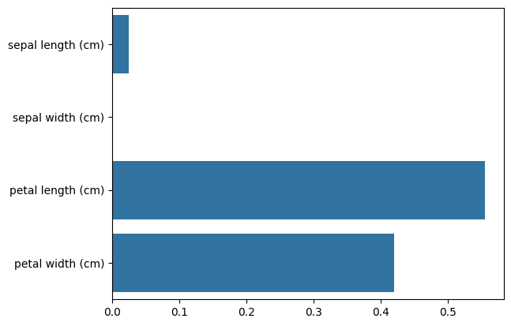
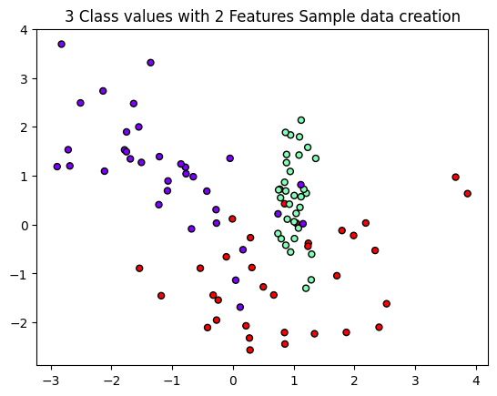
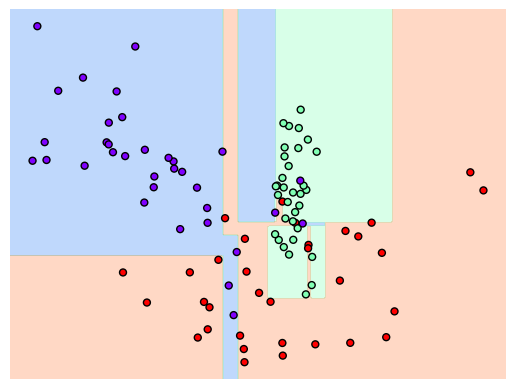
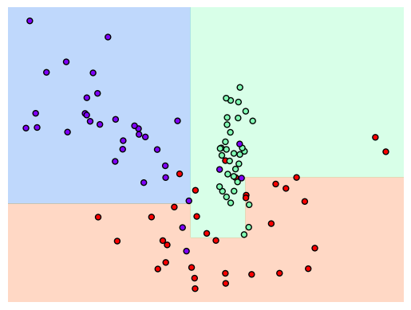
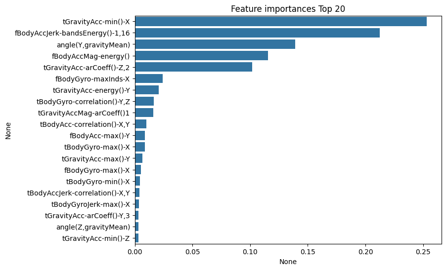
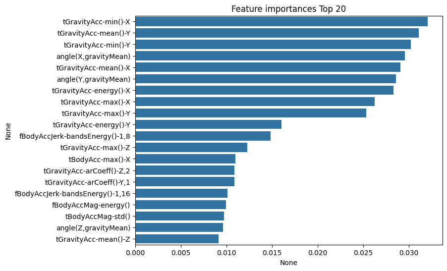
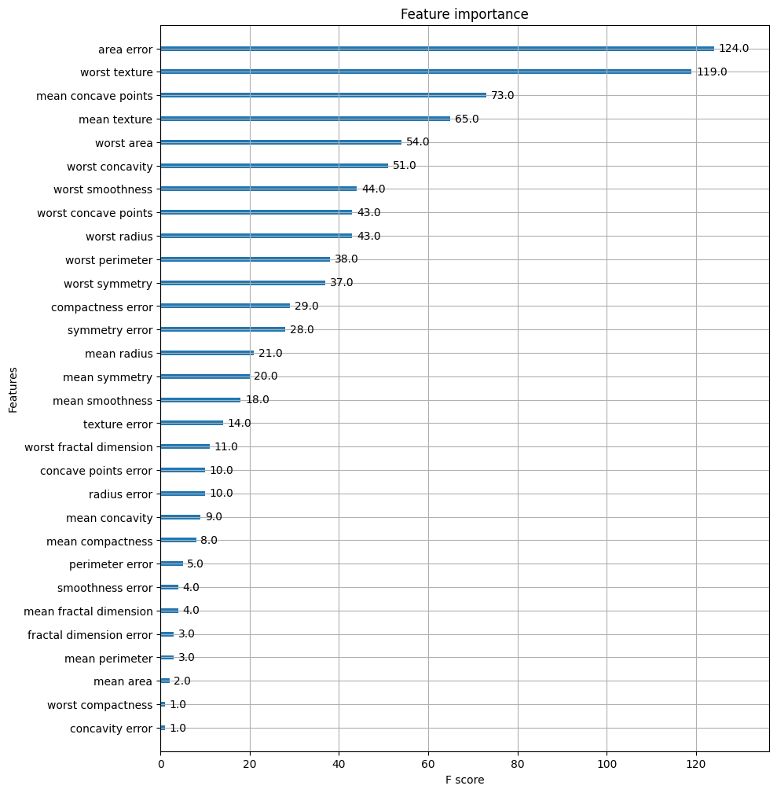
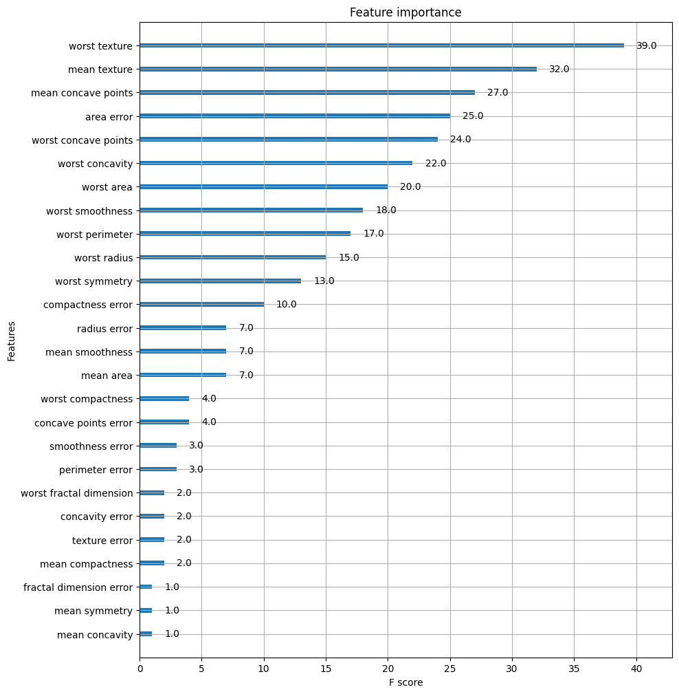
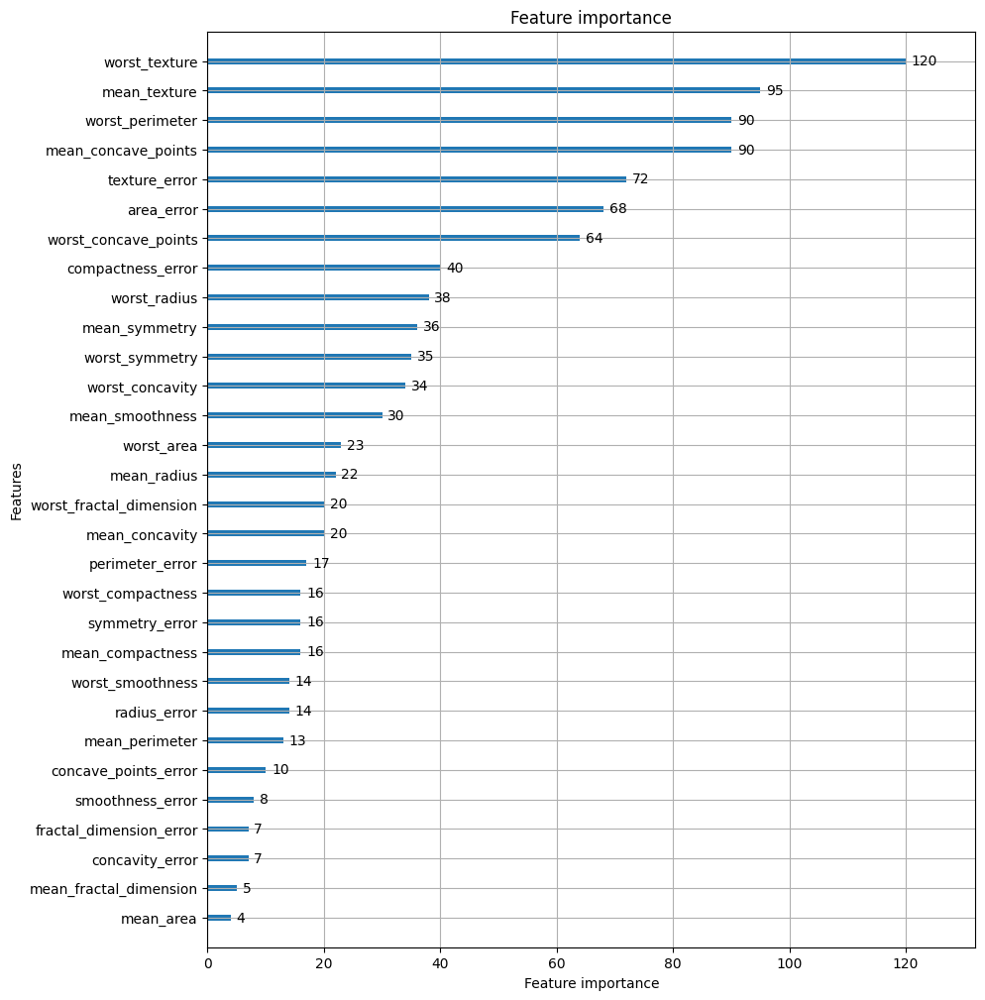

# 『파이썬 머신러닝 완벽 가이드』 4장. 분류(Classification)

> 책 4장 내용 + [4.2 결정 트리](https://github.com/Chankyu99/ModuLABS/blob/master/04_MachineLearning/Study/Classification/4.2%20결정%20트리.ipynb) + [4.3~4.5 앙상블·랜덤포레스트·GBM](https://github.com/Chankyu99/ModuLABS/blob/master/04_MachineLearning/Study/Classification/4.3_앙상블학습_4.4_랜덤포레스트_4.5_GBM.ipynb) + [4.6 XGBoost](https://github.com/Chankyu99/ModuLABS/blob/master/04_MachineLearning/Study/Classification/4.6%20XGBoost.ipynb) + [4.7 LightGBM](https://github.com/Chankyu99/ModuLABS/blob/master/04_MachineLearning/Study/Classification/4.7%20LightGBM.ipynb) + [4.8 HyperOpt](https://github.com/Chankyu99/ModuLABS/blob/master/04_MachineLearning/Study/Classification/4.8%20베이지안%20최적화.ipynb) + [4.11 스태킹](https://github.com/Chankyu99/ModuLABS/blob/master/04_MachineLearning/Study/Classification/4.11%20스태킹%20앙상블.ipynb)

---

지도학습은 레이블, 즉 명시적인 정답이 있는 데이터가 주어진 상태에서 학습하는 머신러닝 방식이다. 대표 유형인 **분류(Classification)**는 학습 데이터의 피처와 레이블 값을 ML 알고리즘으로 학습해 모델을 생성하고, 새로운 데이터에 대해 레이블을 예측하는 것이다.

분류는 나이브 베이즈, 로지스틱 회귀, 결정 트리, 서포트 벡터 머신, 최소 근접, 신경망, 앙상블 등 다양한 알고리즘으로 구현 가능하다. 여기서는 **앙상블** 계열을 주로 다루었다.

---

## 4-1. 결정 트리

ML 알고리즘 중 직관적으로 이해하기 쉬운 알고리즘이다. 데이터를 분석하여 **규칙**을 만들고, 이 규칙을 기반으로 분류를 수행한다.

- **규칙 노드** : 규칙 조건 (보통 if/else 구조)
- **리프 노드** : 결정된 클래스 값
- **서브 트리** : 새로운 규칙 조건마다 생성

> 규칙이 많아짐 → 방식이 복잡해짐 → 트리가 깊어짐 → **과적합**

가능한 한 적은 결정 노드로 높은 예측 정확도를 가지려면, 데이터 분류 시 최대한 많은 데이터 세트가 해당 분류에 속할 수 있도록 결정 노드의 규칙이 정해져야 한다.

### 정보 균일도 측정

결정 노드는 **정보 균일도**가 높은 데이터 세트를 먼저 선택할 수 있도록 규칙 조건을 만든다.

- **엔트로피** : 데이터 집합의 혼잡도. 서로 다른 값이 섞여 있으면 높고, 같은 값이면 낮다
- **정보 이득 지수** : $1 - \text{엔트로피}$. 이것이 높은 속성 기준으로 분할
- **지니 계수** : 0이 가장 균일(평등), 1이 불균일(불평등). 지니 계수가 낮은 속성 기준으로 분할

### 결정 트리의 동작 과정

1. 데이터 집합의 모든 아이템이 같은 분류에 속하는지 확인
2. 같은 분류라면 → 리프 노드로 만들어 분류 결정
3. 그렇지 않다면 → 가장 좋은 속성과 분할 기준 탐색 (정보 이득 / 지니 계수)
4. 해당 속성과 분할 기준으로 데이터 분할하여 Branch 노드 생성
5. **재귀적(Recursive)**으로 모든 데이터의 분류가 결정될 때까지 반복

### 결정 트리 특징

- 정보의 균일도를 기반으로 하고 있어 알고리즘이 쉽고 직관적
- 피처의 스케일링이나 정규화 같은 전처리가 필요 없음
- 그러나 **과적합으로 정확도가 떨어짐** → 트리 크기를 사전에 제한하는 튜닝 필요

### 결정 트리 주요 파라미터

| 파라미터 | 설명 |
| :--- | :--- |
| `min_samples_split` | 노드를 분할하기 위한 최소 샘플 수 |
| `min_samples_leaf` | 리프 노드가 되기 위한 최소 샘플 수 |
| `max_depth` | 트리의 최대 깊이 |
| `max_features` | 분할 시 고려할 최대 피처 수 |
| `max_leaf_nodes` | 리프 노드의 최대 수 |

### 코드 구현 : 결정 트리 시각화

Graphviz를 이용하면 결정 트리가 어떤 규칙으로 트리를 생성하는지 시각적으로 파악할 수 있다.

```python
from sklearn.tree import DecisionTreeClassifier, export_graphviz
from sklearn.datasets import load_iris
import graphviz

dt_clf = DecisionTreeClassifier(random_state=156)
iris_data = load_iris()
dt_clf.fit(iris_data.data, iris_data.target)

export_graphviz(dt_clf, out_file="tree.dot",
                class_names=iris_data.target_names,
                feature_names=iris_data.feature_names,
                impurity=True, filled=True)
```

출력된 노드에서 확인할 수 있는 지표는 다음과 같다.

- `petal length (cm) <= 2.45` : 자식 노드를 만들기 위한 분할 규칙
- `gini` : 해당 노드의 지니 계수
- `value = [50, 50, 50]` : 클래스별 데이터 건수
- 색깔이 짙어질수록 → 지니 계수가 낮고 해당 레이블에 속하는 샘플이 많다는 의미

#### 피처 중요도 확인

사이킷런은 `feature_importances_` 속성을 통해 각 피처가 트리 분할에 얼마나 기여했는지를 정규화된 값으로 확인할 수 있다.

```python
import seaborn as sns
import numpy as np

ftr_importances = dt_clf.feature_importances_
ftr_top = pd.Series(ftr_importances, index=iris_data.feature_names)
ftr_top.sort_values(ascending=False).plot(kind='barh')
```



### 코드 구현 : 과적합 시각화

```python
from sklearn.datasets import make_classification
dt_clf = DecisionTreeClassifier(random_state=156)  # 기본 (제한 없음)
```



> 일부 이상치까지 분류하기 위해 분할이 자주 발생하여 결정 기준 경계가 매우 복잡해진다.





> `min_samples_leaf=6` 제약을 걸면 결정 경계가 훨씬 단순해지며, 일반화 성능이 향상된다.

### 코드 구현 : 사용자 행동 인식 데이터 세트

UCI 머신러닝 리포지토리의 사용자 행동 인식 데이터 세트로 결정 트리 예측 분류를 수행하였다.

```python
dt_clf = DecisionTreeClassifier(random_state=156)
dt_clf.fit(X_train, y_train)
pred = dt_clf.predict(X_test)
print('결정 트리 예측 정확도: {0:.4f}'.format(accuracy_score(y_test, pred)))
```

```
결정 트리 예측 정확도: 0.8548
```

GridSearchCV를 이용한 하이퍼파라미터 튜닝 결과:

```
GridSearchCV 최적 하이퍼 파라미터: {'max_depth': 8, 'min_samples_split': 16}
결정 트리 예측 정확도: 0.8717
```



> 튜닝 후 `max_depth=8`에서 가장 높은 정확도(0.8717)를 달성하였다.

---

## 4-2. 앙상블 학습

여러 개의 분류기(Classifier)를 결합하여 하나의 최종 예측 결과를 만드는 기법이다. 단일 모델보다 더 높은 예측 성능을 제공하며, 특히 결정 트리의 과적합 문제를 해결하는 데 효과적이다.

**보팅, 배깅, 부스팅** 세 가지 유형으로 나뉘며, 이 외에도 스태킹을 포함한 다양한 앙상블 방법이 존재한다.

### 보팅

각기 다른 모델의 예측 결과를 **투표**를 통해 결합하여 최종 예측을 도출하는 방식이다.

- **하드 보팅** : 다수결 방식
- **소프트 보팅** : 모든 모델의 예측 확률을 가중 평균하여 최종 확률 도출

일반적으로는 소프트 보팅이 성능이 좋다.

### 코드 구현 : 보팅 분류기

위스콘신 유방암 데이터 세트로 VotingClassifier를 적용하였다.

```python
from sklearn.ensemble import VotingClassifier

vo_clf = VotingClassifier(estimators=[('LR', lr_clf), ('KNN', knn_clf)], voting='soft')
vo_clf.fit(X_train, y_train)
pred = vo_clf.predict(X_test)
```

```
Voting 분류기 정확도: 0.9561
LogisticRegression 정확도: 0.9474
KNeighborsClassifier 정확도: 0.9386
```

> 보팅 분류기가 무조건 단일 모델보다 좋은 것은 아니지만, 전반적으로 뛰어난 예측 성능을 보인다. **편향-분산 트레이드오프** 관점에서 앙상블은 ML 모델이 극복해야 할 중요 과제이다.

---

## 4-3. 랜덤 포레스트

**배깅(Bagging)**의 대표적인 예시이다. 여러 개의 결정 트리를 학습하여 결과를 결합해 예측 성능을 향상시킨다.

- 각 트리는 **부트스트래핑**으로 무작위 샘플링된 데이터 세트를 기반으로 학습
- 단일 결정 트리의 과적합 단점을 극복하고 뛰어난 예측 성능을 가짐
- 연산 속도도 빠르다

### 주요 하이퍼 파라미터

| 파라미터 | 설명 |
| :--- | :--- |
| `n_estimators` | 결정 트리의 수. 클수록 성능 향상되지만 연산 시간 증가 |
| `max_features` | 분할 시 고려할 최대 피처 수 |
| `max_depth` | 트리의 최대 깊이 |

### 코드 구현 : 사용자 행동 인식 데이터 세트

```python
from sklearn.ensemble import RandomForestClassifier

rf_clf = RandomForestClassifier(random_state=0)
rf_clf.fit(X_train, y_train)
pred = rf_clf.predict(X_test)
```

```
랜덤 포레스트 정확도: 0.9223
```

GridSearchCV 튜닝 결과:

```
최적 하이퍼 파라미터: {'max_depth': 10, 'min_samples_leaf': 8, 'min_samples_split': 8, 'n_estimators': 100}
최고 예측 정확도: 0.9172
```

```python
rf_clf1 = RandomForestClassifier(n_estimators=300, max_depth=10, min_samples_leaf=8,
                                  min_samples_split=8, random_state=0)
```

```
예측 정확도: 0.9162
```

#### 피처 중요도 시각화



---

## 4-4. GBM(Gradient Boosting Machine)

**부스팅** 알고리즘은 여러 개의 약한 학습기를 **순차적으로** 학습·예측하며, 잘못 예측한 데이터에 가중치를 부여해 오류를 개선해 나가는 방식이다.

- **AdaBoost** : 이전 분류기가 틀린 데이터에 가중치를 높여 다음 분류기가 집중
- **GBM** : **경사 하강법**을 이용해 가중치를 업데이트. 반복 수행으로 오류를 최소화

GBM은 분류와 회귀 모두 가능하다.

### GBM 주요 하이퍼 파라미터

| 파라미터 | 설명 |
| :--- | :--- |
| `loss` | 경사 하강법에서 사용할 비용 함수 |
| `learning_rate` | 학습률. 약한 학습기가 오류를 보정하는 계수 |
| `n_estimators` | 약한 학습기의 수 |
| `subsample` | 학습 시 사용하는 데이터 샘플링 비율 |

### 코드 구현 : 사용자 행동 인식 데이터 세트

```python
from sklearn.ensemble import GradientBoostingClassifier

gb_clf = GradientBoostingClassifier(random_state=0)
gb_clf.fit(X_train, y_train)
pred = gb_clf.predict(X_test)
```

```
GBM 정확도: 0.9379
GBM 수행 시간: 490.2 초
```

GridSearchCV 튜닝 결과:

```
최적 하이퍼 파라미터: {'learning_rate': 0.05, 'n_estimators': 500}
GBM 정확도: 0.9406
```

> GBM은 과적합에 강하나 **수행 시간이 매우 오래 걸린다**. 이를 개선한 것이 XGBoost와 LightGBM이다.

---

## 4-5. XGBoost(eXtra Gradient Boost)

트리 기반 앙상블 학습에서 성능이 매우 뛰어나다. GBM의 단점인 느린 수행 시간 및 과적합 규제 부재를 해결하였다.

### XGBoost의 장점

- **병렬 학습** : 병렬 CPU 환경에서 빠른 학습 가능
- **Tree Pruning** : 더 이상 긍정 이득이 없는 분할을 가지치기하여 분할 수를 줄임
- **자체 교차검증** : 반복 수행 시마다 내부적으로 교차검증을 수행해 최적의 반복 횟수를 자동으로 찾아줌
- **Early Stopping** 지원
- **결손값 자체 처리** 기능

### 주요 하이퍼 파라미터

**부스터 파라미터** :

| 파이썬 래퍼 | 사이킷런 래퍼 | 설명 |
| :--- | :--- | :--- |
| `eta` | `learning_rate` | 학습률 (0.01~0.1) |
| `num_boost_round` | `n_estimators` | 부스팅 반복 횟수 |
| `min_child_weight` | `min_child_weight` | 자식 노드 분할 시 최소 가중치 합 |
| `gamma` | `gamma` | 분할 시 손실 감소량의 최소값 |
| `max_depth` | `max_depth` | 트리 최대 깊이 |
| `sub_sample` | `subsample` | 데이터 샘플링 비율 |
| `lambda` | `reg_lambda` | L2 규제 계수 |
| `alpha` | `reg_alpha` | L1 규제 계수 |

**과적합 대응 가이드** :
- `eta` 낮추고 `num_boost_round` 늘리기
- `max_depth` 낮추기 / `min_child_weight` 늘리기
- `gamma` 늘리기 / `subsample`, `colsample_bytree` 비율 낮추기

### 코드 구현 : 파이썬 래퍼 XGBoost — 위스콘신 유방암 예측

```python
import xgboost as xgb

# DMatrix 생성
dtr = xgb.DMatrix(data=X_tr, label=y_tr)
dval = xgb.DMatrix(data=X_val, label=y_val)
dtest = xgb.DMatrix(data=X_test, label=y_test)

params = {'max_depth': 3, 'eta': 0.05,
          'objective': 'binary:logistic', 'eval_metric': 'logloss'}
num_rounds = 400

xgb_model = xgb.train(params, dtr, num_rounds, evals=[(dtr, 'train'), (dval, 'eval')])
```

```
오차 행렬
[[35  2]
 [ 2 75]]
정확도: 0.9649, 정밀도: 0.9740, 재현율: 0.9740, F1: 0.9740, AUC: 0.9965
```

#### 피처 중요도 시각화

```python
from xgboost import plot_importance
plot_importance(xgb_model)
```



### 코드 구현 : 사이킷런 래퍼 XGBoost

```python
from xgboost import XGBClassifier

xgb_wrapper = XGBClassifier(n_estimators=400, learning_rate=0.1, max_depth=3)
xgb_wrapper.fit(X_train, y_train)
w_preds = xgb_wrapper.predict(X_test)
```

```
오차 행렬
[[35  2]
 [ 1 76]]
정확도: 0.9737, 정밀도: 0.9744, 재현율: 0.9870, F1: 0.9806, AUC: 0.9947
```

#### 조기 중단 적용

```python
xgb_wrapper = XGBClassifier(n_estimators=400, learning_rate=0.1, max_depth=3)
xgb_wrapper.fit(X_train, y_train, early_stopping_rounds=100,
                eval_set=[(X_test, y_test)], eval_metric='logloss')
```

```
오차 행렬
[[34  3]
 [ 2 75]]
정확도: 0.9561, 정밀도: 0.9615, 재현율: 0.9740, F1: 0.9677, AUC: 0.9954
```

> 너무 이른 조기 중단은 오히려 성능을 저해할 수 있다. 데이터 세트가 작을수록 주의가 필요하다.



---

## 4-6. LightGBM

XGBoost와 함께 각광받는 부스팅 알고리즘이다. XGBoost보다 **학습 속도가 빠르고 메모리 사용량이 적다**.

### XGBoost vs LightGBM

| 구분 | XGBoost | LightGBM |
| :---: | :--- | :--- |
| 트리 분할 | **Level Wise** (균형 트리) | **Leaf Wise** (리프 중심) |
| 속도 | 빠름 | 더 빠름 |
| 메모리 | 보통 | 적음 |
| 과적합 | 규제 내장 | 데이터 10,000건 이하 시 주의 |

- **Level Wise** : 트리 깊이를 효과적으로 줄이기 위해 균형 트리 방식 사용. 과적합에 강건하나 시간이 오래 걸림
- **Leaf Wise** : 최대 손실 값(Max delta loss)을 가지는 리프 노드를 지속적으로 분할. 학습 반복 시 예측 오류 손실을 최소화할 수 있다

### LightGBM 주요 하이퍼 파라미터

| 파라미터 | 설명 |
| :--- | :--- |
| `num_iterations` / `n_estimators` | 부스팅 반복 횟수 |
| `learning_rate` | 학습률 |
| `max_depth` | 트리 최대 깊이 |
| `num_leaves` | 트리 최대 리프 수 |
| `min_data_in_leaf` / `min_child_samples` | 리프 노드 최소 샘플 수 |
| `bagging_fraction` / `subsample` | 데이터 샘플링 비율 |
| `feature_fraction` / `colsample_bytree` | 피처 샘플링 비율 |
| `lambda_l1` / `reg_alpha` | L1 규제 계수 |
| `lambda_l2` / `reg_lambda` | L2 규제 계수 |

**튜닝 방안** : `num_leaves` 개수를 중심으로 `min_child_samples`, `max_depth`를 함께 조정하거나, 과적합 제어를 위해 규제 및 샘플링 비율을 조정한다.

### 코드 구현 : 위스콘신 유방암 예측

```python
from lightgbm import LGBMClassifier

lgbm_wrapper = LGBMClassifier(n_estimators=400)
lgbm_wrapper.fit(X_train, y_train, early_stopping_rounds=100,
                 eval_set=[(X_test, y_test)], eval_metric='logloss')
preds = lgbm_wrapper.predict(X_test)
```

```
오차 행렬
[[34  3]
 [ 2 75]]
정확도: 0.9561, 정밀도: 0.9615, 재현율: 0.9740, F1: 0.9677, AUC: 0.9877
```

#### 피처 중요도 시각화

```python
from lightgbm import plot_importance
plot_importance(lgbm_wrapper)
```



---

## 4-7. 베이지안 최적화 기반 HyperOpt를 이용한 하이퍼 파라미터 튜닝

### GridSearch의 한계

부스팅 알고리즘은 하이퍼 파라미터가 매우 많은데, GridSearch로 튜닝하기에는 시간이 너무 오래 걸린다. 그래서 **베이지안 최적화**라는 다른 방식을 적용한다.

### 베이지안 최적화 개요

수식을 정확히 알 수 없는 **블랙박스 함수**의 최댓값 또는 최솟값을 찾는 기법이다. 적은 시도로도 빠르고 효율적으로 최적의 입력값을 찾아내는 것이 특징이다.

핵심 구성 요소:

- **대체 모델(Surrogate Model)** : 획득 함수가 추천한 값을 바탕으로 실제 목적 함수를 예측하고 개선해 나가는 모델
- **획득 함수(Acquisition Function)** : 대체 모델의 결과를 확인하여 다음번에 탐색할 최적의 입력값을 계산하고 추천

**베이지안 최적화 단계** :

1. 랜덤하게 하이퍼 파라미터 샘플링 후 성능 결과 관측
2. 관측된 값을 기반으로 대체 모델이 최적 함수를 추정
3. 추정된 최적 함수를 기반으로 획득 함수가 다음 관측할 하이퍼 파라미터 값 계산
4. 전달된 하이퍼 파라미터로 수행한 결과를 기반으로 대체 모델 갱신
5. 3~4를 반복 → 대체 모델의 불확실성이 개선되고 점차 정확한 최적 함수 추정 가능

### HyperOpt 사용법

HyperOpt 파이썬 패키지를 이용해 베이지안 최적화로 하이퍼 파라미터 튜닝을 수행한다.

**주요 로직** :

1. 입력 변수명과 검색 공간 설정 (`hp` 모듈)
2. 목적 함수 설정
3. 목적 함수의 반환 **최솟값**을 가지는 최적 입력값 유추

> **유의점** : HyperOpt는 목적 함수 반환값의 **최솟값**을 반환한다. 정확도처럼 높을수록 좋은 값은 `-1`을 곱해서 변환해야 한다.

#### 1단계 : 검색 공간 설정

```python
from hyperopt import hp

search_space = {
    'x': hp.quniform('x', -10, 10, 1),
    'y': hp.quniform('y', -15, 15, 1)
}
```

주요 함수:
- `hp.quniform(label, low, high, step)` : low~high 사이를 step 간격으로 설정
- `hp.uniform(label, low, high)` : low~high 사이 연속 분포 설정
- `hp.choice(label, options)` : 문자열 또는 문자열+숫자가 섞인 경우 사용
- `hp.randint(label, upper)` : 0~upper 사이 정수 설정

#### 2단계 : 목적 함수 생성

```python
from hyperopt import STATUS_OK

def objective_func(search_space):
    x = search_space['x']
    y = search_space['y']
    retval = x**2 - 20*y
    return retval
```

#### 3단계 : fmin()으로 최적값 탐색

```python
from hyperopt import fmin, tpe, Trials

trial_val = Trials()
best = fmin(fn=objective_func, space=search_space,
            algo=tpe.suggest, max_evals=20, trials=trial_val)
```

```
best: {'x': 2.0, 'y': 15.0}
```

- `fn` : 목적 함수
- `space` : 검색 공간
- `algo` : 베이지안 최적화 알고리즘 (기본: TPE)
- `max_evals` : 반복 횟수
- `trials` : 시도 결과 저장 객체

### 코드 구현 : HyperOpt를 이용한 XGBoost 최적화

위스콘신 유방암 데이터 세트에 적용하였다.

```python
from hyperopt import hp

xgb_search_space = {
    'max_depth': hp.quniform('max_depth', 5, 20, 1),
    'min_child_weight': hp.quniform('min_child_weight', 1, 2, 1),
    'learning_rate': hp.uniform('learning_rate', 0.01, 0.2),
    'colsample_bytree': hp.uniform('colsample_bytree', 0.5, 1),
}

def objective_func(search_space):
    xgb_clf = XGBClassifier(n_estimators=100,
                            max_depth=int(search_space['max_depth']),
                            min_child_weight=int(search_space['min_child_weight']),
                            learning_rate=search_space['learning_rate'],
                            colsample_bytree=search_space['colsample_bytree'],
                            eval_metric='logloss')
    accuracy = cross_val_score(xgb_clf, X_train, y_train, scoring='accuracy', cv=3)
    return {'loss': -1 * np.mean(accuracy), 'status': STATUS_OK}
```

```
best: {'colsample_bytree': 0.63, 'learning_rate': 0.17, 'max_depth': 15, 'min_child_weight': 2}
```

> 최적 파라미터를 적용하여 최종 모델을 학습한 결과, Early Stopping과 함께 우수한 성능을 달성하였다.

---

## 4-8. 스태킹 앙상블

개별적인 여러 알고리즘을 서로 결합해 예측 결과를 도출하는 점에서 배깅·부스팅과 공통점을 가진다.

**가장 큰 차이점** : 개별 알고리즘으로 예측한 데이터를 기반으로 **다시 예측을 수행**한다.

- 개별 알고리즘 예측 결과 데이터 세트를 **메타 데이터 세트**로 만들어 별도의 ML 알고리즘으로 최종 학습 수행 → **메타 모델** 기법
- 두 종류의 모델이 필요: ① 개별 기반 모델 ② 최종 메타 모델

### 코드 구현 : 기본 스태킹 모델

```python
from sklearn.neighbors import KNeighborsClassifier
from sklearn.ensemble import RandomForestClassifier, AdaBoostClassifier
from sklearn.tree import DecisionTreeClassifier
from sklearn.linear_model import LogisticRegression

# 개별 기반 모델
knn_clf = KNeighborsClassifier(n_neighbors=4)
rf_clf = RandomForestClassifier(n_estimators=100, random_state=0)
dt_clf = DecisionTreeClassifier()
ada_clf = AdaBoostClassifier(n_estimators=100)

# 최종 메타 모델
lr_final = LogisticRegression(C=10)
```

```
KNN 정확도: 0.9211
랜덤 포레스트 정확도: 0.9649
결정 트리 정확도: 0.9123
에이다부스트 정확도: 0.9737
```

개별 모델의 예측 결과를 스태킹하여 메타 모델(로지스틱 회귀)의 학습 데이터로 사용한다.

```python
pred = np.array([knn_pred, rf_pred, dt_pred, ada_pred])
pred = np.transpose(pred)  # (114, 4) 형태로 변환

lr_final.fit(pred, y_test)
final_pred = lr_final.predict(pred)
```

```
최종 메타 모델의 예측 정확도: 0.9737
```

### CV 세트 기반의 스태킹

기본 스태킹은 과적합 우려가 있다. 이를 해결하기 위해 **교차 검증 기반**으로 예측 결과 데이터 세트를 생성한다.

```python
from sklearn.model_selection import KFold

def get_stacking_base_datasets(model, X_train, y_train, X_test, n_folds):
    kf = KFold(n_splits=n_folds, shuffle=False)
    train_fold_pred = np.zeros((X_train.shape[0], 1))
    test_pred = np.zeros((X_test.shape[0], n_folds))

    for folder_counter, (train_index, valid_index) in enumerate(kf.split(X_train)):
        X_tr = X_train[train_index]
        y_tr = y_train[train_index]
        X_te = X_train[valid_index]

        model.fit(X_tr, y_tr)
        train_fold_pred[valid_index, :] = model.predict(X_te).reshape(-1, 1)
        test_pred[:, folder_counter] = model.predict(X_test)

    test_pred_mean = np.mean(test_pred, axis=1).reshape(-1, 1)
    return train_fold_pred, test_pred_mean
```

```
원본 학습 피처 데이터 Shape: (455, 30) 원본 테스트 피처 Shape: (114, 30)
스태킹 학습 피처 데이터 Shape: (455, 4) 스태킹 테스트 피처 데이터 Shape: (114, 4)
```

```
최종 메타 모델의 예측 정확도: 0.9649
```

> 스태킹의 핵심은 여러 개별 모델의 예측 데이터를 **스태킹 형태로 결합**하여 최종 메타 모델의 학습/테스트용 피처 데이터 세트를 만드는 것이다. CV 기반 스태킹으로 과적합을 방지하면서도 높은 성능을 유지할 수 있다.

---

## 정리 : 분류 알고리즘 성능 비교

| 알고리즘 | 데이터 세트 | 정확도 | 비고 |
| :---: | :--- | :---: | :--- |
| 결정 트리 | 사용자 행동 인식 | **0.8717** | GridSearchCV 튜닝 후 |
| 랜덤 포레스트 | 사용자 행동 인식 | **0.9162** | n_estimators=300 |
| GBM | 사용자 행동 인식 | **0.9406** | 수행 시간 490초 |
| Voting | 유방암 | **0.9561** | LR + KNN |
| XGBoost (래퍼) | 유방암 | **0.9649** | 파이썬 래퍼 |
| XGBoost (사이킷런) | 유방암 | **0.9737** | 사이킷런 래퍼 |
| LightGBM | 유방암 | **0.9561** | Early Stopping 적용 |
| 스태킹 (CV) | 유방암 | **0.9649** | LR 메타 모델 |

> **핵심**: 단일 결정 트리 → 랜덤 포레스트(배깅) → GBM(부스팅) → XGBoost/LightGBM(최적화된 부스팅) → 스태킹(메타 모델)으로 발전하며, 각 단계에서 과적합 방지와 성능 개선이 이루어진다. 하이퍼 파라미터 튜닝은 GridSearch에서 **베이지안 최적화(HyperOpt)**로 발전하여 효율성을 크게 높였다.
