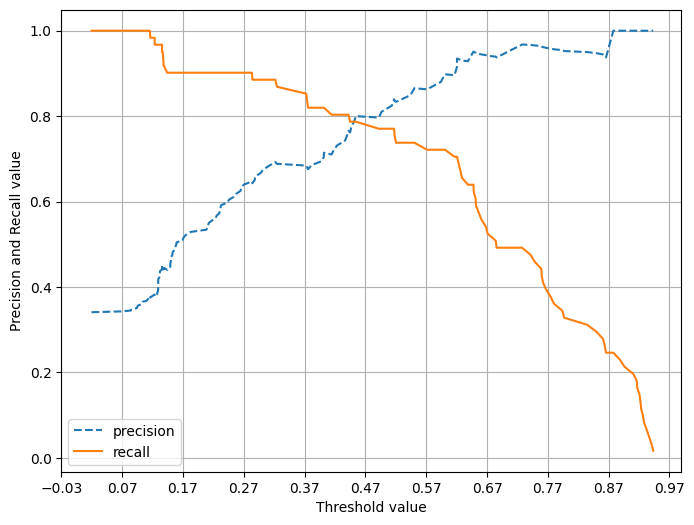
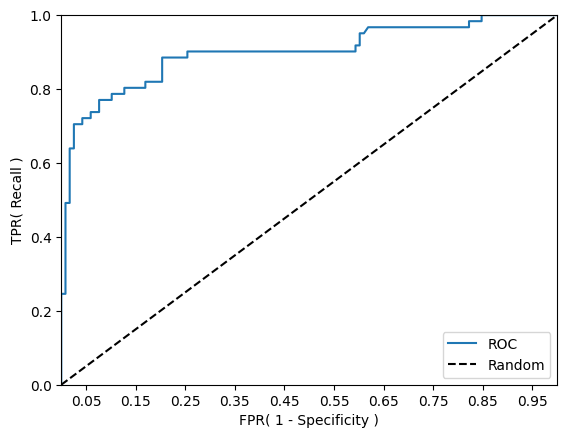
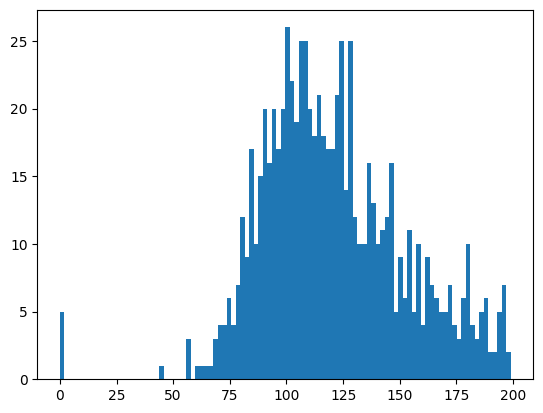
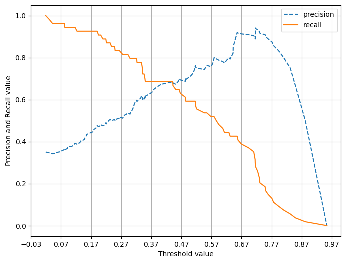

# 3. 평가 지표 (Metric)

본 문서는 이진 분류 성능 평가 지표와 피마 인디언 당뇨병 예측 실습을 바탕으로 정리한 학습 노트이다.  
정확도, 오차 행렬, 정밀도, 재현율, F1 스코어, ROC-AUC를 중심으로 개념과 한계를 함께 정리한다.

---

## 3-1. 분류 평가의 기본 관점

분류 문제는 예측 결과가 맞았는지만 보는 것으로 끝나지 않는다.  
특히 **이진 분류(Binary Classification)** 에서는 Positive를 얼마나 잘 찾아냈는지, Negative를 얼마나 헷갈리지 않았는지까지 함께 확인해야 한다.

주요 평가 지표는 다음과 같다.

- 정확도(Accuracy)
- 오차 행렬(Confusion Matrix)
- 정밀도(Precision)
- 재현율(Recall)
- F1 스코어(F1 Score)
- ROC-AUC

실습 환경에서 확인한 사이킷런 버전은 다음과 같았다.

```text
1.6.1
```

---

## 3-2. 정확도(Accuracy)

정확도는 전체 예측 중에서 맞춘 비율을 의미한다.

$$
Accuracy = \frac{\text{정답을 맞춘 건수}}{\text{전체 데이터 건수}}
$$

직관적이지만, **불균형 데이터(Imbalanced Data)** 에서는 쉽게 왜곡될 수 있다.

### 타이타닉 더미 분류기 예제

실습에서는 타이타닉 데이터를 전처리한 뒤, 단순한 Dummy Classifier를 만들어 정확도를 확인했다.

```python
import pandas as pd
from sklearn.model_selection import train_test_split
from sklearn.metrics import accuracy_score

titanic_df = pd.read_csv('/Users/chankyulee/Desktop/ModuLABS/04_MachineLearning/Data/titanic_train.csv')
y_titanic_df = titanic_df['Survived']
X_titanic_df = titanic_df.drop('Survived', axis=1)
X_titanic_df = transform_features(X_titanic_df)

X_train, X_test, y_train, y_test = train_test_split(
    X_titanic_df, y_titanic_df, test_size=0.2, random_state=0
)

myclf = MyDummyClassifier()
myclf.fit(X_train, y_train)
mypredictions = myclf.predict(X_test)
print('Dummy Classifier의 정확도는: {0:.4f}'.format(accuracy_score(y_test, mypredictions)))
```

```text
Dummy Classifier의 정확도는: 0.7877
```

단순한 규칙 기반 더미 분류기인데도 약 78.8% 정확도가 나온다.  
즉, 정확도만 보면 꽤 괜찮아 보이지만 실제로는 좋은 모델이라고 보기 어렵다.

### 불균형 데이터에서의 정확도 착시

MNIST 숫자 데이터에서 `7`인지 아닌지만 맞히는 이진 분류 문제로 바꾸고, 모든 예측을 0으로만 내보내는 가짜 분류기를 만들면 다음과 같은 결과가 나온다.

```python
from sklearn.datasets import load_digits
from sklearn.base import BaseEstimator
from sklearn.metrics import accuracy_score
import numpy as np
import pandas as pd

class MyFakeClassifier(BaseEstimator):
    def fit(self, X, y):
        pass

    def predict(self, X):
        return np.zeros((len(X), 1), dtype=bool)
```

```text
### digits.data.shape: (1797, 64)
### digits.target.shape: (1797,)

레이블 테스트 세트 크기 : (450,)
테스트 세트 레이블 0 과 1의 분포도
0    405
1     45
Name: count, dtype: int64

모든 예측을 0으로 하여도 정확도는:0.900
```

실제 Positive(1)가 매우 적기 때문에, 무조건 0만 찍어도 정확도는 90%가 된다.  
이 예제가 정확도만으로 모델을 평가하면 왜 위험한지 가장 잘 보여준다.

---

## 3-3. 오차 행렬(Confusion Matrix)

오차 행렬은 모델이 어떤 식으로 틀리고 있는지를 보여주는 2x2 표이다.

| 실제 / 예측 | Negative(0) | Positive(1) |
| --- | --- | --- |
| Negative(0) | TN | FP |
| Positive(1) | FN | TP |

- **TN(True Negative)**: 실제 Negative를 Negative로 맞춤
- **FP(False Positive)**: 실제 Negative를 Positive로 잘못 예측
- **FN(False Negative)**: 실제 Positive를 Negative로 잘못 예측
- **TP(True Positive)**: 실제 Positive를 Positive로 맞춤

앞선 Fake Classifier의 오차 행렬은 다음과 같았다.

```python
from sklearn.metrics import confusion_matrix

confusion_matrix(y_test, fakepred)
```

```text
array([[405,   0],
       [ 45,   0]])
```

모든 샘플을 0으로 예측했기 때문에 FP와 TP는 0이고, Positive 클래스는 전혀 잡아내지 못했다.  
그런데도 정확도는 높게 나왔다는 점이 핵심이다.

---

## 3-4. 정밀도(Precision)와 재현율(Recall)

정밀도와 재현율은 Positive 예측 성능을 더 세밀하게 보기 위한 지표이다.

$$
Precision = \frac{TP}{FP + TP}
$$

$$
Recall = \frac{TP}{FN + TP}
$$

- **정밀도**: Positive라고 예측한 것 중 실제 Positive 비율
- **재현율**: 실제 Positive 중 모델이 찾아낸 비율

Fake Classifier의 정밀도와 재현율은 다음과 같았다.

```python
from sklearn.metrics import precision_score, recall_score

print("정밀도:", precision_score(y_test, fakepred))
print("재현율:", recall_score(y_test, fakepred))
```

```text
정밀도: 0.0
재현율: 0.0
```

정확도는 0.900이지만, Positive를 전혀 예측하지 못하므로 정밀도와 재현율은 모두 0이다.

### 타이타닉 로지스틱 회귀 예제

더 현실적인 평가를 위해 타이타닉 데이터에 로지스틱 회귀를 적용하면 다음과 같은 결과가 나온다.

```python
from sklearn.linear_model import LogisticRegression

lr_clf = LogisticRegression(solver='liblinear')
lr_clf.fit(X_train, y_train)
pred = lr_clf.predict(X_test)
get_clf_eval(y_test, pred)
```

```text
오차 행렬
[[108  10]
 [ 14  47]]
정확도: 0.8659, 정밀도: 0.8246, 재현율: 0.7705
```

이제는 정확도만 높은 것이 아니라, 정밀도와 재현율도 함께 확인하며 모델 품질을 평가할 수 있다.

---

## 3-5. 임곗값(Threshold)과 Precision-Recall Trade-off

분류 모델은 보통 `predict_proba()`로 확률을 구한 뒤, 기본 임곗값 0.5를 기준으로 Positive/Negative를 나눈다.

```python
pred_proba = lr_clf.predict_proba(X_test)
pred = lr_clf.predict(X_test)
print('pred_proba()결과 Shape : {0}'.format(pred_proba.shape))
print('pred_proba array에서 앞 3개만 샘플로 추출 \n:', pred_proba[:3])
```

```text
pred_proba()결과 Shape : (179, 2)
pred_proba array에서 앞 3개만 샘플로 추출 
: [[0.44935225 0.55064775]
 [0.86335511 0.13664489]
 [0.86429643 0.13570357]]
```

### Binarizer로 임곗값 조정

```python
from sklearn.preprocessing import Binarizer

custom_threshold = 0.4
pred_proba_1 = pred_proba[:, 1].reshape(-1, 1)
binarizer = Binarizer(threshold=custom_threshold).fit(pred_proba_1)
custom_predict = binarizer.transform(pred_proba_1)

get_clf_eval(y_test, custom_predict)
```

```text
오차 행렬
[[97 21]
 [11 50]]
정확도: 0.8212, 정밀도: 0.7042, 재현율: 0.8197
```

기본 임곗값 0.5보다 0.4로 낮추자, 재현율은 올라가고 정밀도는 낮아졌다.  
이것이 정밀도-재현율 Trade-off의 대표적인 예시이다.

### 임곗값별 비교

```text
임곗값: 0.4
정확도: 0.8212, 정밀도: 0.7042, 재현율: 0.8197

임곗값: 0.45
정확도: 0.8547, 정밀도: 0.7869, 재현율: 0.7869

임곗값: 0.5
정확도: 0.8659, 정밀도: 0.8246, 재현율: 0.7705

임곗값: 0.55
정확도: 0.8715, 정밀도: 0.8654, 재현율: 0.7377

임곗값: 0.6
정확도: 0.8771, 정밀도: 0.8980, 재현율: 0.7213
```

임곗값이 높아질수록 정밀도는 올라가고 재현율은 내려가는 흐름을 분명하게 확인할 수 있다.

### Precision-Recall Curve

```text
반환된 분류 결정 임곗값 배열의 Shape: (165,)
반환된 precisions 배열의 Shape: (166,)
반환된 recalls 배열의 Shape: (166,)

샘플용 10개의 임곗값:  [0.02 0.11 0.13 0.14 0.16 0.24 0.32 0.45 0.62 0.73 0.87]
샘플 임계값별 정밀도:  [0.341 0.372 0.401 0.44  0.505 0.598 0.688 0.774 0.915 0.968 0.938]
샘플 임계값별 재현율:  [1.    1.    0.967 0.902 0.902 0.902 0.869 0.787 0.705 0.492 0.246]
```



위 그래프는 임곗값 변화에 따라 정밀도와 재현율이 어떻게 엇갈리며 움직이는지를 보여준다.

---

## 3-6. F1 스코어

F1 스코어는 정밀도와 재현율의 조화 평균이다.

$$
F1 = 2 \times \frac{Precision \times Recall}{Precision + Recall}
$$

```python
from sklearn.metrics import f1_score

f1 = f1_score(y_test, pred)
print('F1 스코어: {0:.4f}'.format(f1))
```

```text
F1 스코어: 0.7966
```

또한 임곗값별 F1 비교 결과는 다음과 같았다.

```text
임곗값: 0.4  -> F1:0.7576
임곗값: 0.45 -> F1:0.7869
임곗값: 0.5  -> F1:0.7966
임곗값: 0.55 -> F1:0.7965
임곗값: 0.6  -> F1:0.8000
```

즉, F1 스코어는 어느 한쪽 지표만 극단적으로 높을 때보다, 정밀도와 재현율이 비교적 균형을 이룰 때 높게 형성된다.

---

## 3-7. ROC Curve와 AUC

ROC Curve는 FPR(False Positive Rate)과 TPR(True Positive Rate)의 관계를 보여주는 곡선이다.

$$
TPR = \frac{TP}{TP + FN}
$$

$$
FPR = \frac{FP}{FP + TN}
$$

실습에서 추출한 샘플 값은 다음과 같았다.

```text
샘플 index로 추출한 임곗값:  [0.94 0.73 0.62 0.52 0.44 0.28 0.15 0.14 0.13 0.12]
샘플 임곗값별 FPR:  [0.    0.008 0.025 0.076 0.127 0.254 0.576 0.61  0.746 0.847]
샘플 임곗값별 TPR:  [0.016 0.492 0.705 0.738 0.803 0.885 0.902 0.951 0.967 1.   ]
```



ROC-AUC 값은 다음과 같았다.

```python
from sklearn.metrics import roc_auc_score

pred_proba = lr_clf.predict_proba(X_test)[:, 1]
roc_score = roc_auc_score(y_test, pred_proba)
print('ROC AUC 값: {0:.4f}'.format(roc_score))
```

```text
ROC AUC 값: 0.8987
```

0.5에 가까우면 랜덤 수준이고, 1에 가까울수록 좋은 성능을 의미하므로 이 결과는 비교적 우수한 편이라고 볼 수 있다.

---

## 3-8. 피마 인디언 당뇨병 예측 실습

이제 위 지표들을 실제 불균형 이진 분류 데이터에 적용해 본다.

### 데이터 확인

```python
import numpy as np
import pandas as pd
from sklearn.model_selection import train_test_split
from sklearn.metrics import accuracy_score, precision_score, recall_score, roc_auc_score
from sklearn.metrics import f1_score, confusion_matrix, precision_recall_curve, roc_curve
from sklearn.preprocessing import StandardScaler
from sklearn.linear_model import LogisticRegression

diabetes_data = pd.read_csv('/Users/chankyulee/Desktop/ModuLABS/04_MachineLearning/Data/diabetes.csv')
print(diabetes_data['Outcome'].value_counts())
diabetes_data.head(3)
```

```text
Outcome
0    500
1    268
Name: count, dtype: int64

   Pregnancies  Glucose  BloodPressure  SkinThickness  Insulin   BMI  \
0            6      148             72             35        0  33.6
1            1       85             66             29        0  26.6
2            8      183             64              0        0  23.3
```

정상(0)이 500건, 당뇨(1)가 268건이므로 Negative 비율이 더 높은 데이터이다.

### 기본 로지스틱 회귀 성능

```python
X = diabetes_data.iloc[:, :-1]
y = diabetes_data.iloc[:, -1]

X_train, X_test, y_train, y_test = train_test_split(
    X, y, test_size=0.2, random_state=156, stratify=y
)

lr_clf = LogisticRegression(solver='liblinear')
lr_clf.fit(X_train, y_train)
pred = lr_clf.predict(X_test)
pred_proba = lr_clf.predict_proba(X_test)[:, 1]

get_clf_eval(y_test, pred, pred_proba)
```

```text
오차 행렬
[[87 13]
 [22 32]]
정확도: 0.7727, 정밀도: 0.7111, 재현율: 0.5926,    F1: 0.6465, AUC:0.8083
```

정확도는 나쁘지 않지만, 의료 데이터 특성상 재현율 0.5926은 다소 아쉽다.  
실제 환자를 놓치는 FN이 중요하기 때문이다.

### 이상치처럼 보이는 0값 확인

기술통계량을 보면 `Glucose`, `BloodPressure`, `SkinThickness`, `Insulin`, `BMI` 등에 0이 존재한다.

```text
Glucose 0 건수는 5, 퍼센트는 0.65 %
BloodPressure 0 건수는 35, 퍼센트는 4.56 %
SkinThickness 0 건수는 227, 퍼센트는 29.56 %
Insulin 0 건수는 374, 퍼센트는 48.70 %
BMI 0 건수는 11, 퍼센트는 1.43 %
```

또한 `Glucose` 분포를 히스토그램으로 확인할 수 있었다.



0이 생물학적으로 의미 없을 수 있는 컬럼이 많기 때문에, 평균값 대체가 필요하다.

### 평균값 대체 후 스케일링

0값을 평균으로 대체하고 `StandardScaler`를 적용한 뒤 다시 학습하면 성능이 다음처럼 바뀐다.

```python
scaler = StandardScaler()
X_scaled = scaler.fit_transform(X)

X_train, X_test, y_train, y_test = train_test_split(
    X_scaled, y, test_size=0.2, random_state=156, stratify=y
)

lr_clf = LogisticRegression()
lr_clf.fit(X_train, y_train)
pred = lr_clf.predict(X_test)
pred_proba = lr_clf.predict_proba(X_test)[:, 1]

get_clf_eval(y_test, pred, pred_proba)
```

```text
오차 행렬
[[90 10]
 [21 33]]
정확도: 0.7987, 정밀도: 0.7674, 재현율: 0.6111,    F1: 0.6804, AUC:0.8433
```

전처리 전보다 전체 지표가 전반적으로 개선되었다.

### Precision-Recall Curve



이 그래프를 통해 피마 인디언 데이터에서도 임곗값에 따라 정밀도와 재현율이 trade-off 관계를 갖는다는 점을 확인할 수 있다.

### 임곗값 조정

```text
임곗값: 0.3
정확도: 0.7143, 정밀도: 0.5658, 재현율: 0.7963, F1: 0.6615, AUC:0.8433

임곗값: 0.33
정확도: 0.7403, 정밀도: 0.6000, 재현율: 0.7778, F1: 0.6774, AUC:0.8433

임곗값: 0.36
정확도: 0.7468, 정밀도: 0.6190, 재현율: 0.7222, F1: 0.6667, AUC:0.8433

임곗값: 0.39
정확도: 0.7532, 정밀도: 0.6333, 재현율: 0.7037, F1: 0.6667, AUC:0.8433

임곗값: 0.42
정확도: 0.7792, 정밀도: 0.6923, 재현율: 0.6667, F1: 0.6792, AUC:0.8433

임곗값: 0.45
정확도: 0.7857, 정밀도: 0.7059, 재현율: 0.6667, F1: 0.6857, AUC:0.8433

임곗값: 0.48
정확도: 0.7987, 정밀도: 0.7447, 재현율: 0.6481, F1: 0.6931, AUC:0.8433

임곗값: 0.5
정확도: 0.7987, 정밀도: 0.7674, 재현율: 0.6111, F1: 0.6804, AUC:0.8433
```

기본 0.5보다 0.48로 낮췄을 때, 정확도를 유지하면서 재현율과 F1이 조금 더 균형 있게 조정되었다.

```python
from sklearn.preprocessing import Binarizer

binarizer = Binarizer(threshold=0.48)
pred_th_048 = binarizer.fit_transform(pred_proba[:, 1].reshape(-1, 1))
get_clf_eval(y_test, pred_th_048, pred_proba[:, 1])
```

```text
오차 행렬
[[88 12]
 [19 35]]
정확도: 0.7987, 정밀도: 0.7447, 재현율: 0.6481,    F1: 0.6931, AUC:0.8433
```

---

## 정리

평가 지표를 한 줄로 정리하면 다음과 같다.

- **정확도**는 가장 직관적이지만 불균형 데이터에서는 쉽게 속을 수 있다.
- **오차 행렬**은 모든 지표의 출발점이다.
- **정밀도/재현율**은 Positive 클래스 관점에서 모델을 다시 보게 해준다.
- **F1 스코어**는 두 지표의 균형을 판단하기 좋다.
- **ROC-AUC**는 전반적인 분류 성능을 비교할 때 매우 유용하다.
- **임곗값 조정**은 업무 목적에 맞는 모델 튜닝의 핵심이다.

결국 이진 분류 평가에서는 하나의 숫자만 보는 것이 아니라, 데이터 특성과 업무 목적에 맞춰 여러 지표를 함께 해석해야 한다고 정리할 수 있다.
