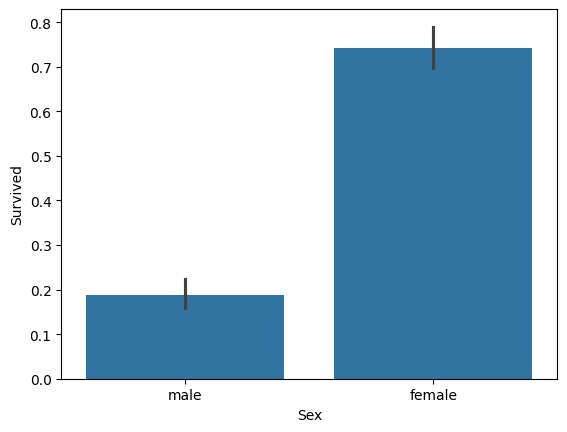
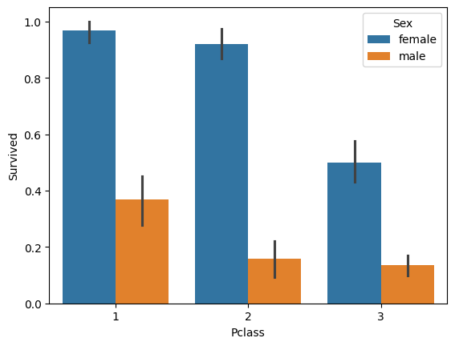
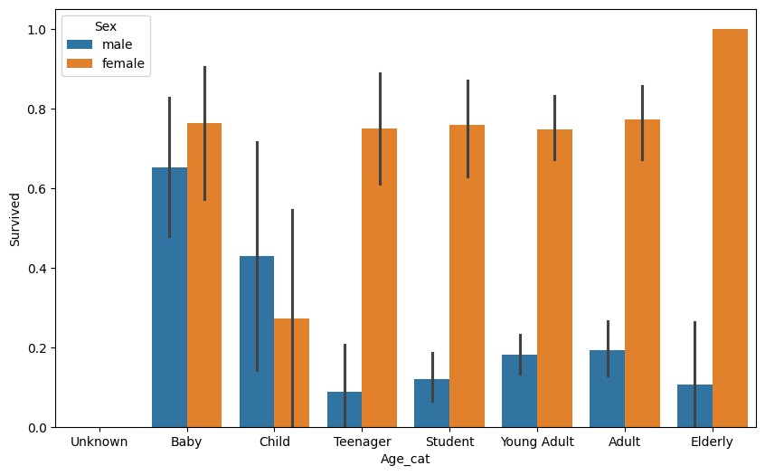

# 『파이썬 머신러닝 완벽 가이드』 2장. 사이킷런으로 시작하는 머신러닝

> 책 2장 내용 + [2.2 붓꽃 예측](https://github.com/Chankyu99/ModuLABS/blob/master/04_MachineLearning/Study/Scikit-learn/2.2%20첫%20번째%20머신러닝%20만들어%20보기%20_%20붓꽃%20품종%20예측하기.ipynb) + [2.3 기반 프레임워크](https://github.com/Chankyu99/ModuLABS/blob/master/04_MachineLearning/Study/Scikit-learn/2.3%20사이킷런의%20기반%20프레임워크%20익히기.ipynb) + [2.4 Model Selection](https://github.com/Chankyu99/ModuLABS/blob/master/04_MachineLearning/Study/Scikit-learn/2.4%20Model%20Selection%20모듈%20소개.ipynb) + [2.5 전처리](https://github.com/Chankyu99/ModuLABS/blob/master/04_MachineLearning/Study/Scikit-learn/2.5%20데이터_전처리.ipynb) + [2.6 타이타닉](https://github.com/Chankyu99/ModuLABS/blob/master/04_MachineLearning/Study/Scikit-learn/2.6%20사이킷런으로%20수행하는%20타이타닉%20생존자%20예측.ipynb)

---

## 2-1. 사이킷런 소개와 특징

사이킷런(scikit-learn) : 파이썬 기반의 대표적인 머신러닝 라이브러리

### 특징

1. 가장 쉽고 파이썬스러운 API를 제공한다
2. 분류, 회귀, 군집화, 전처리, 평가, 모델 선택 기능을 폭넓게 지원한다
3. `fit()`, `predict()`, `transform()`처럼 일관된 인터페이스를 제공해 사용하기 편하다
4. 실무와 학습에서 모두 많이 사용되는 표준 라이브러리이다

## 2-2. 첫 번째 머신러닝 만들어 보기 - 붓꽃 품종 예측

붓꽃(Iris) 데이터는 사이킷런에서 가장 자주 사용하는 입문용 데이터 세트이다.
꽃받침 길이, 꽃받침 너비, 꽃잎 길이, 꽃잎 너비를 피처로 사용하여 품종을 분류한다.

### 붓꽃 데이터 세트 불러오기

사이킷런에서는 `load_iris()` 함수로 붓꽃 데이터를 바로 불러올 수 있다.
불러온 객체는 피처 데이터, 레이블 데이터, 피처명, 품종명 등을 함께 가지고 있다.

```python
from sklearn.datasets import load_iris
import pandas as pd

iris = load_iris()

iris_data = iris.data
iris_label = iris.target

iris_df = pd.DataFrame(data=iris_data, columns=iris.feature_names)
iris_df['label'] = iris.target
iris_df.head(3)
```

- `iris.data` : 피처 데이터
- `iris.target` : 품종을 나타내는 레이블 데이터
- `iris.feature_names` : 피처 이름
- `iris.target_names` : 품종 이름

### 학습 데이터와 테스트 데이터 분리

머신러닝 모델 성능을 올바르게 확인하려면 학습용 데이터와 평가용 데이터를 분리해야 한다.
이때 `train_test_split()`을 사용한다.

```python
from sklearn.model_selection import train_test_split

X_train, X_test, y_train, y_test = train_test_split(
    iris_data, iris_label, test_size=0.2, random_state=11
)
```

- `test_size=0.2` : 전체 데이터 중 20%를 테스트 데이터로 사용
- `random_state=11` : 데이터를 섞을 때 기준이 되는 난수 시드

### 모델 생성, 학습, 예측

붓꽃 예측에서는 `DecisionTreeClassifier`를 사용하였다.
분류 모델은 보통 객체를 만든 뒤 `fit()`으로 학습하고 `predict()`로 예측한다.

```python
from sklearn.tree import DecisionTreeClassifier

dt_clf = DecisionTreeClassifier(random_state=11)
dt_clf.fit(X_train, y_train)

pred = dt_clf.predict(X_test)
```

- `fit(X_train, y_train)` : 학습 데이터와 레이블로 모델 학습
- `predict(X_test)` : 학습된 모델로 테스트 데이터 예측

### 예측 성능 평가

분류 문제에서는 `accuracy_score()`를 사용해 정확도를 확인할 수 있다.

```python
from sklearn.metrics import accuracy_score

print('예측 정확도: {0:.4f}'.format(accuracy_score(y_test, pred)))
```

```
예측 정확도: 0.9333
```

### 배운 점

- 사이킷런은 데이터 로드부터 학습, 예측, 평가까지 흐름이 매우 일정하다
- 붓꽃 데이터처럼 작은 예제 데이터로 전체 머신러닝 흐름을 빠르게 익힐 수 있다
- 모델 성능 평가는 반드시 학습 데이터와 분리된 테스트 데이터로 해야 한다

## 2-3. 사이킷런의 기반 프레임워크 익히기

### 붓꽃 데이터 세트 구조 확인하기

`load_iris()`가 반환하는 객체는 딕셔너리와 비슷한 `Bunch` 형태이다.
즉, 여러 정보를 키(key)로 구분해 저장하고 있다.

```python
from sklearn.datasets import load_iris

iris_data = load_iris()
print(type(iris_data))
print('붓꽃 데이터 세트의 키들:', iris_data.keys())
```

실제로 확인한 주요 구성 요소는 다음과 같다.

- `feature_names` : 피처 이름 목록
- `target_names` : 레이블 이름 목록
- `data` : 실제 피처 데이터
- `target` : 레이블 값

```python
print(iris_data.feature_names)
print(iris_data.target_names)
print(iris_data.data.shape)
print(iris_data.target.shape)
```

### Estimator 이해 및 fit(), predict() 메서드

사이킷런에서는 머신러닝 알고리즘 객체를 **Estimator**라고 부른다.
분류든 회귀든 대부분 다음과 같은 공통 메서드를 가진다.

- `fit()` : 데이터로 모델 학습
- `predict()` : 학습된 모델로 예측 수행
- `score()` : 기본 평가 지표 반환

즉, 알고리즘이 달라도 사용 방식이 거의 비슷하다는 점이 사이킷런의 큰 장점이다.

### 사이킷런의 주요 모듈

| 분류 | 모듈명 | 설명 |
| :---: | :---: | :--- |
| 예제 데이터 | `sklearn.datasets` | 내장 예제 데이터 세트 제공 |
| 피처 처리 | `sklearn.preprocessing` | 인코딩, 정규화, 스케일링 등 전처리 기능 제공 |
| 피처 선택 | `sklearn.feature_selection` | 중요한 피처를 선택하는 기능 제공 |
| 피처 추출 | `sklearn.feature_extraction` | 텍스트, 이미지 데이터에서 피처 추출 |
| 차원 축소 | `sklearn.decomposition` | PCA, NMF, SVD 등 차원 축소 알고리즘 지원 |
| 모델 선택 | `sklearn.model_selection` | 데이터 분할, 교차 검증, 하이퍼파라미터 튜닝 지원 |
| 평가 | `sklearn.metrics` | 분류, 회귀, 군집화 성능 평가 지원 |
| 앙상블 | `sklearn.ensemble` | Random Forest, Gradient Boosting 등 지원 |
| 선형 모델 | `sklearn.linear_model` | 선형 회귀, 로지스틱 회귀 등 지원 |
| 나이브 베이즈 | `sklearn.naive_bayes` | 나이브 베이즈 기반 알고리즘 지원 |
| 최근접 이웃 | `sklearn.neighbors` | KNN 등 최근접 이웃 알고리즘 지원 |
| 서포트 벡터 머신 | `sklearn.svm` | SVM 알고리즘 지원 |
| 트리 | `sklearn.tree` | 결정 트리 알고리즘 지원 |
| 군집화 | `sklearn.cluster` | 비지도 학습인 군집화 알고리즘 지원 |
| 파이프라인 | `sklearn.pipeline` | 전처리와 모델 학습 과정을 묶어서 실행 |

## 2-4. Model Selection 모듈 소개

### 학습 데이터만으로 평가하면 왜 안 될까

학습에 사용한 데이터로 그대로 예측하면 모델이 정답을 외운 상태일 수 있다.
실제로 붓꽃 데이터를 학습용 전체 데이터로 학습하고 같은 데이터로 예측하면 높은 정확도가 나온다.

```python
from sklearn.datasets import load_iris
from sklearn.tree import DecisionTreeClassifier
from sklearn.metrics import accuracy_score

iris = load_iris()
dt_clf = DecisionTreeClassifier()

train_data = iris.data
train_label = iris.target

dt_clf.fit(train_data, train_label)
pred = dt_clf.predict(train_data)

print('예측 정확도:', accuracy_score(train_label, pred))
```

```
예측 정확도: 1.0
```

> 정확도가 100%로 나오지만, 이는 모델이 학습 데이터를 그대로 외운 것이므로 실제 일반화 성능을 보여주지 못한다. 그래서 데이터 분리와 교차 검증이 필요하다.

### 학습/테스트 데이터 세트 분리 : train_test_split()

```python
from sklearn.model_selection import train_test_split

X_train, X_test, y_train, y_test = train_test_split(
    iris.data, iris.target, test_size=0.3, random_state=121
)
```

주요 인자는 다음과 같다.

- `test_size` : 테스트 데이터 비율
- `train_size` : 학습 데이터 비율
- `shuffle` : 데이터 셔플 여부
- `random_state` : 난수 시드 고정

분리한 뒤에는 학습 데이터로 모델을 학습하고, 테스트 데이터로 성능을 확인한다.

```python
dt_clf.fit(X_train, y_train)
pred = dt_clf.predict(X_test)
print('예측 정확도: {0:.4f}'.format(accuracy_score(y_test, pred)))
```

```
예측 정확도: 0.9556
```

### 교차 검증

고정된 한 번의 학습/테스트 분리만으로는 모델 성능이 데이터 구성에 따라 달라질 수 있다.
이를 보완하기 위해 교차 검증을 사용한다.

#### K-Fold 교차 검증

K개의 폴드로 데이터를 나눈 뒤, 번갈아 가며 학습과 검증을 수행하는 방식이다.

```python
from sklearn.model_selection import KFold
import numpy as np

kfold = KFold(n_splits=5)
cv_accuracy = []

for train_index, test_index in kfold.split(features):
    X_train, X_test = features[train_index], features[test_index]
    y_train, y_test = label[train_index], label[test_index]

    dt_clf.fit(X_train, y_train)
    pred = dt_clf.predict(X_test)
    accuracy = np.round(accuracy_score(y_test, pred), 4)
    cv_accuracy.append(accuracy)

print('평균 검증 정확도:', np.mean(cv_accuracy))
```

`split()`은 각 폴드에서 사용할 학습용 인덱스와 검증용 인덱스를 반환한다.

#### KFold의 한계

붓꽃 데이터처럼 레이블이 클래스별로 균등하게 나뉜 데이터라도,
단순 `KFold`는 분할 과정에서 레이블 분포가 한쪽으로 치우칠 수 있다.

```python
import pandas as pd

iris_df = pd.DataFrame(data=iris.data, columns=iris.feature_names)
iris_df['label'] = iris.target

kfold = KFold(n_splits=3)
for train_index, test_index in kfold.split(iris_df):
    label_train = iris_df['label'].iloc[train_index]
    label_test = iris_df['label'].iloc[test_index]
    print(label_train.value_counts())
    print(label_test.value_counts())
```

### StratifiedKFold

분류 문제에서는 레이블 분포를 최대한 유지하며 폴드를 나누는 것이 중요하다.
이를 위해 `StratifiedKFold`를 사용한다.

```python
from sklearn.model_selection import StratifiedKFold

skf = StratifiedKFold(n_splits=3)

for train_index, test_index in skf.split(iris_df, iris_df['label']):
    label_train = iris_df['label'].iloc[train_index]
    label_test = iris_df['label'].iloc[test_index]
    print(label_train.value_counts())
    print(label_test.value_counts())
```

이후 실제 학습과 평가도 같은 방식으로 수행할 수 있다.

```python
dt_clf = DecisionTreeClassifier(random_state=156)
skfold = StratifiedKFold(n_splits=3)
cv_accuracy = []

for train_index, test_index in skfold.split(features, label):
    X_train, X_test = features[train_index], features[test_index]
    y_train, y_test = label[train_index], label[test_index]

    dt_clf.fit(X_train, y_train)
    pred = dt_clf.predict(X_test)
    cv_accuracy.append(np.round(accuracy_score(y_test, pred), 4))

print('교차 검증별 정확도:', np.round(cv_accuracy, 4))
print('평균 검증 정확도:', np.round(np.mean(cv_accuracy), 4))
```

```
교차 검증별 정확도: [0.98 0.94 0.98]
평균 검증 정확도: 0.9667
```

> 일반적으로 분류 문제에서는 `KFold`보다 `StratifiedKFold`가 더 적절하다. 회귀 문제에서는 결정값이 연속형이므로 `StratifiedKFold`가 지원되지 않는다.

### cross_val_score()

교차 검증은 직접 반복문을 작성할 수도 있지만,
사이킷런은 이를 더 편하게 수행할 수 있는 API도 제공한다.

```python
from sklearn.model_selection import cross_val_score

scores = cross_val_score(dt_clf, data, label, scoring='accuracy', cv=3)
print('교차 검증별 정확도:', np.round(scores, 4))
print('평균 검증 정확도:', np.round(np.mean(scores), 4))
```

```
교차 검증별 정확도: [0.98 0.94 0.98]
평균 검증 정확도: 0.9667
```

- `estimator` : 사용할 모델 객체
- `X` : 피처 데이터
- `y` : 레이블 데이터
- `scoring` : 평가 지표
- `cv` : 교차 검증 폴드 수

> `cross_val_score()`는 반복문 없이 교차 검증 결과를 빠르게 확인할 수 있어 매우 편리하다. 비슷한 API로 `cross_validate()`가 있는데, 이는 여러 개의 평가 지표를 한 번에 반환할 수 있고 수행 시간도 출력 가능하다.

### GridSearchCV

하이퍼파라미터는 모델 내부 동작을 결정하는 설정값이다.
여러 값을 직접 바꿔가며 테스트하는 것은 번거롭기 때문에 `GridSearchCV`를 사용한다.

```python
from sklearn.model_selection import GridSearchCV

parameters = {'max_depth': [1, 2, 3], 'min_samples_split': [2, 3]}
grid_dtree = GridSearchCV(dtree, param_grid=parameters, cv=3, refit=True)
grid_dtree.fit(X_train, y_train)
```

주요 인자는 다음과 같다.

- `estimator` : 학습할 모델
- `param_grid` : 테스트할 하이퍼파라미터 조합
- `cv` : 교차 검증 폴드 수
- `refit` : 최적 파라미터로 다시 학습할지 여부

결과는 `cv_results_`로 확인할 수 있고, DataFrame으로 정리하면 보기 편하다.

```python
import pandas as pd

scores_df = pd.DataFrame(grid_dtree.cv_results_)
scores_df[['params', 'mean_test_score', 'rank_test_score']]
```

```
GridSearchCV 최적 파라미터: {'max_depth': 3, 'min_samples_split': 2}
GridSearchCV 최고 정확도: 0.9750
테스트 데이터 세트 정확도: 0.9667
```

최적 결과는 다음 속성으로 확인한다.

- `best_params_` : 최적 하이퍼파라미터
- `best_score_` : 최고 교차 검증 점수
- `best_estimator_` : 최적 파라미터로 학습된 모델

---

## 2-5. 데이터 전처리

사이킷런의 머신러닝 알고리즘은 문자열 자체를 입력값으로 받지 못한다.
따라서 문자열 데이터를 숫자형으로 바꾸거나, 피처의 크기 범위를 맞추는 전처리가 필요하다.

### 데이터 인코딩

대표적인 인코딩 방식은 레이블 인코딩과 원-핫 인코딩이다.

#### 레이블 인코딩

범주형 값을 0부터 시작하는 정수형 값으로 변환하는 방식이다.

```python
from sklearn.preprocessing import LabelEncoder

items = ['TV', '냉장고', '전자레인지', '컴퓨터', '선풍기', '선풍기', '믹서', '믹서']

encoder = LabelEncoder()
encoder.fit(items)
labels = encoder.transform(items)

print('인코딩 변환값:', labels)
print('인코딩 클래스:', encoder.classes_)
print('디코딩 원본 값:', encoder.inverse_transform([4, 5, 2, 0, 1, 1, 3, 3]))
```

- `fit()` : 어떤 값들이 있는지 학습
- `transform()` : 숫자형으로 변환
- `inverse_transform()` : 원래 값으로 복원

주의할 점은 숫자에 크고 작음의 의미가 생길 수 있다는 것이다.
따라서 순서가 없는 범주형 데이터에는 원-핫 인코딩이 더 적절한 경우가 많다.

#### 원-핫 인코딩

각 범주를 새로운 컬럼으로 만들고, 해당 값이면 1 아니면 0으로 표현하는 방식이다.

```python
from sklearn.preprocessing import OneHotEncoder
import numpy as np

items = ['TV', '냉장고', '전자레인지', '컴퓨터', '선풍기', '선풍기', '믹서', '믹서']
items = np.array(items).reshape(-1, 1)

oh_encoder = OneHotEncoder()
oh_encoder.fit(items)
oh_labels = oh_encoder.transform(items)

print(oh_labels.toarray())
print(oh_labels.shape)
```

주의점은 다음과 같다.

- `OneHotEncoder`는 2차원 입력을 요구한다
- 결과가 희소행렬이므로 필요하면 `toarray()`로 밀집행렬로 바꾼다

Pandas에서는 더 간단하게 `get_dummies()`를 사용할 수 있다.

```python
import pandas as pd

df = pd.DataFrame({'item': ['TV', '냉장고', '전자레인지', '컴퓨터', '선풍기', '선풍기', '믹서', '믹서']})
pd.get_dummies(df)
```

### 피처 스케일링과 정규화

서로 다른 피처의 값 범위를 일정하게 맞추는 작업이다.
대표적으로 표준화와 정규화가 있다.

#### 표준화

피처 값을 평균이 0, 분산이 1인 형태로 변환한다.

$$x_i^* = \frac{x_i - \mu}{\sigma}$$

#### 정규화

서로 다른 피처의 크기를 일정 범위로 맞추는 방식이다.

$$x_i^* = \frac{x_i - x_{min}}{x_{max} - x_{min}}$$

### StandardScaler

붓꽃 데이터 세트에 대해 표준화를 적용하면 각 피처 평균이 0에 가깝고, 분산이 1에 가까워진다.

```python
from sklearn.datasets import load_iris
from sklearn.preprocessing import StandardScaler
import pandas as pd

iris = load_iris()
iris_df = pd.DataFrame(data=iris.data, columns=iris.feature_names)

scaler = StandardScaler()
scaler.fit(iris_df)
iris_scaled = scaler.transform(iris_df)

iris_df_scaled = pd.DataFrame(data=iris_scaled, columns=iris.feature_names)
print(iris_df_scaled.mean())
print(iris_df_scaled.var())
```

### MinMaxScaler

`MinMaxScaler`는 피처 값을 0과 1 사이 범위로 변환한다.

```python
from sklearn.preprocessing import MinMaxScaler

scaler = MinMaxScaler()
scaler.fit(iris_df)
iris_scaled = scaler.transform(iris_df)

iris_df_scaled = pd.DataFrame(data=iris_scaled, columns=iris.feature_names)
print(iris_df_scaled.min())
print(iris_df_scaled.max())
```

데이터 분포가 정규분포가 아닐 때 자주 사용한다.

### 학습 데이터와 테스트 데이터 스케일링 시 유의점

스케일링에서 가장 중요한 점은 **기준은 항상 학습 데이터로만 잡아야 한다**는 것이다.
즉, 테스트 데이터에는 `fit()`을 하면 안 되고 `transform()`만 해야 한다.

```python
from sklearn.preprocessing import MinMaxScaler
import numpy as np

train_array = np.arange(0, 11).reshape(-1, 1)
test_array = np.arange(0, 6).reshape(-1, 1)

scaler = MinMaxScaler()
scaler.fit(train_array)

train_scaled = scaler.transform(train_array)
test_scaled = scaler.transform(test_array)
```

잘못된 예시는 테스트 데이터에 다시 `fit()`을 수행하는 것이다.
이렇게 하면 학습 데이터와 테스트 데이터의 스케일 기준이 달라져 데이터 누수가 발생할 수 있다.

정리하면 다음과 같다.

- 학습 데이터 : `fit_transform()` 또는 `fit()` 후 `transform()`
- 테스트 데이터 : 반드시 `transform()`만 사용

## 2-6. 사이킷런으로 수행하는 타이타닉 생존자 예측

타이타닉 데이터는 결측치 처리, 문자열 인코딩, 피처 선택, 모델 비교까지 한 번에 실습할 수 있는 대표적인 분류 예제이다.

### 타이타닉 데이터 개략

- `PassengerId` : 탑승자 데이터 일련번호
- `Survived` : 생존 여부 (0: 사망, 1: 생존)
- `Pclass` : 승객 등급
- `Sex` : 성별
- `Name` : 이름
- `Age` : 나이
- `SibSp` : 형제자매/배우자 수
- `Parch` : 부모/자녀 수
- `Ticket` : 티켓 번호
- `Fare` : 요금
- `Cabin` : 객실 번호
- `Embarked` : 승선 항구

### 데이터 확인과 결측치 처리

먼저 `info()`로 데이터 구조와 결측치를 확인한다.

```python
import pandas as pd

titanic_df = pd.read_csv('./titanic_train.csv')
print(titanic_df.info())
```

이후 주요 결측치를 다음과 같이 처리했다.

```python
titanic_df['Age'].fillna(titanic_df['Age'].mean(), inplace=True)
titanic_df['Cabin'].fillna('N', inplace=True)
titanic_df['Embarked'].fillna('N', inplace=True)
```

- `Age` : 평균값으로 대체
- `Cabin`, `Embarked` : `'N'`으로 대체

### 문자열 피처 확인과 간단한 EDA

값 분포를 확인하고, `Cabin`은 객실 번호 전체 대신 첫 글자만 사용하였다.

```python
print(titanic_df['Sex'].value_counts())
print(titanic_df['Cabin'].value_counts())
print(titanic_df['Embarked'].value_counts())

titanic_df['Cabin'] = titanic_df['Cabin'].str[:1]
```

또한 `groupby()`와 `seaborn.barplot()`을 이용해 생존율을 비교하였다.

```python
titanic_df.groupby(['Sex', 'Survived'])['Survived'].count()
sns.barplot(x='Sex', y='Survived', data=titanic_df)
sns.barplot(x='Pclass', y='Survived', hue='Sex', data=titanic_df)
```





> 여성의 생존율이 남성보다 훨씬 높고, 1등급 여성의 생존율이 가장 높다.

### 나이 구간화

나이를 범주형으로 나누어 생존율을 더 직관적으로 살펴보았다.

```python
def get_category(age):
    if age <= -1:
        return 'Unknown'
    elif age <= 5:
        return 'Baby'
    elif age <= 12:
        return 'Child'
    elif age <= 18:
        return 'Teenager'
    elif age <= 25:
        return 'Student'
    elif age <= 35:
        return 'Young Adult'
    elif age <= 60:
        return 'Adult'
    else:
        return 'Elderly'

titanic_df['Age_cat'] = titanic_df['Age'].apply(lambda x: get_category(x))
sns.barplot(x='Age_cat', y='Survived', hue='Sex', data=titanic_df, order=group_names)
```



> Baby, Child 구간에서는 남녀 모두 생존율이 높고, Student~Adult 구간에서는 여성의 생존율이 남성보다 현저히 높다.

이후 시각화를 마치고 `Age_cat` 컬럼은 제거하였다.

### 문자열 피처 인코딩

머신러닝 모델에 넣기 위해 `Cabin`, `Sex`, `Embarked`를 레이블 인코딩하였다.

```python
from sklearn import preprocessing

def encode_features(dataDF):
    features = ['Cabin', 'Sex', 'Embarked']
    for feature in features:
        le = preprocessing.LabelEncoder()
        le = le.fit(dataDF[feature])
        dataDF[feature] = le.transform(dataDF[feature])
    return dataDF
```

### 전처리 함수 만들기

실전에서는 전처리 과정을 함수로 나누어 두는 것이 재사용성과 가독성 면에서 좋다.
노트북에서도 결측치 처리, 불필요 피처 제거, 인코딩을 함수로 분리하였다.

```python
from sklearn.preprocessing import LabelEncoder

def fillna(df):
    df['Age'].fillna(df['Age'].mean(), inplace=True)
    df['Cabin'].fillna('N', inplace=True)
    df['Embarked'].fillna('N', inplace=True)
    df['Fare'].fillna(0, inplace=True)
    return df

def drop_features(df):
    df.drop(['PassengerId', 'Name', 'Ticket'], axis=1, inplace=True)
    return df

def format_features(df):
    df['Cabin'] = df['Cabin'].str[:1]
    features = ['Cabin', 'Sex', 'Embarked']
    for feature in features:
        le = LabelEncoder()
        le = le.fit(df[feature])
        df[feature] = le.transform(df[feature])
    return df

def transform_features(df):
    df = fillna(df)
    df = drop_features(df)
    df = format_features(df)
    return df
```

전처리 함수로 입력 피처 데이터를 만든 뒤 학습/테스트 데이터를 나눈다.

```python
y_titanic_df = titanic_df['Survived']
X_titanic_df = titanic_df.drop('Survived', axis=1)

X_titanic_df = transform_features(X_titanic_df)
```

### 모델 학습, 예측, 평가

세 가지 분류 모델을 비교하였다.

- `DecisionTreeClassifier`
- `RandomForestClassifier`
- `LogisticRegression`

```python
from sklearn.model_selection import train_test_split
from sklearn.tree import DecisionTreeClassifier
from sklearn.ensemble import RandomForestClassifier
from sklearn.linear_model import LogisticRegression
from sklearn.metrics import accuracy_score

X_train, X_test, y_train, y_test = train_test_split(
    X_titanic_df, y_titanic_df, test_size=0.2, random_state=11
)

dt_clf = DecisionTreeClassifier(random_state=11)
rf_clf = RandomForestClassifier(random_state=11)
lr_clf = LogisticRegression(solver='liblinear')
```

각 모델은 동일한 방식으로 학습과 평가를 수행한다.

```python
dt_clf.fit(X_train, y_train)
dt_pred = dt_clf.predict(X_test)
print('DecisionTreeClassifier 정확도: {0:.4f}'.format(accuracy_score(y_test, dt_pred)))
```

```
DecisionTreeClassifier 정확도: 0.7877
RandomForestClassifier 정확도: 0.8547
LogisticRegression 정확도: 0.8659
```

> 단일 분리 기준에서는 LogisticRegression이 가장 높은 정확도를 보였다.

### KFold 교차 검증 적용

단일 테스트 세트 결과만 보지 않고, KFold 기반 교차 검증도 수행하였다.

```python
from sklearn.model_selection import KFold
import numpy as np

def exec_kfold(clf, folds=5):
    kfold = KFold(n_splits=folds)
    scores = []

    for iter_count, (train_index, test_index) in enumerate(kfold.split(X_titanic_df)):
        X_train, X_test = X_titanic_df.values[train_index], X_titanic_df.values[test_index]
        y_train, y_test = y_titanic_df.values[train_index], y_titanic_df.values[test_index]

        clf.fit(X_train, y_train)
        predictions = clf.predict(X_test)
        accuracy = accuracy_score(y_test, predictions)
        scores.append(accuracy)
        print("교차 검증 {0} 정확도: {1:.4f}".format(iter_count, accuracy))

    print("평균 정확도: {0:.4f}".format(np.mean(scores)))
```

```
교차 검증 0 정확도: 0.7542
교차 검증 1 정확도: 0.7809
교차 검증 2 정확도: 0.7865
교차 검증 3 정확도: 0.7697
교차 검증 4 정확도: 0.8202
평균 정확도: 0.7823
```

### GridSearchCV로 결정 트리 튜닝하기

결정 트리의 주요 하이퍼파라미터를 조정해 성능을 더 높일 수 있다.

```python
from sklearn.model_selection import GridSearchCV

parameters = {
    'max_depth': [2, 3, 5, 10],
    'min_samples_split': [2, 3, 5],
    'min_samples_leaf': [1, 5, 8]
}

grid_dclf = GridSearchCV(dt_clf, param_grid=parameters, scoring='accuracy', cv=5)
grid_dclf.fit(X_train, y_train)

print('GridSearchCV 최적 하이퍼 파라미터 :', grid_dclf.best_params_)
print('GridSearchCV 최고 정확도: {0:.4f}'.format(grid_dclf.best_score_))
```

최적 파라미터로 학습된 모델은 `best_estimator_`로 꺼내어 테스트 세트 평가에 사용할 수 있다.

```python
best_dclf = grid_dclf.best_estimator_
dpredictions = best_dclf.predict(X_test)
accuracy = accuracy_score(y_test, dpredictions)
print('테스트 세트에서의 DecisionTreeClassifier 정확도 : {0:.4f}'.format(accuracy))
```

```
GridSearchCV 최적 하이퍼 파라미터 : {'max_depth': 3, 'min_samples_leaf': 5, 'min_samples_split': 2}
GridSearchCV 최고 정확도: 0.7992
테스트 세트에서의 DecisionTreeClassifier 정확도 : 0.8715
```

> GridSearchCV를 통해 최적 하이퍼파라미터를 찾은 결과, 단순 결정 트리(0.7877)보다 약 8%p 향상된 0.8715의 정확도를 달성하였다.

---

### 정리

- 사이킷런 프로젝트의 기본 흐름은 **데이터 확인 → 전처리 → 데이터 분리 → 모델 학습 → 예측 → 평가**이다
- 분류 문제에서는 단순 정확도뿐 아니라 교차 검증 결과도 함께 보는 것이 좋다
- 전처리 과정을 함수화하면 재사용과 유지보수가 쉬워진다
- `GridSearchCV`를 사용하면 하이퍼파라미터 튜닝까지 한 번에 수행할 수 있다
