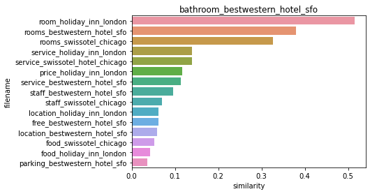

# 8. 텍스트 분석 (Text Analysis)

본 문서는 텍스트 전처리, BOW, 텍스트 분류, 감성 분석, 토픽 모델링, 문서 군집화, 문서 유사도, 한글 감성 분석까지의 실습 내용을 바탕으로 정리한 학습 노트이다.

---

## 8-1. 텍스트 분석 개요

텍스트 분석(Text Analytics)은 자연어 형태의 비정형 데이터를 정제하고, 이를 수치 벡터로 변환해 머신러닝 모델에 적용하는 과정 전반을 의미한다.

- **NLP와 텍스트 분석의 차이**
  - **NLP(Natural Language Processing)**: 기계가 인간 언어를 이해하고 해석하도록 만드는 데 초점을 둔다.
  - **텍스트 분석(Text Analytics)**: 텍스트에서 의미 있는 정보를 추출해 분류, 예측, 요약, 추천 등에 활용하는 데 초점을 둔다.

- **텍스트 분석의 주요 영역**
  - 텍스트 분류(Text Classification)
  - 감성 분석(Sentiment Analysis)
  - 토픽 모델링(Topic Modeling)
  - 문서 군집화(Document Clustering)
  - 문서 유사도 측정(Document Similarity)

- **기본 처리 흐름**
  1. 텍스트 정제 및 정규화
  2. 토큰화 및 불용어 제거
  3. 어근 추출 또는 표제어 추출
  4. 벡터화(BOW, TF-IDF 등)
  5. 머신러닝 모델 학습 및 평가

---

## 8-2. 텍스트 사전 준비 작업(텍스트 전처리)

텍스트 데이터는 그대로는 모델 입력으로 사용할 수 없기 때문에, 먼저 정규화와 전처리 과정을 거쳐야 한다. 이 과정은 보통 NLTK 같은 NLP 패키지를 활용해 수행한다.

### 클렌징 (Cleansing)

텍스트 분석에 방해가 되는 HTML 태그, 특수문자, 숫자, 불필요한 기호 등을 제거하는 작업이다.  
예를 들어 영화 리뷰 데이터에서는 `<br />` 같은 태그를 공백으로 치환하고, 정규 표현식을 이용해 영문 이외 문자를 제거하는 방식이 자주 사용된다.

### 토큰화 (Tokenization)

토큰화는 문서를 분석 가능한 단위로 나누는 과정이다.

- **문장 토큰화**: 문서를 문장 단위로 나눈다. `sent_tokenize()`를 사용한다.
- **단어 토큰화**: 문장을 다시 단어 단위로 나눈다. `word_tokenize()`를 사용한다.

문장 토큰화 후 각 문장을 다시 단어 토큰화하면 문서 구조를 더 세밀하게 다룰 수 있다.

```python
from nltk import sent_tokenize, word_tokenize

text_sample = "The Matrix is everywhere. It is all around us."
sentences = sent_tokenize(text_sample)
words = word_tokenize(sentences[0])
```

```text
<class 'list'> 3
['The Matrix is everywhere its all around us, here even in this room.',
 'You can see it out your window or on your television.',
 'You feel it when you go to work, or go to church or pay your taxes.']

<class 'list'> 15
['The', 'Matrix', 'is', 'everywhere', 'its', 'all', 'around', 'us', ',', 'here', 'even', 'in', 'this', 'room', '.']
```

### 스톱 워드 제거 (Stop Word Removal)

`is`, `the`, `a`, `will`처럼 자주 등장하지만 큰 의미를 갖지 않는 단어를 제거하는 과정이다.  
불용어를 제거하지 않으면 핵심 단어보다 빈도가 높은 일반 단어가 오히려 중요한 피처처럼 작동할 수 있다.

### 어근 추출과 표제어 추출

단어는 시제, 복수형, 진행형 등으로 다양하게 변형되므로, 이를 원형 중심으로 통일하는 작업이 필요하다.

- **Stemming(어간 추출)**: 단순 규칙으로 단어를 잘라 어근 형태로 맞춘다. 빠르지만 다소 거칠다.
- **Lemmatization(표제어 추출)**: 품사와 의미를 고려해 더 정확한 원형 단어를 찾는다. 느리지만 결과가 더 자연스럽다.

실습에서도 `LancasterStemmer`와 `WordNetLemmatizer`를 비교해 보면, Lemmatization 쪽이 더 의미적으로 자연스러운 단어를 반환한다.

```python
from nltk.stem import LancasterStemmer, WordNetLemmatizer

stemmer = LancasterStemmer()
lemma = WordNetLemmatizer()

print(stemmer.stem("working"), stemmer.stem("works"), stemmer.stem("worked"))
print(lemma.lemmatize("amusing", "v"), lemma.lemmatize("amuses", "v"))
```

```text
work work work
amus amus
```

---

## 8-3. Bag of Words (BOW)와 희소 행렬

### BOW의 개념

BOW(Bag of Words)는 문서 안에 어떤 단어가 몇 번 등장했는지를 기반으로 피처를 구성하는 가장 기본적인 텍스트 벡터화 방식이다.  
단어의 순서나 문맥은 고려하지 않고, 단어의 존재와 빈도 자체에 집중한다.

- **장점**
  - 구조가 단순하고 구현이 쉽다.
  - 전통적인 머신러닝 모델과 결합하기 좋다.

- **단점**
  - 단어 순서를 고려하지 못해 문맥 정보가 손실된다.
  - 전체 단어 사전을 기준으로 벡터를 만들기 때문에 차원이 매우 커진다.
  - 대부분의 값이 0인 희소 행렬(Sparse Matrix)이 만들어진다.

### Count 기반 벡터화와 TF-IDF 벡터화

- **CountVectorizer**: 단어 등장 횟수를 그대로 피처 값으로 사용한다.
- **TfidfVectorizer**: 특정 문서에서 자주 등장하지만 전체 문서에서는 흔하지 않은 단어에 더 높은 가중치를 부여한다.

일반적으로 분류 문제에서는 단순 Count 기반보다 TF-IDF 기반이 더 좋은 성능을 보이는 경우가 많다.

```python
from sklearn.feature_extraction.text import CountVectorizer, TfidfVectorizer

cnt_vect = CountVectorizer()
tfidf_vect = TfidfVectorizer(stop_words="english", ngram_range=(1, 2))
```

실제 전처리 출력 예시는 다음과 같았다.

```text
영어 stop words 갯수: 198

불용어 제거 후:
[['matrix', 'everywhere', 'around', 'us', ',', 'even', 'room', '.'],
 ['see', 'window', 'television', '.'],
 ['feel', 'go', 'work', ',', 'go', 'church', 'pay', 'taxes', '.']]
```

### 희소 행렬의 표현 방식

텍스트 벡터화 결과는 대부분 0으로 채워진 큰 행렬이 되기 때문에, 메모리를 아끼기 위해 희소 행렬로 저장한다.

- **COO(Coordinate) 형식**
  - 0이 아닌 값과 해당 행, 열 위치를 각각 따로 저장하는 기본적인 방식이다.

- **CSR(Compressed Sparse Row) 형식**
  - COO보다 메모리 효율이 높고 연산 성능도 좋다.
  - 사이킷런의 `CountVectorizer`, `TfidfVectorizer`도 기본적으로 CSR 형식의 희소 행렬을 반환한다.

즉, BOW 계열 벡터화에서는 벡터화 자체보다도 이 거대한 희소 행렬을 얼마나 효율적으로 다루는지가 매우 중요하다.

```python
import numpy as np
from scipy import sparse

dense = np.array([[3, 0, 1], [0, 2, 0]])
data = np.array([3, 1, 2])
row_pos = np.array([0, 0, 1])
col_pos = np.array([0, 2, 1])

sparse_coo = sparse.coo_matrix((data, (row_pos, col_pos)))
sparse_csr = sparse_coo.tocsr()
```

```text
array([[3, 0, 1],
       [0, 2, 0]])
```

---

## 8-4. 텍스트 분류 실습 - 20 뉴스그룹(20 Newsgroups)

### 데이터 세트와 전처리

20 뉴스그룹 데이터는 20개 주제의 뉴스 문서를 모아 둔 대표적인 텍스트 분류용 데이터 세트이다.  
실습에서는 `fetch_20newsgroups()`를 이용해 데이터를 불러오고, 문서 본문만 남기기 위해 헤더(header), 푸터(footer), 인용구(quotes)를 제거하였다.

이 작업은 중요한 이유가 있다. 메타데이터가 그대로 남아 있으면 모델이 실제 본문 의미가 아니라 형식적인 단서로 분류를 수행할 수 있기 때문이다.

실행 결과 기준으로 전체 데이터는 20개 클래스로 구성되어 있었고, 학습/테스트 데이터 크기는 다음과 같았다.

```text
dict_keys(['data', 'filenames', 'target_names', 'target', 'DESCR'])

학습 데이터 크기 11314 , 테스트 데이터 크기 7532
```

또한 `news_data.target_names`를 통해 20개 뉴스그룹 카테고리를 확인할 수 있었고, 각 클래스는 대체로 수백 건 단위로 비교적 고르게 분포해 있었다.

### 피처 벡터화와 분류 모델

텍스트를 벡터화한 뒤, 희소 행렬 처리에 강한 **로지스틱 회귀(Logistic Regression)** 모델을 적용하였다.

- Count 기반 벡터화보다 **TF-IDF 벡터화**가 더 나은 분류 성능을 보였다.
- `stop_words='english'`, `ngram_range=(1,2)`, `max_df` 설정 등을 함께 적용하면 성능이 더 좋아졌다.

여기서 중요한 점은 다음과 같다.

- 학습 데이터에는 `fit_transform()`을 사용한다.
- 테스트 데이터에는 반드시 `transform()`만 사용한다.

테스트 데이터까지 다시 `fit()` 해버리면 학습 시점과 피처 공간이 달라져 올바른 평가가 불가능해진다.

실습에서 확인한 벡터화 및 성능 비교 결과는 다음과 같다.

```text
학습 데이터 Text의 CountVectorizer Shape: (11314, 101631)

CountVectorized Logistic Regression 의 예측 정확도는 0.617
TF-IDF Logistic Regression 의 예측 정확도는 0.678
TF-IDF Vectorized Logistic Regression 의 예측 정확도는 0.690
```

즉, 같은 로지스틱 회귀 모델이라도 Count 기반보다 TF-IDF 기반이 더 나은 성능을 보였고, 불용어 제거와 bi-gram 설정을 함께 적용했을 때 정확도가 추가로 향상되었다.

### GridSearchCV와 Pipeline

텍스트 분석에서는 전처리와 모델 학습이 강하게 연결되어 있으므로, `Pipeline`을 사용하면 코드가 훨씬 깔끔해진다.

- `TfidfVectorizer`
- `LogisticRegression`

위 두 단계를 하나의 파이프라인으로 묶고, `GridSearchCV`를 결합해 다음과 같은 요소를 한 번에 튜닝할 수 있다.

- `tfidf_vect__ngram_range`
- `tfidf_vect__stop_words`
- `lr_clf__C`

즉, 텍스트 분류에서는 단순히 모델만 바꾸는 것이 아니라, 벡터화 방식과 모델 파라미터를 함께 최적화하는 것이 성능 향상에 중요하다.

```python
from sklearn.pipeline import Pipeline
from sklearn.feature_extraction.text import TfidfVectorizer
from sklearn.linear_model import LogisticRegression

pipeline = Pipeline([
    ("tfidf_vect", TfidfVectorizer(stop_words="english", ngram_range=(1, 2), max_df=300)),
    ("lr_clf", LogisticRegression(solver="liblinear", C=10))
])
```

GridSearchCV와 Pipeline을 적용한 실제 결과는 다음과 같았다.

```text
Logistic Regression best C parameter : {'C': 10}
TF-IDF Vectorized Logistic Regression 의 예측 정확도는 0.704

Pipeline을 통한 Logistic Regression 의 예측 정확도는 0.704

{'lr_clf__C': 10, 'tfidf_vect__max_df': 700, 'tfidf_vect__ngram_range': (1, 2)} 0.7550828826229531
Pipeline을 통한 Logistic Regression 의 예측 정확도는 0.702
```

흥미로운 점은 교차 검증 최고 점수는 약 0.755까지 나왔지만, 테스트 정확도는 0.702~0.704 수준이었다는 것이다. 즉, 파이프라인과 하이퍼파라미터 튜닝이 분명 유효하지만, 검증 성능이 그대로 테스트 성능으로 이어지지는 않는다는 점도 함께 확인할 수 있었다.

---

## 8-5. 감성 분석 (Sentiment Analysis)

감성 분석은 문서가 긍정인지 부정인지, 혹은 어떤 감정 성향을 가지는지를 판별하는 작업이다.  
실습에서는 **지도학습 기반 방법**과 **사전(Lexicon) 기반 방법**을 모두 다루었다.

### 지도학습 기반 감성 분석 - IMDB 영화 리뷰

IMDB 영화 리뷰 데이터는 감성 레이블이 함께 제공되므로, 일반적인 분류 문제처럼 접근할 수 있다.

전처리 과정은 다음과 같다.

- HTML 태그 제거
- 영문 이외 문자 제거
- 학습/테스트 데이터 분리
- TF-IDF 기반 벡터화

실습 데이터는 다음처럼 `id`, `sentiment`, `review` 컬럼으로 구성되어 있었고, 학습/테스트 분할 결과는 `(17500, 1)`, `(7500, 1)`이었다.

```text
         id  sentiment                                             review
0  "5814_8"          1  "With all this stuff going down at the moment ...
1  "2381_9"          1  "\"The Classic War of the Worlds\" by Timothy ...
2  "7759_3"          0  "The film starts with a manager (Nicholas Bell...
```

이후 `TfidfVectorizer`와 `LogisticRegression`을 `Pipeline`으로 연결해 감성 분류를 수행하였다.  
텍스트 분류와 마찬가지로 감성 분석에서도 TF-IDF와 로지스틱 회귀 조합이 강력하게 작동한다.

```python
from sklearn.pipeline import Pipeline
from sklearn.feature_extraction.text import TfidfVectorizer
from sklearn.linear_model import LogisticRegression

pipeline = Pipeline([
    ("tfidf_vect", TfidfVectorizer(stop_words="english", ngram_range=(1, 2))),
    ("lr_clf", LogisticRegression(C=10, solver="liblinear"))
])
```

Count 기반과 TF-IDF 기반 지도학습 모델의 실제 성능은 다음과 같았다.

```text
예측 정확도는 0.8861, ROC-AUC는 0.9503
예측 정확도는 0.8936, ROC-AUC는 0.9598
```

즉, 지도학습 기반 감성 분석에서는 CountVectorizer 조합도 상당히 강력했지만, TF-IDF 조합이 정확도와 ROC-AUC 모두에서 조금 더 우수한 결과를 보였다.

### 사전 기반 감성 분석 - SentiWordNet

SentiWordNet은 WordNet의 Synset에 긍정, 부정, 객관성 점수를 부여한 감성 사전이다.

기본 처리 흐름은 다음과 같다.

1. 문장을 문장 단위와 단어 단위로 분리한다.
2. 각 단어의 품사를 태깅한다.
3. 표제어 추출을 수행한다.
4. 해당 단어의 SentiWordNet 점수를 찾는다.
5. 문서 전체의 긍정/부정 점수를 합산해 최종 감성을 판별한다.

실습 결과, IMDB 데이터에서 다음과 같은 성능을 보였다.

- Accuracy: 약 **66.13%**
- Recall: 약 **70.91%**

혼동행렬과 세부 지표는 다음과 같았다.

```text
[[7669 4831]
 [3635 8865]]
정확도: 0.6614
정밀도: 0.6473
재현율: 0.7092
```

사전 기반 방식은 학습 데이터가 없어도 사용할 수 있다는 장점이 있지만, 문맥을 정교하게 반영하기 어렵다는 한계가 있다.

```python
def swn_polarity(text):
    # 문장 분리 -> 단어 토큰화 -> 품사 태깅 -> 표제어 추출 -> 감성 점수 합산
    ...
```

### VADER 감성 분석

VADER는 소셜 미디어 텍스트 감성 분석을 위해 설계된 규칙 기반 감성 분석 도구이다.  
NLTK의 `SentimentIntensityAnalyzer`를 통해 간단히 사용할 수 있으며, 다음 4개 점수를 반환한다.

- `neg`: 부정 점수
- `neu`: 중립 점수
- `pos`: 긍정 점수
- `compound`: 최종 복합 감성 점수

보통 `compound` 점수가 특정 임계값 이상이면 긍정, 그보다 작으면 부정으로 분류한다.

실제로 예시 리뷰에 대해 계산한 VADER 점수는 다음과 같았다.

```text
{'neg': 0.13, 'neu': 0.743, 'pos': 0.127, 'compound': -0.7943}
```

실습 결과, VADER는 SentiWordNet보다 더 좋은 성능을 보였다.

- Accuracy: **69.56%**
- Recall: **85.14%**

혼동행렬과 세부 지표는 다음과 같았다.

```text
[[ 6747  5753]
 [ 1858 10642]]
정확도: 0.6956
정밀도: 0.6491
재현율: 0.8514
```

즉, 사전 기반 감성 분석 안에서도 어떤 감성 사전을 쓰는지에 따라 성능 차이가 꽤 크게 발생한다.

```python
from nltk.sentiment.vader import SentimentIntensityAnalyzer

analyzer = SentimentIntensityAnalyzer()
scores = analyzer.polarity_scores(review_text)
```

---

## 8-6. 토픽 모델링 (Topic Modeling) - LDA

토픽 모델링은 문서 집합 안에 숨어 있는 주제를 자동으로 찾아내는 비지도학습 기법이다.  
실습에서는 **LDA(Latent Dirichlet Allocation)** 를 이용해 20 뉴스그룹 데이터 일부에서 토픽을 추출하였다.

### LDA 실습 흐름

1. 20 뉴스그룹 중 일부 주제만 선택해 문서를 구성한다.
2. `CountVectorizer`로 문서를 단어 빈도 기반 벡터로 변환한다.
3. `LatentDirichletAllocation`으로 토픽 개수를 지정해 모델을 학습한다.
4. `components_` 속성을 기반으로 토픽별 상위 단어를 확인한다.

여기서 중요한 점은 **LDA는 TF-IDF보다 Count 기반 벡터화와 더 잘 결합된다**는 것이다.  
토픽 모델링의 목적은 예측 정확도 향상이 아니라, 문서의 잠재 주제를 해석 가능한 단어 집합으로 드러내는 데 있다.

### 결과 해석

학습된 `components_` 배열에서 값이 큰 단어일수록 해당 토픽을 대표하는 핵심 단어이다.  
실습 결과 일부 토픽은 종교, 의학, 컴퓨터, 그래픽 등 비교적 명확한 주제어 묶음으로 해석되었다.

다만 토픽 모델링은 사람이 사전에 정의한 카테고리를 그대로 재현하는 작업이 아니기 때문에, 토픽과 실제 데이터 레이블이 완전히 1:1로 대응되지는 않는다.

즉, LDA는 분류기가 아니라 문서 집합의 전반적인 주제 구조를 탐색하는 도구로 이해하는 것이 적절하다.

```python
from sklearn.feature_extraction.text import CountVectorizer
from sklearn.decomposition import LatentDirichletAllocation

count_vect = CountVectorizer(max_df=0.95,
                             max_features=1000,
                             min_df=2,
                             stop_words="english",
                             ngram_range=(1, 2))
feat_vect = count_vect.fit_transform(documents)

lda = LatentDirichletAllocation(n_components=8, random_state=0)
lda.fit(feat_vect)
```

실습에서 생성된 벡터와 토픽 행렬 크기는 다음과 같았다.

```text
CountVectorizer Shape: (7862, 1000)
(8, 1000)
```

대표적으로 출력된 토픽 단어는 다음과 같았다.

```text
Topic #0
year 10 game medical health team 12 20 disease cancer 1993 games years patients good

Topic #2
image file jpeg program gif images output format files color entry 00 use bit 03

Topic #4
armenian israel armenians jews turkish people israeli jewish government war dos dos turkey arab armenia 000

Topic #6
god people jesus church believe christ does christian say think christians bible faith sin life

Topic #7
use dos thanks windows using window does display help like problem server need know run
```

---

## 8-7. 문서 군집화 (Document Clustering)

문서 군집화는 정답 레이블 없이 비슷한 문서끼리 묶는 비지도학습 문제이다.  
실습에서는 Opinion Review 데이터 세트를 사용해 여러 리뷰 문서를 군집화하였다.

### 데이터 구성과 벡터화

실습 데이터는 전자기기, 호텔, 자동차 등 여러 리뷰 문서로 구성되어 있다.  
여러 개의 텍스트 파일을 읽어 `filename`, `opinion_text` 컬럼을 가진 DataFrame으로 정리한 뒤, `TfidfVectorizer`로 벡터화하였다.

이때 tokenizer 자리에 Lemmatization 기반 사용자 정의 함수를 넣어 어근 변환을 함께 수행하였다.

### K-Means 군집화 결과

먼저 `n_clusters=5`로 군집화를 수행하면, 전자기기 리뷰가 세부 제품 단위로 더 잘게 나뉘는 경향이 나타난다.  
반면 `n_clusters=3`으로 줄이면 전체 리뷰가 다음과 같은 큰 주제로 비교적 명확하게 묶인다.

- 전자기기
- 자동차
- 호텔

즉, 군집 수를 어떻게 두느냐에 따라 세부 분화 중심의 군집화가 될 수도 있고, 상위 범주 중심의 군집화가 될 수도 있다.

```python
from sklearn.feature_extraction.text import TfidfVectorizer
from sklearn.cluster import KMeans

tfidf_vect = TfidfVectorizer(tokenizer=LemNormalize,
                             stop_words="english",
                             ngram_range=(1, 2))
feature_vect = tfidf_vect.fit_transform(document_df["opinion_text"])

km_cluster = KMeans(n_clusters=3, max_iter=10000, random_state=0)
km_cluster.fit(feature_vect)
```

실습에서 생성한 중심 벡터의 크기는 다음과 같았다.

```text
cluster_centers shape : (3, 4610)
```

### 군집별 핵심 단어 추출

`KMeans`의 `cluster_centers_`를 확인하면 각 군집 중심에 가까운 단어를 추출할 수 있다.  
이를 통해 왜 문서가 해당 군집에 배정되었는지를 해석할 수 있다.

예를 들어 실습에서는 다음과 같은 단어들이 각 군집을 대표했다.

- 전자기기 군집: `screen`, `battery`, `keyboard`, `video`
- 자동차 군집: `interior`, `seat`, `mileage`, `gas`
- 호텔 군집: `room`, `hotel`, `service`, `staff`, `food`

실제 출력된 군집별 핵심 단어와 대표 리뷰 파일은 다음과 같았다.

```text
Cluster 0
Top features: ['room', 'hotel', 'service', 'staff', 'food', 'location', 'bathroom', 'clean', 'price', 'parking']
대표 리뷰: room_holiday_inn_london, location_holiday_inn_london, staff_bestwestern_hotel_sfo

Cluster 1
Top features: ['screen', 'battery', 'keyboard', 'battery life', 'life', 'kindle', 'direction', 'video', 'size', 'voice']
대표 리뷰: battery-life_ipod_nano_8gb, voice_garmin_nuvi_255W_gps, speed_garmin_nuvi_255W_gps

Cluster 2
Top features: ['interior', 'seat', 'mileage', 'comfortable', 'gas', 'gas mileage', 'transmission', 'car', 'performance', 'quality']
대표 리뷰: gas_mileage_toyota_camry_2007, comfort_honda_accord_2008, interior_toyota_camry_2007
```

비지도학습 결과임에도 주제별 핵심 단어가 비교적 선명하게 나왔다는 점이 인상적이다.

---

## 8-8. 문서 유사도와 코사인 유사도

문서 간 유사도를 측정할 때 가장 널리 사용하는 방법 중 하나가 **코사인 유사도(Cosine Similarity)** 이다.

### 코사인 유사도의 개념

코사인 유사도는 두 벡터의 크기보다 **방향의 유사성**에 집중하는 지표이다.

$$
\cos(\theta) = \frac{A \cdot B}{||A|| \, ||B||}
$$

텍스트 벡터는 차원이 크고 희소하기 때문에, 단순 유클리드 거리보다 코사인 유사도가 훨씬 적절한 경우가 많다.  
특히 문서 길이가 서로 다르더라도, 단어 구성 비율이 비슷하면 높은 유사도를 얻을 수 있다.

### 사이킷런을 이용한 유사도 계산

넘파이로 직접 공식을 구현할 수도 있지만, 실무에서는 `sklearn.metrics.pairwise.cosine_similarity`를 사용하는 편이 훨씬 간단하다.

- 문서 한 개와 나머지 문서 간 유사도 계산 가능
- 전체 문서 쌍의 유사도 행렬도 한 번에 계산 가능

```python
from sklearn.metrics.pairwise import cosine_similarity

similarity_simple_pair = cosine_similarity(feature_vect_simple[0], feature_vect_simple)
similarity_matrix = cosine_similarity(feature_vect_simple, feature_vect_simple)
```

간단한 3개 문장 예시에서 계산된 결과는 다음과 같았다.

```text
문장 1, 문장 2 Cosine 유사도: 0.402
문장 1, 문장 3 Cosine 유사도: 0.404
문장 2, 문장 3 Cosine 유사도: 0.456

[[1.         0.40207758 0.40425045]
 [0.40207758 1.         0.45647296]
 [0.40425045 0.45647296 1.        ]]
```

### Opinion Review 데이터 적용

앞서 군집화에 사용한 Opinion Review 데이터에서 호텔 군집 문서만 따로 추출한 뒤, 특정 문서를 기준으로 다른 호텔 리뷰들과의 코사인 유사도를 계산하였다.

실습 결과, 샌프란시스코 베스트 웨스턴 호텔의 욕실 관련 리뷰와 가장 유사한 문서는 런던 홀리데이 인 호텔의 객실 리뷰로 나타났으며, 유사도는 약 **0.514** 수준이었다.

즉, 코사인 유사도는 문서 추천, 검색 결과 정렬, 유사 문서 탐색 같은 작업에 매우 유용하게 활용될 수 있다.

실제 호텔 군집 기준 문서와 유사도 출력은 다음과 같았다.

```text
호텔로 클러스터링 된 문서들의 DataFrame Index:
Int64Index([1, 13, 14, 15, 20, 21, 24, 28, 30, 31, 32, 38, 39, 40, 45, 46], dtype='int64')

비교 기준 문서명:
bathroom_bestwestern_hotel_sfo

유사도:
[[1.         0.0430688  0.05221059 0.06189595 0.05846178 0.06193118
  0.03638665 0.11742762 0.38038865 0.32619948 0.51442299 0.11282857
  0.13989623 0.1386783  0.09518068 0.07049362]]
```



위 이미지는 호텔 군집 내 기준 문서와 다른 호텔 리뷰들 간의 코사인 유사도를 막대그래프로 시각화한 결과이다.

---

## 8-9. 한글 텍스트 처리와 네이버 영화 평점 감성 분석

영어 기반 NLP와 달리 한글 NLP는 형태소 구조와 조사 결합 때문에 전처리가 훨씬 까다롭다.

### 한글 NLP가 어려운 이유

- **띄어쓰기 문제**: 띄어쓰기 하나만 달라져도 의미가 크게 달라질 수 있다.
- **조사와 어미 결합**: 어근에 조사와 어미가 다양하게 붙기 때문에 단순 공백 기준 토큰화로는 의미 단위를 제대로 분리하기 어렵다.

따라서 한글 텍스트 분석에서는 일반적인 토큰화보다 **형태소 분석**이 훨씬 중요하다.

### KoNLPy와 형태소 분석

KoNLPy는 파이썬에서 한글 형태소 분석기를 쉽게 사용할 수 있도록 만든 패키지이다.  
실습에서는 `Twitter` 형태소 분석기(현재는 `Okt`)를 사용해 문장을 형태소 단위로 분리하였다.

형태소 분석기를 `TfidfVectorizer`의 `tokenizer` 인자로 연결하면, 한글 문장을 공백 단위가 아니라 실제 형태소 단위로 벡터화할 수 있다.

### 네이버 영화 평점(NSMC) 데이터 실습

실습 흐름은 다음과 같다.

1. `ratings_train.txt`, `ratings_test.txt` 데이터를 불러온다.
2. 결측치를 채우고 숫자를 정규 표현식으로 제거한다.
3. 형태소 분석 기반 토크나이저를 정의한다.
4. `TfidfVectorizer`로 한글 텍스트를 벡터화한다.
5. `LogisticRegression` 모델을 학습한다.
6. `GridSearchCV`로 `C` 값을 튜닝한다.

```python
from konlpy.tag import Twitter
from sklearn.feature_extraction.text import TfidfVectorizer
from sklearn.linear_model import LogisticRegression
from sklearn.model_selection import GridSearchCV

twitter = Twitter()

def tw_tokenizer(text):
    return twitter.morphs(text)

tfidf_vect = TfidfVectorizer(tokenizer=tw_tokenizer, ngram_range=(1, 2), min_df=3, max_df=0.9)
lg_clf = LogisticRegression(random_state=0, solver="liblinear")
params = {"C": [1, 3.5, 4.5, 5.5, 10]}
```

실습에서 확인한 학습 데이터 일부와 라벨 분포는 다음과 같았다.

```text
         id                           document  label
0   9976970                아 더빙.. 진짜 짜증나네요 목소리      0
1   3819312  흠...포스터보고 초딩영화줄....오버연기조차 가볍지 않구나      1
2  10265843                  너무재밓었다그래서보는것을추천한다      0

0    75173
1    74827
Name: label, dtype: int64
```

실습 로그 기준 최적 파라미터는 다음과 같다.

```text
{'C': 3.5} 0.8593

Logistic Regression 정확도:  0.86172
```

즉, 네이버 영화 평점 데이터에서는 약 **86.17%** 정확도로 감성 분류가 수행되었다.  
한글 텍스트도 적절한 형태소 분석과 TF-IDF 벡터화를 적용하면 전통적인 머신러닝 방식으로 꽤 높은 성능을 얻을 수 있음을 보여준다.

---

## 정리

텍스트 분석은 결국 **텍스트를 어떻게 잘 정제하고, 어떤 방식으로 수치 벡터로 바꾸며, 그 벡터를 어떤 문제에 적용하느냐**의 문제로 정리할 수 있다.

- 전처리는 토큰화, 불용어 제거, 어근 추출이 핵심이다.
- 벡터화에서는 BOW와 TF-IDF가 기본이며, 실전에서는 TF-IDF가 더 자주 유리하다.
- 분류와 감성 분석은 로지스틱 회귀 같은 전통적인 모델과도 매우 잘 결합된다.
- 토픽 모델링, 군집화, 유사도 분석은 정답 레이블이 없는 텍스트를 탐색적으로 이해하는 데 유용하다.
- 한글 NLP는 형태소 분석이 특히 중요하며, KoNLPy 같은 도구의 역할이 크다.

결국 텍스트 분석은 전처리와 벡터화의 품질이 전체 모델 성능과 해석 가능성을 크게 좌우하는 분야라고 정리할 수 있다.
