# 『파이썬 머신러닝 완벽 가이드』 10장. 시각화(Visualization)

> 책 10장 내용 + [Matplotlib 실습 코드](https://github.com/Chankyu99/ModuLABS/blob/master/04_MachineLearning/Visualization/Visualization_Matplotlib.ipynb) + [Seaborn 실습 코드](https://github.com/Chankyu99/ModuLABS/blob/master/04_MachineLearning/Visualization/Visualization_Seaborn.ipynb)

---

## 1. 시각화를 시작하며 — Matplotlib과 Seaborn 개요

Matplotlib은 파이썬 시각화에 큰 공헌을 한 라이브러리이며, 가장 많이 사용되고 있다.

그러나 직관적이지 못한 개발 API로 인해 시각화 코딩에 익숙해지는 데 많은 시간이 걸리며, 축 이름이나 타이틀, 범례 등의 부가적인 속성을 일일이 코딩해야 하는 불편함이 있다.

Seaborn은 Matplotlib을 기반으로 만들어진 시각화 라이브러리로, Matplotlib의 복잡성을 줄이고 간편하게 시각화를 가능하게 해준다.

따라서 Matplotlib의 구조를 먼저 이해한 뒤, Seaborn으로 넘어가는 것이 효율적이다.

---

## 2. Matplotlib

### 2.1 Matplotlib.pyplot 모듈 이해

주로 `plt`라는 별칭으로 임포트하여 사용한다.

```python
import matplotlib.pyplot as plt
```

기본 흐름은 **데이터 입력** → **차트 꾸미기** → **차트 출력**이다.

```python
plt.plot(x, y)           # 데이터 입력
plt.xlabel('X축')         # 축 라벨
plt.ylabel('Y축')
plt.title('제목')         # 타이틀
plt.legend()             # 범례
plt.show()               # 출력
```

#### pyplot 기본 사용

```python
plt.plot([1, 2, 3, 4, 5, 6, 7, 8, 9, 10])
plt.show()
```

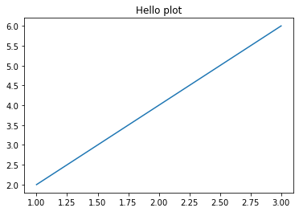

> 가장 단순한 형태의 `plt.plot()` 호출. x값을 지정하지 않으면 인덱스(0~9)가 자동으로 x축이 된다.

---

### 2.2 Figure와 Axes — pyplot의 두 가지 핵심 요소

- **Figure** : "캔버스" 느낌. 종이가 없으면 펜이 있어도 그릴 수 없으니 중요한 요소이다.
- **Axes** : 실제 그림을 그리는 메서드들을 가짐. 축 이외에도 다양한 것을 그릴 수 있다.

#### Figure 객체

Figure 객체로 전체 그림판의 크기, 배경색 등을 조절할 수 있다.

```python
plt.figure(figsize=(10, 4))                    # 크기 조절
plt.figure(figsize=(4, 4), facecolor='yellow')  # 배경색 설정
```

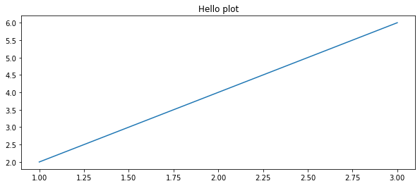

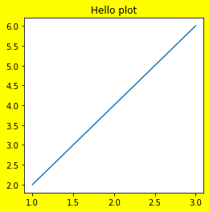

#### Axes 객체

Axes 객체로 실제 그래프를 그린다.

```python
ax = plt.axes()
ax.plot([1, 2, 3])
```

- `ax.set_xlabel(label)` : x축 이름 설정
- `ax.set_ylabel(label)` : y축 이름 설정
- `ax.set_title(title)` : 그래프 제목 설정
- `ax.legend()` : 범례 설정

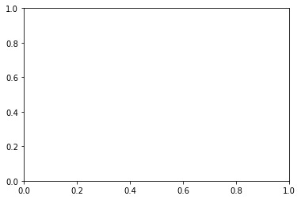

#### Figure와 Axes를 함께 가져오기

`plt.subplots()`를 사용하면 Figure와 Axes 객체를 동시에 반환받을 수 있다.

```python
fig, ax = plt.subplots(figsize=(4, 4))
ax.plot([1, 2, 3, 4, 5])
```


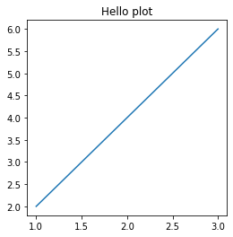

---

### 2.3 여러 개의 plot을 가지는 subplot 생성

`plt.subplots(nrows, ncols)`를 사용하면 여러 개의 subplot을 가지는 Figure를 생성할 수 있다.

```python
fig, (ax1, ax2) = plt.subplots(nrows=1, ncols=2, figsize=(10, 4))
ax1.plot([1, 2, 3])
ax2.plot([3, 2, 1])
```

이때, ax는 1차원 튜플(혹은 ndarray)이므로 `ax[0]`, `ax[1]`으로 접근한다. 2차원 배열인 경우 `ax[0][0]`, `ax[0][1]`과 같이 접근해야 한다. 각 Axes 객체에 메서드를 개별로 적용해야 한다.


---

### 2.4 plot() 함수로 선 그래프 그리기

`plt.plot()`에 들어갈 x, y 데이터는 **리스트 / ndarray / DataFrame / Series** 모두 가능하다. 단, 두 변수 간의 데이터 길이가 다르면 오류가 발생하므로 길이가 동일해야 한다.

#### 기본 선 그래프

```python
x_value = np.arange(1, 100)
y_value = np.log(x_value)
plt.plot(x_value, y_value)
```


#### DataFrame 활용

```python
df = pd.DataFrame({'x': np.arange(1, 100), 'y_log': np.log(np.arange(1, 100))})
plt.plot(df['x'], df['y_log'])
```

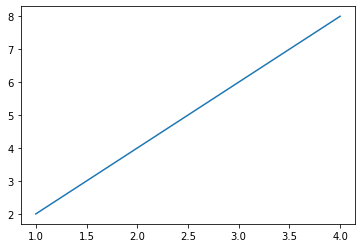

#### 색상·마커·선 스타일 변경 (API 기반)

보통 `color`, `marker`, `linestyle` 인자를 사용해서 그래프를 꾸미는데, 이를 **API 기반 시각화**라고 한다. 함수의 인자들을 알고 있어야 하는 단점이 있다.

```python
plt.plot(x_value, y_value, color='green', marker='o', linestyle='dashed')
```

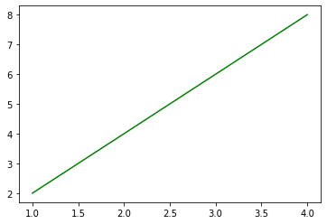

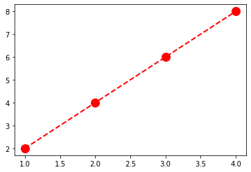

---

### 2.5 축 명칭 설정, 틱값 회전, 범례 설정

#### 축 라벨과 틱 설정

```python
plt.xlabel('X축 이름')
plt.ylabel('Y축 이름')
plt.xticks(rotation=45)   # 틱값 회전 (x축값이 문자열이고 많을 때)
```

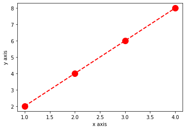

#### 틱값 회전 적용

x축에 100개의 값이 있을 때 글자가 겹치는 문제를 `rotation`으로 해결한다.

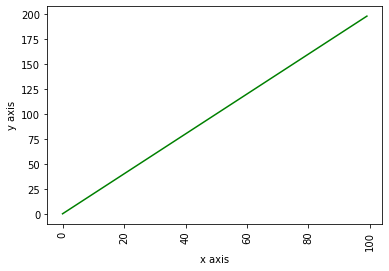

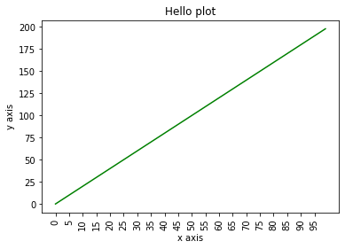

#### 범례(Legend) 설정

`plt.plot()` 함수에 `label` 인자를 전달한 뒤, `plt.legend()`를 호출하면 범례가 표시된다.

```python
plt.plot(x, y, label='log(x)')
plt.legend()
```

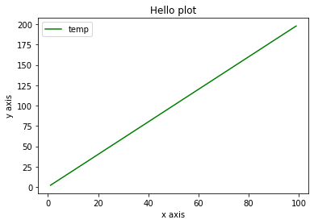

#### 여러 그래프를 하나의 Axes 내에서 시각화

하나의 Axes 안에 여러 `plot()`을 호출하면 겹쳐서 표현된다. 이때 `label`과 `legend()`를 활용하여 각 그래프를 구분한다.

```python
plt.plot(x, y1, label='2x')
plt.plot(x, y2, label='4x')
plt.legend()
```

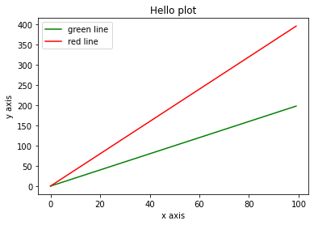

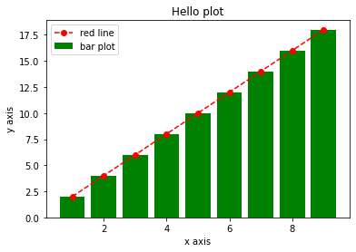

---

### 2.6 Axes 객체에서 직접 작업

`plt.plot()` 대신 Axes 객체의 메서드를 직접 호출하여 동일한 결과를 얻을 수 있다. 이 방식은 subplots 사용 시 필수적이다.

```python
figure = plt.figure()
ax = figure.add_subplot(111)
ax.plot(x, y)
ax.set_xlabel('X축')
ax.set_title('제목')
```


#### 여러 subplots에 개별 그래프 시각화

```python
fig, ax = plt.subplots(nrows=1, ncols=2, figsize=(6, 3))
ax[0].plot(x, y1)
ax[1].bar(x, y2)
```

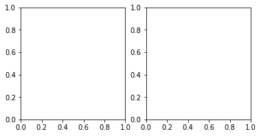

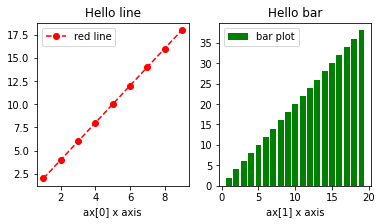

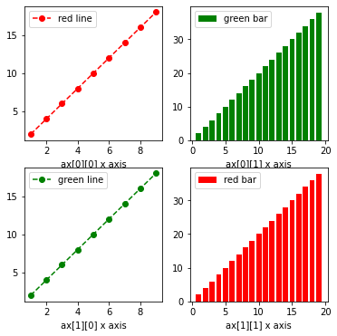

> **핵심**: Matplotlib의 핵심은 **Figure(캔버스)**와 **Axes(그래프 영역)**의 관계를 이해하는 것이다. `plt.plot()`은 내부적으로 Figure와 Axes를 자동 생성하지만, 복잡한 레이아웃에서는 `subplots()`로 직접 관리하는 것이 필수적이다.

---

## 3. Seaborn

시각화를 위한 차트/그래프의 유형은 크게 2가지로 분류된다.

1. **통계 분석을 위한 시각화** : 분포, 상관관계, 차이 확인
2. **비즈니스 분석을 위한 시각화** : 트렌드, 비교, 구성비 확인

Seaborn은 히스토그램, 바, 박스, 바이올린, 산점도, 상관 히트맵 등 다양한 그래프를 제공한다. 타이타닉 데이터셋을 활용하여 실습하였다.

```python
import seaborn as sns
titanic_df = pd.read_csv('titanic.csv')
```

---

### 3.1 히스토그램(Histogram)

연속형 변수의 분포를 시각적으로 확인하는 가장 기본적인 방법이다.

#### histplot (Axes 레벨)

```python
sns.histplot(x='Age', data=titanic_df)
```

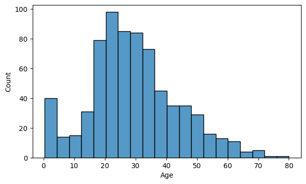

구간 개수를 늘리고 `kde=True`로 설정하면 히스토그램 위에 연속 확률분포 곡선(KDE)까지 시각화할 수 있다.

```python
sns.histplot(x='Age', data=titanic_df, bins=30, kde=True)
```

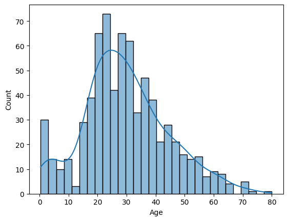

#### displot (Figure 레벨)

`displot`은 **Figure 레벨 함수**로, Matplotlib API 사용을 최소화하고 기본 기능들을 인자로 대체한다. 따라서 `plt.figure()`로 크기 조절이 불가능하다.

```python
sns.displot(x='Age', data=titanic_df, kde=True)
```

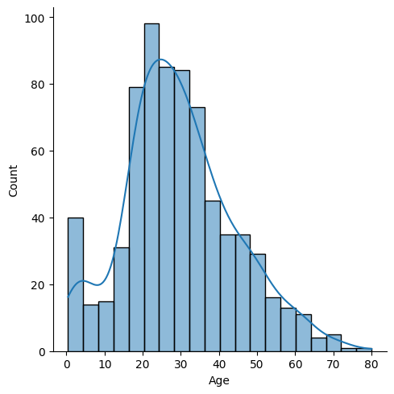

- `height`(세로)와 `aspect`(가로/세로 **배율**, 가로 길이가 아님!)로 Figure 크기를 조절한다.
- 그래프의 세부적인 변경이 불가능하지만, 여러 시각화 함수를 한 번에 시각화할 수 있는 장점이 있다.

```python
sns.displot(titanic_df['Age'], kde=True, height=4, aspect=2)
```

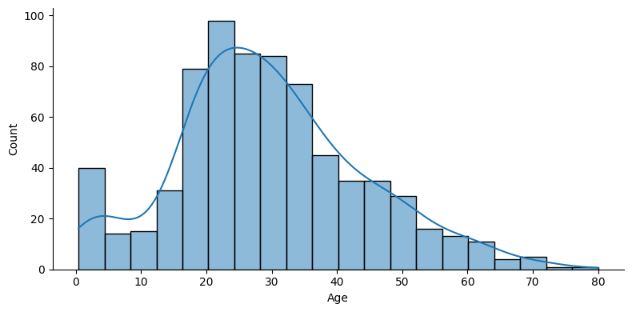

---

### 3.2 카운트플롯(Countplot)

카테고리 값에 대한 **건수**를 표현한다. x축이 카테고리값, y축이 해당 카테고리의 건수이다.

```python
sns.countplot(x='Pclass', data=titanic_df)
```

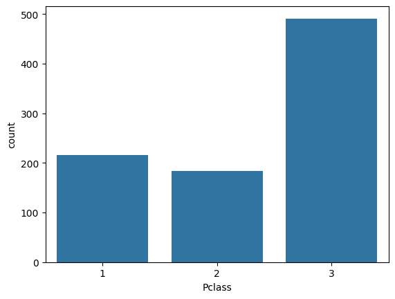

---

### 3.3 바플롯(Barplot)

x축은 이산값(주로 카테고리값), y축은 연속값(기본적으로 **평균**)을 표현한다.

#### 기본 barplot

```python
sns.barplot(x='Pclass', y='Age', data=titanic_df)    # 클래스별 Age 평균
sns.barplot(x='Pclass', y='Survived', data=titanic_df)  # 클래스별 생존율
```

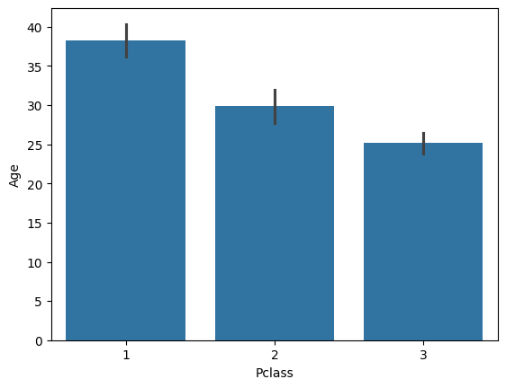

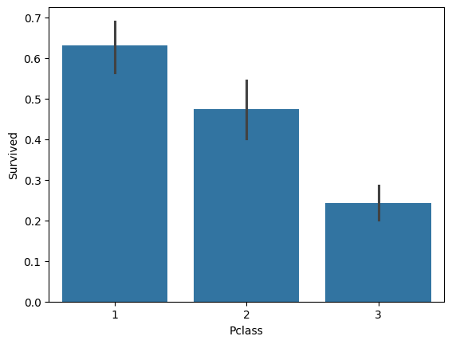

> y축을 문자값으로 설정하면 자동으로 수평 막대 그래프로 변환된다.

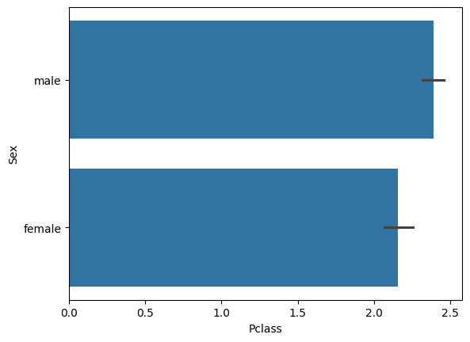

> x, y 인자 모두 문자열(범주형) 컬럼을 넣으면 barplot은 오류를 발생시킨다 — 최소 하나는 수치형이어야 한다.

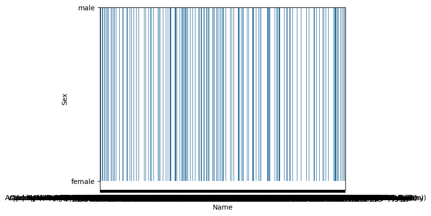

#### 신뢰구간 제거 & 통합 색상

```python
sns.barplot(x='Pclass', y='Survived', data=titanic_df, ci=None, color='green')
```

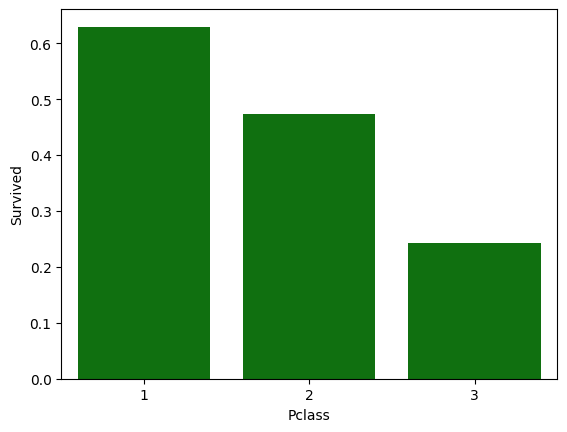

#### estimator 변경 (평균 → 총합)

```python
sns.barplot(x='Pclass', y='Survived', data=titanic_df, ci=None, estimator=sum)
```

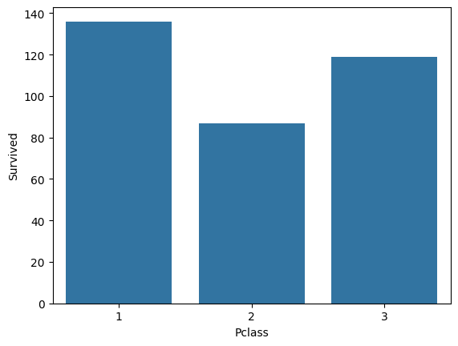

#### hue를 이용한 세분화

`hue` 파라미터를 설정하면 x축의 각 값을 특정 컬럼별로 세분화하여 시각화할 수 있다.

```python
sns.barplot(x='Pclass', y='Age', hue='Sex', data=titanic_df)
sns.barplot(x='Pclass', y='Survived', hue='Sex', data=titanic_df)
```

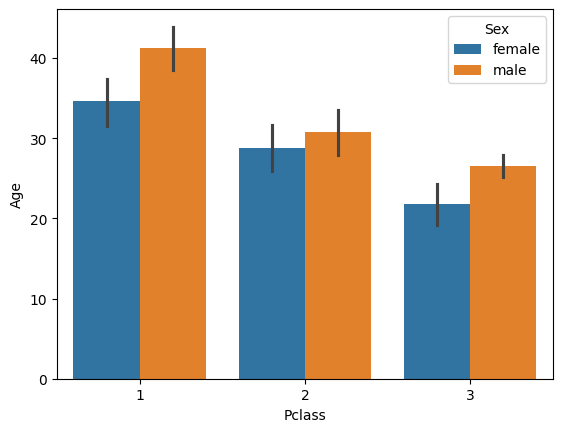

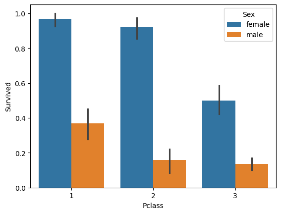

> **핵심**: `hue`는 하나의 축을 추가적인 범주로 쪼개어 비교 분석을 가능하게 하는 핵심 파라미터이다.

---

### 3.4 박스플롯(Box Plot)

4분위를 박스 형태로 표현한다. x축에 이산값을 부여하면 이산값에 따른 box plot을 시각화한다.

```python
sns.boxplot(y='Age', data=titanic_df)                      # 단변량
sns.boxplot(x='Pclass', y='Age', data=titanic_df)           # 클래스별
sns.boxplot(x='Pclass', y='Age', hue='Sex', data=titanic_df) # 성별 세분화
```

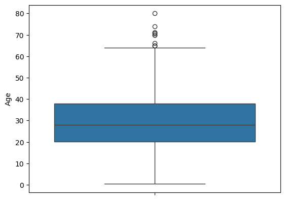

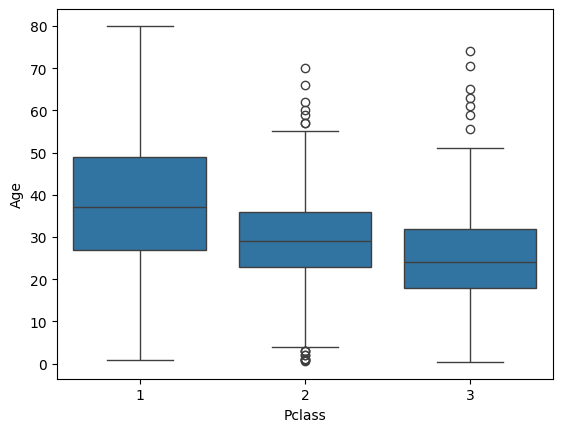

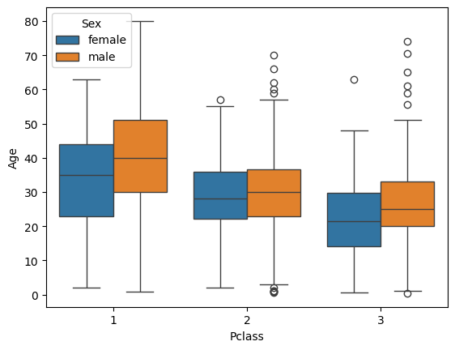

---

### 3.5 바이올린 플롯(Violin Plot)

단일 컬럼에 대해 히스토그램과 유사하게 연속값의 분포도를 시각화한다. 중심에는 4분위 정보를 포함한다. 보통 x축에 설정한 이산값 별로 y축의 분포도를 비교하는 용도로 많이 사용한다.

```python
sns.violinplot(y='Age', data=titanic_df)
sns.violinplot(x='Pclass', y='Age', data=titanic_df)
sns.violinplot(x='Pclass', y='Age', hue='Sex', data=titanic_df)
```

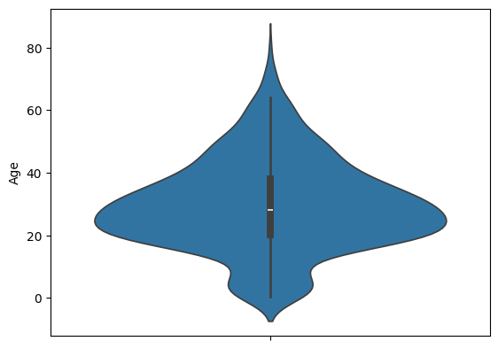

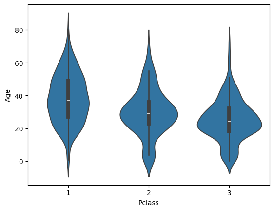

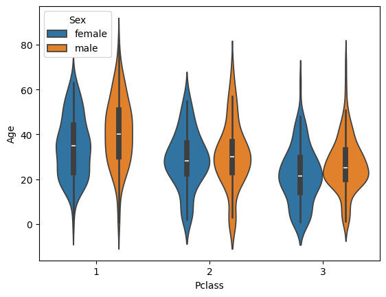

> Pclass별 Age의 연속 확률분포 곡선과 박스플롯을 동시에 시각화하므로, 분포의 형태와 중앙값·사분위수를 한눈에 비교할 수 있다.

---

### 3.6 subplots를 이용한 다중 시각화

Seaborn의 **Axes 레벨 함수**들은 `ax` 인자를 통해 특정 subplot 위치에 그래프를 배치할 수 있다.

#### 이산형 컬럼의 건수 시각화

```python
cat_columns = ['Survived', 'Pclass', 'Sex']
fig, axs = plt.subplots(nrows=1, ncols=len(cat_columns), figsize=(14, 4))

for index, column in enumerate(cat_columns):
    sns.countplot(x=column, data=titanic_df, ax=axs[index])
```

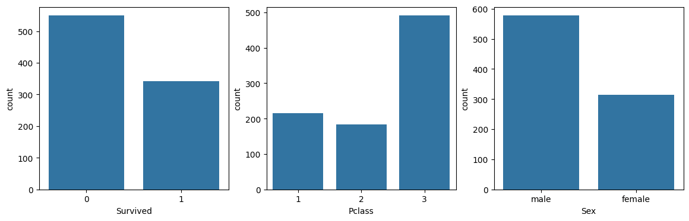

#### 이산형 컬럼별 생존율 시각화

```python
cat_columns = ['Pclass', 'Sex', 'Embarked']
fig, axs = plt.subplots(nrows=1, ncols=len(cat_columns), figsize=(14, 4))

for index, column in enumerate(cat_columns):
    sns.barplot(x=column, y='Survived', data=titanic_df, ax=axs[index])
```

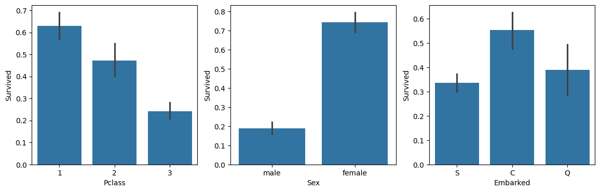

#### 연속형 컬럼의 Survived별 분포도

왼쪽에는 Violin Plot, 오른쪽에는 Survived별 Histogram을 함께 표현한다.

```python
cont_columns = ['Age', 'Fare']
for column in cont_columns:
    fig, axs = plt.subplots(nrows=1, ncols=2, figsize=(10, 4))
    sns.violinplot(x='Survived', y=column, data=titanic_df, ax=axs[0])
    sns.histplot(x=column, data=titanic_df, kde=True, hue='Survived', ax=axs[1])
```

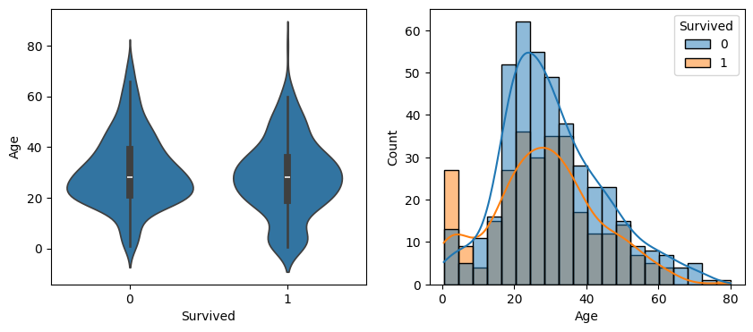

> 생존 여부에 따른 Age, Fare의 분포 차이를 한눈에 비교할 수 있다.

---

### 3.7 산점도(Scatter Plot)

x와 y축에 **연속형 값**을 시각화한다. `hue`, `style` 등을 통해 범주별 세분화가 가능하다.

```python
sns.scatterplot(x='Age', y='Fare', data=titanic_df)
sns.scatterplot(x='Age', y='Fare', hue='Survived', data=titanic_df)
sns.scatterplot(x='Age', y='Fare', hue='Survived', style='Sex', data=titanic_df)
```

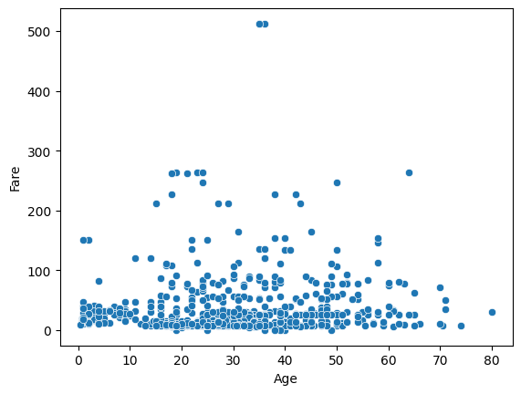

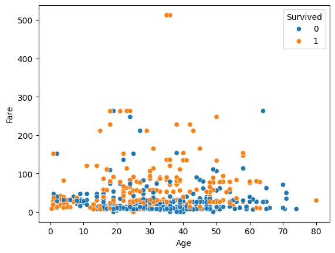

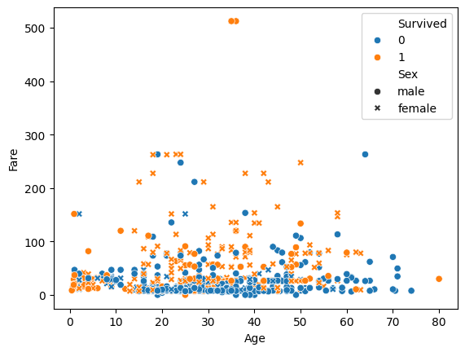

> `hue`는 색상으로, `style`은 마커 모양으로 범주를 구분한다. 두 개를 합쳐 사용하면 4차원(x, y, 색상, 모양)의 정보를 하나의 2D 그래프에 담을 수 있다.

---

### 3.8 상관 히트맵(Correlation Heatmap)

컬럼 간의 상관도를 히트맵 형태로 표현한다.

```python
corr = titanic_df.corr()
sns.heatmap(corr)
```


#### 컬러맵 변경

```python
sns.heatmap(corr, cmap='rocket')
```

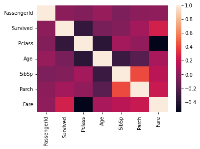

#### 상관계수 값 표시

```python
sns.heatmap(corr, annot=True, fmt='.1f', cbar=True)
```


> `annot=True`로 각 셀에 상관계수 값을 직접 표시하면, 색상만으로 파악하기 어려운 미세한 차이를 정확히 읽을 수 있다.

---

## 정리 : Matplotlib vs Seaborn

| 구분 | Matplotlib | Seaborn |
| :---: | :--- | :--- |
| **레벨** | 저수준(Low-level) | 고수준(High-level) |
| **유연성** | 매우 높음 (세밀한 커스텀 가능) | 상대적으로 제한적 |
| **편의성** | 낮음 (많은 코드 필요) | 높음 (간결한 코드) |
| **통계 시각화** | 직접 구현 필요 | 기본 내장 (KDE, CI 등) |
| **사용 시점** | 세밀한 커스터마이징 필요 시 | 빠른 탐색적 데이터 분석(EDA) 시 |

> **핵심**: Matplotlib은 시각화의 **기반 엔진**이고, Seaborn은 그 위에서 **통계적 시각화를 빠르게** 구현하기 위한 래퍼(wrapper)이다. 둘 다 알아야 하지만, EDA에서는 Seaborn으로 빠르게 패턴을 파악하고, 최종 발표용 그래프는 Matplotlib으로 세밀하게 다듬는 것이 효율적이다.
