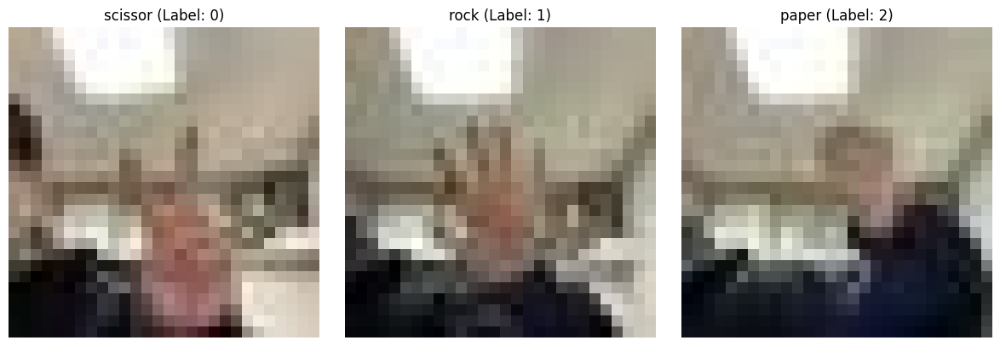

# [PROJECT] : [가위바위보 판독기]

# 데이터셋 = 직접 찍은 사진 300장(가위 + 바위 + 보 100장씩)

[구글 teachable machine](https://teachablemachine.withgoogle.com/)에서 이미지 데이터를 간편하게 생성

# 진행 과정

- 원하는 이미지 크기(28X28)로 Resize 데이터 로드 함수 구현(`load_data`)

- 300장 만으로는 과적합이 너무 심해 다른 조건을 가지고 이미지 데이터를 추가
    - 훈련에 사용할 300장 이미지 : 어두운 환경에서 왼손을 이용

    

    - 테스트에 사용할 300장 이미지 : 밝은 환경에서 오른손을 이용

    

# 모델링

<pre style="white-space:pre;overflow-x:auto;line-height:normal;font-family:Menlo,'DejaVu Sans Mono',consolas,'Courier New',monospace">┏━━━━━━━━━━━━━━━━━━━━━━━━━━━━━━━━━┳━━━━━━━━━━━━━━━━━━━━━━━━┳━━━━━━━━━━━━━━━┓
┃ Layer (type)                    ┃ Output Shape           ┃       Param # ┃
┡━━━━━━━━━━━━━━━━━━━━━━━━━━━━━━━━━╇━━━━━━━━━━━━━━━━━━━━━━━━╇━━━━━━━━━━━━━━━┩
│ conv2d_8 (Conv2D)               │ (None, 26, 26, 16)     │           448 │
├─────────────────────────────────┼────────────────────────┼───────────────┤
│ max_pooling2d_6 (MaxPooling2D)  │ (None, 13, 13, 16)     │             0 │
├─────────────────────────────────┼────────────────────────┼───────────────┤
│ conv2d_9 (Conv2D)               │ (None, 11, 11, 32)     │         4,640 │
├─────────────────────────────────┼────────────────────────┼───────────────┤
│ max_pooling2d_7 (MaxPooling2D)  │ (None, 5, 5, 32)       │             0 │
├─────────────────────────────────┼────────────────────────┼───────────────┤
│ flatten_3 (Flatten)             │ (None, 800)            │             0 │
├─────────────────────────────────┼────────────────────────┼───────────────┤
│ dense_6 (Dense)                 │ (None, 32)             │        25,632 │
├─────────────────────────────────┼────────────────────────┼───────────────┤
│ dense_7 (Dense)                 │ (None, 3)              │            99 │
└─────────────────────────────────┴────────────────────────┴───────────────┘
</pre>

<pre style="white-space:pre;overflow-x:auto;line-height:normal;font-family:Menlo,'DejaVu Sans Mono',consolas,'Courier New',monospace"> Total params: 30,819 (120.39 KB)
</pre>

<pre style="white-space:pre;overflow-x:auto;line-height:normal;font-family:Menlo,'DejaVu Sans Mono',consolas,'Courier New',monospace"> Trainable params: 30,819 (120.39 KB)
</pre>

<pre style="white-space:pre;overflow-x:auto;line-height:normal;font-family:Menlo,'DejaVu Sans Mono',consolas,'Courier New',monospace"> Non-trainable params: 0 (0.00 B)
</pre>

# 결과 정리

1. 왼손 300장 + 오른손 300장의 경우 Test accuracy가 약 **0.08**로 매우 낮게 측정
-> 조건이 달라진 테스트 케이스를 제대로 맞추지 못함

2. 총 600장의 데이터를 섞어 일정 비율로 훈련/테스트 데이터로 분리해 학습시킨 경우 Test accuracy가 **1.0**로 측정
-> 너무 과적합된 모습을 보였다.