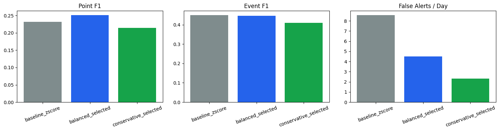
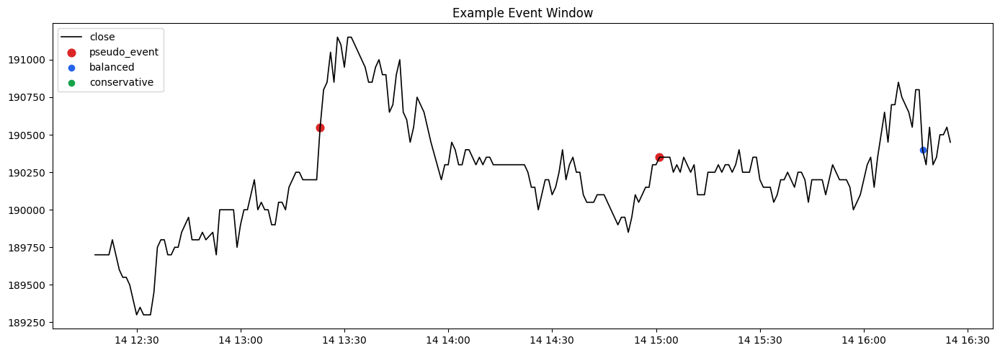
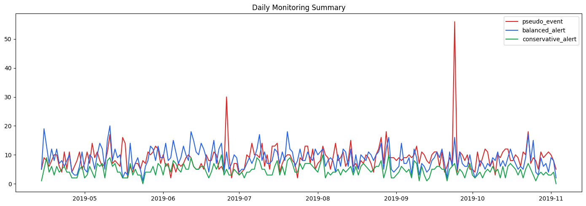

# 이더리움 1분봉 기반 이상 상태 모니터링 프로젝트

## 개요

- Upbit 이더리움 1분봉 데이터를 사용해 `트레이딩 전략`이 아니라 `이상 상태 조기경보 시스템`을 설계
- 핵심 목표는 이상 징후를 가능한 한 빨리 탐지하고, 동시에 오경보를 줄여 실제 운영에 가까운 규칙을 만드는 것
- 금융 데이터를 사용했지만, 전체 흐름은 `반도체 공정 모니터링`, `이상 감지`, `운영 규칙 튜닝`, `오경보 제어` 문제로 자연스럽게 번역할 수 있도록 설계

## 문제 정의

### 문제

- 원본 데이터는 1분봉이지만 시간 gap과 저유동성 구간이 섞여 있어 그대로 모델링하면 결과가 왜곡될 수 있음
- 이상 탐지에서는 단순 성능 점수보다 `오경보를 얼마나 줄였는지`가 실제 운영에서 더 중요함
- 금융 데이터를 사용하더라도 취업 포트폴리오에서는 이를 제조/공정 데이터 문제로 설명할 수 있어야 함

### 해결 방안

- 먼저 데이터 검증 단계에서 시간축 연속성, 결측 분, 저유동성 구간을 점검
- 기존 피처 파일을 그대로 쓰지 않고 drift, 중복, 분리력을 다시 확인
- rolling z-score, EWMA, Isolation Forest를 baseline으로 비교
- threshold와 cooldown rule을 validation에서 조정해 `balanced`, `conservative` 두 가지 운영안을 설계
- 최종 결과를 dashboard 형태와 반도체 공정 모니터링 언어로 정리

### 기대 효과

- 이상 상태를 빠르게 감지하면서도 경보량을 운영 가능한 수준으로 낮출 수 있음
- 단순 모델 성능 비교를 넘어, `운영 규칙 설계`까지 포함한 프로젝트로 확장 가능

## 데이터 분석 & 시각화

### 1. 데이터 검증 -- `notebooks/01_data_audit.ipynb`

원본 1분봉 데이터(`sub_upbit_eth_min_tick.csv`)가 실제로 모델링에 적합한지부터 다음 항목을 위주로 확인

- 시간축 연속성
- 결측 분 비율
- gap 분포
- 저유동성 구간
- 이상 징후 후보

#### 결과

- 누락 분 비율: 약 `9.73%`
- 1분 초과 gap 비율: 약 `5.59%`
- 최대 gap: `4,924분`

> 따라서 프로젝트에 사용된 데이터는 “완전한 연속 1분 시계열”로 다루기보다, 공백과 저유동성 구간을 분리해서 보는 것이 더 적절했다.

### 2. 피처 EDA -- `notebooks/02_eda_feature_review.ipynb`

기존 피처 파일(`sub_upbit_eth_min_feature_labels.pkl`)에서 미리 생성된 feature들 중 쓸모가 있을 만한 feature를 아래의 기준으로 선별

- 월별 drift
- 피처 간 상관과 중복
- `t_value`와의 분리력

#### 결과

- 가격 레벨 feature의 drift가 가장 큼
- 일부 기술지표는 높은 중복 정보를 가짐
- `momentum`, `return` 계열 feature가 `t_value`와 더 잘 갈림

> 즉, 피처를 무조건 많이 쓰는 것보다 중복을 줄이고, 목표에 맞는 feature를 고르는 것이 더 중요하다는 점을 확인했다.

### 3. 베이스라인 모델링 -- `notebooks/03_baseline_modeling.ipynb`

- 단순 baseline으로 rolling z-score, EWMA, Isolation Forest를 먼저 비교
- pseudo anomaly label은 절대 1분 수익률, 30분 실현 변동성, 60분 거래량 z-score를 기준으로 정의

#### 결과

- `rolling z-score`와 `EWMA`는 recall이 높아 `탐지형 모델`에 가까웠다.
- `Isolation Forest`는 precision과 FPR 측면에서 더 보수적으로 동작했다.
- 즉, 최고 성능 모델을 바로 찾기보다 `탐지형 모델`과 `보수형 모델`이 어떤 trade-off를 가지는지 확인하는 데 더 집중했다.

### 4. 임계값 튜닝과 룰 설계 -- `notebooks/04_threshold_tuning_and_rules.ipynb`

baseline score를 실제 운영 가능한 경보 규칙으로 바꾸는 작업을 진행

- alert threshold, cooldown rule 튜닝으로 진행
- 최종적으로 `balanced`, `conservative` 두 가지 rule 수립
- point-level F1만이 아니라 `event_f1`, `false_alerts_per_day`, `point_fpr`를 함께 고려

#### 결과

- validation에서 threshold와 cooldown을 조정한 결과, `balanced_selected`와 `conservative_selected` 두 가지 운영안으로 정리할 수 있었다.
- `balanced_selected`는 baseline보다 point F1을 개선하면서 false alert/day를 크게 낮췄다.
- `conservative_selected`는 가장 낮은 경보량을 만드는 대신 일부 이벤트를 더 놓치는 구조였다.
- 즉, “얼마나 많이 잡는가”뿐 아니라 “얼마나 운영 가능한가”를 같이 보도록 설계했다.

#### 시각화

최종 rule KPI 비교:

이벤트 창 예시:

같은 이벤트 창에서도 baseline, balanced, conservative의 반응 강도가 다릅니다.  
이 그림은 threshold와 cooldown 조정이 실제 경보 개수에 어떤 영향을 주는지 보여줍니다.

### 5. 모니터링 대시보드 -- `notebooks/05_monitoring_story_and_dashboard.ipynb`

최종 rule 결과를 운영 관점에서 다시 정리

- monitoring KPI summary
- daily monitoring summary
- dashboard mockup

#### 결과

- test 204일 기준으로 `balanced_selected`는 일평균 경보 수가 실제 pseudo event 규모와 가장 가깝게 내려왔다.
- `balanced_selected`는 이벤트가 있었던 날을 놓치지 않았고, `conservative_selected`는 일부 약한 날을 놓쳤다.
- 따라서 기본 운영안은 `balanced_selected`, 보수 운영안은 `conservative_selected`로 정리하는 것이 자연스럽다.

#### 시각화

일별 모니터링 추이:

### 주요 수치 요약

| 항목 | 값 |
|---|---:|
| raw 데이터 행 수 | 1,000,000 |
| feature 파일 행 수 | 908,845 |
| 누락 분 비율 | 9.73% |
| 최종 모델링 데이터 행 수 | 832,228 |
| 기본 운영안 | balanced_selected |
| 보수 운영안 | conservative_selected |

## 결론 및 한계

### 결론

튜닝 후 test 구간 비교 결과는 아래와 같습니다.

| config | point_f1 | point_fpr | event_f1 | false_alerts_per_day |
|---|---:|---:|---:|---:|
| baseline_zscore | 0.2323 | 0.00947 | 0.4493 | 8.5592 |
| balanced_selected | 0.2510 | 0.00531 | 0.4461 | 4.5137 |
| conservative_selected | 0.2143 | 0.00266 | 0.4100 | 2.3209 |

- `balanced_selected`는 baseline 대비 point-level F1이 좋아졌습니다.
- 동시에 false alerts per day를 약 `47%` 줄였습니다.
- `conservative_selected`는 가장 조용한 rule이며 false alerts per day를 약 `73%` 줄였습니다.
- 대신 conservative는 더 많은 이벤트를 놓칠 수 있습니다.

test 구간 daily summary:

- 운영 일수: `204일`
- 일평균 pseudo event: `8.82건`
- 일평균 baseline alert: `14.18건`
- 일평균 balanced alert: `8.64건`
- 일평균 conservative alert: `4.68건`
- balanced missed day: `0일`
- conservative missed day: `2일`

최종적으로는 `balanced_selected`를 기본 운영안으로, `conservative_selected`를 보수 운영안으로 함께 사용하는 것을 추천합니다.

기본 운영안(`balanced_selected`)의 장점:

- baseline보다 경보 부담이 낮음
- point-level F1이 baseline보다 좋음
- test summary에서 이벤트가 있었던 날을 놓치지 않음
- 운영 기본 모드로 설명하기 좋음

보수 운영안(`conservative_selected`)의 장점:

- 오경보 비용이 매우 큰 환경에 적합
- 야간 모드, 저터치 운영, 보수적 모니터링 모드로 설명 가능

### 한계

- pseudo anomaly label은 rule-based label이며 실제 ground truth 이벤트는 아닙니다.
- 데이터에는 시간 gap과 저유동성 구간이 존재합니다.
- 이 프로젝트는 live trading 시스템이 아니라 monitoring prototype입니다.
- adaptive threshold, richer feature, event merging 개선 여지가 남아 있습니다.

## 배운 점

- 데이터 품질 문제를 먼저 정리하지 않으면 뒤의 모델 성능 해석이 쉽게 왜곡된다는 점을 배웠습니다.
- 이상탐지에서는 모델 성능만큼이나 `threshold`, `cooldown`, `false alert/day` 같은 운영 규칙이 중요하다는 점을 확인했습니다.
- point-level 성능과 event-level 성능은 다를 수 있어서, 두 지표를 분리해서 보는 습관이 필요하다는 점을 배웠습니다.
- 좋은 운영안은 하나만 있는 것이 아니라, `balanced`와 `conservative`처럼 운영 목적에 따라 여러 모드로 제안하는 것이 더 실무적이라는 점을 느꼈습니다.
- 같은 분석이라도 어떤 언어로 설명하느냐에 따라 프로젝트의 직무 적합도가 크게 달라진다는 점을 배웠습니다.
