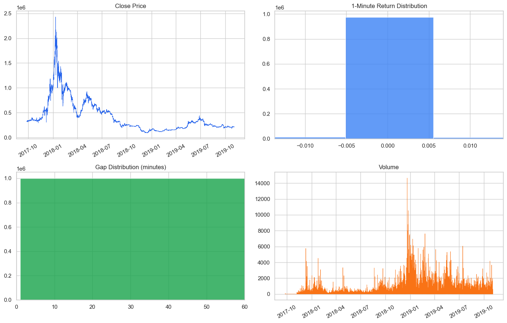
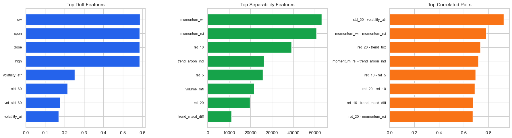
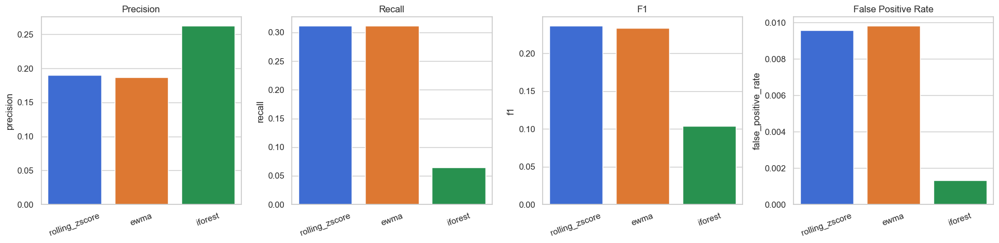

# 이더리움 1분봉 기반 이상 상태 모니터링 프로젝트

## 개요

- Upbit 이더리움 1분봉 데이터를 사용해 `트레이딩 전략`이 아니라 `이상 상태 조기경보 시스템`을 설계
- 핵심 목표는 이상 징후를 가능한 한 빨리 탐지하고, 동시에 오경보를 줄여 실제 운영에 가까운 규칙을 만드는 것

## 문제 정의

### 문제

- 원본 데이터는 1분봉이지만 시간 gap과 저유동성 구간이 섞여 있어 그대로 모델링하면 결과가 왜곡될 수 있음
- 이상 탐지에서는 단순 성능 점수보다 오경보를 얼마나 줄였는지가 실제 운영에서 더 중요함

### 해결 방안

- 먼저 데이터 검증 단계에서 시간축 연속성, 결측 분, 저유동성 구간을 점검
- 기존 피처 파일을 그대로 쓰지 않고 drift, 중복, 분리력을 다시 확인
- rolling z-score, EWMA, Isolation Forest를 baseline으로 비교
- threshold와 cooldown rule을 validation에서 조정해 `balanced`, `conservative` 두 가지 운영안을 설계

### 기대 효과

- 이상 상태를 빠르게 감지하면서도 경보량을 운영 가능한 수준으로 낮출 수 있음
- 단순 모델 성능 비교를 넘어, "운영 규칙 설계"까지 포함한 프로젝트로 확장 가능

## 데이터 분석 & 시각화

### 1. `notebooks/01_data_audit.ipynb`

- 원본 1분봉 데이터(`sub_upbit_eth_min_tick.csv`)가 실제로 모델링에 적합한지 확인

- 누락 분 비율: 약 `9.73%`
- 1분 초과 gap 비율: 약 `5.59%`
- 최대 gap: `4,924분`

가격 추이, 수익률 분포, gap 분포, 거래량 시계열을 함께 보면 이 데이터가 `장기 추세 + 극단값 + 공백 구간`이 섞인 고빈도 시계열이라는 점을 한 번에 확인

> 따라서 프로젝트에 사용된 데이터는 “완전한 연속 1분 시계열”로 다루기보다, 공백과 저유동성 구간을 분리해서 보는 것이 더 적절했다.

### 2. `notebooks/02_eda_feature_review.ipynb`

기존 피처 파일(`sub_upbit_eth_min_feature_labels.pkl`)에서 미리 생성된 feature들 중 쓸모가 있을 만한 feature를 선별

왼쪽부터 `drift가 큰 피처`, `분리력이 높은 피처`, `상관이 높은 피처 쌍`을 보여주고, 어떤 feature를 남기고 어떤 feature를 줄여야 할지 판단

- 가격 레벨 feature의 drift가 가장 큼
- 일부 기술지표는 높은 중복 정보를 가짐
- `momentum`, `return` 계열 feature가 `t_value`와 더 잘 갈림

> 즉, 피처를 무조건 많이 쓰는 것보다 중복을 줄이고, 목표에 맞는 feature를 고르는 것이 더 중요하다는 점을 확인했다.

### 3. `notebooks/03_baseline_modeling.ipynb`

절대 1분 수익률, 30분 실현 변동성, 60분 거래량 z-score를 기준으로 pseudo anomaly label 정의하고 baseline으로 rolling z-score, EWMA, Isolation Forest를 비교

베이스라인 모델을 precision, recall, F1, FPR 기준으로 나란히 비교한 결과

**z-score/EWMA**는 이상징후를 자주 캐치하는 편이라 재현율이 높고, **Isolation Forest**는 더 조심스럽게 울리는 편이라 precision이 높고 FPR이 낮게 측정되었다. 

> 따라서 두 모델링을 각각 탐지형 모델(balanced)과 보수형 모델(conservative)로 정의하고, 선택에 있어서의 trade-off를 고려해보았다.

### 4. `notebooks/04_threshold_tuning_and_rules.ipynb`

단순 분 단위 정답률이 아닌, '실제 고장 이벤트 탐지율'과 '일평균 오경보 발생 건수' 등 실무적인 지표로 모델을 평가

validation에서 임계치와 cooldown rule을 조정한 결과, 탐지형 모델은 baseline보다 point F1을 개선하면서 오경보를 크게 낮췄다.

보수형 모델은 가장 낮은 경보량을 만드는 대신 일부 이벤트를 더 놓치는 구조였다.

그리고 같은 이벤트 창에서도 baseline, 탐지형, 보수형 모델의 반응 강도가 다르다.

임계치와 cooldown 조정이 실제 경보 개수에 어떤 영향을 주는지 보여준다.

### 5. `notebooks/05_monitoring_story_and_dashboard.ipynb`

최종 결과를 운영 관점에서 일별 모니터링 추이를 보았다.

- test 204일 기준으로 탐지형 모델은 일평균 경보 수가 실제 pseudo event 규모와 가장 가깝게 내려왔다.
- 탐지형 모델은 이벤트가 있었던 날을 놓치지 않았고, 보수형 모델은 일부 약한 날을 놓쳤다.
- 따라서 기본 운영안은 탐지형 모델, 보수 운영안은 보수형 모델로 하이브리드 운영을 제안할 수 있다.

### 주요 수치 요약

| 항목 | 값 |
|---|---:|
| raw 데이터 행 수 | 1,000,000 |
| feature 파일 행 수 | 908,845 |
| 누락 분 비율 | 9.73% |
| 최종 모델링 데이터 행 수 | 832,228 |
| 기본 운영안 | balanced_selected |
| 보수 운영안 | conservative_selected |

## 결론 및 한계

### 결론

튜닝 후 test 구간 비교 결과는 아래와 같다.

| config | point_f1 | point_fpr | event_f1 | false_alerts_per_day |
|---|---:|---:|---:|---:|
| baseline_zscore | 0.2323 | 0.00947 | 0.4493 | 8.5592 |
| balanced_selected | 0.2510 | 0.00531 | 0.4461 | 4.5137 |
| conservative_selected | 0.2143 | 0.00266 | 0.4100 | 2.3209 |

- 탐지형 모델은 baseline 대비 point-level F1이 좋아졌다.
- 동시에 false alerts per day를 약 `47%` 줄였다.
- 보수형 모델은 가장 조용한 rule이며 false alerts per day를 약 `73%` 줄였다.
- 대신 보수형 모델은 더 많은 이벤트를 놓칠 수 있다.

#### test 구간 daily summary

- 운영 일수: `204일`
- 일평균 pseudo event: `8.82건`
- 일평균 baseline alert: `14.18건`
- 일평균 탐지형 모델 경보: `8.64건`
- 일평균 보수형 모델 경보: `4.68건`
- 탐지형 모델이 놓친 일 수: `0일`
- 보수형 모델이 놓친 일 수: `2일`

#### 탐지형 모델의 장점

- baseline보다 경보 부담이 낮음
- point-level F1이 baseline보다 좋음
- test summary에서 이벤트가 있었던 날을 놓치지 않음
- 운영 기본 모드로 설명하기 좋음

#### 보수형 모델의 장점:

- 오경보 비용이 매우 큰 환경에 적합
- 야간 모드, 저터치 운영, 보수적 모니터링 모드로 설명 가능

### 한계

- 사용된 pseudo anomaly label은 실제 ground truth 이벤트는 아니여서 실무 적용 가능성은 판단이 필요하다.
- 데이터에는 시간 gap과 저유동성 구간이 존재해 완벽한 연속성을 갖추기는 어려웠다.

## 배운 점

- 데이터 품질 문제를 먼저 정리하지 않으면 뒤의 모델 성능 해석이 쉽게 왜곡된다는 점을 배웠다.
- 이상탐지에서는 모델 성능만큼이나 `threshold`, `cooldown`, `false alert/day` 같은 규칙이 중요하다는 점을 확인했다.
- point-level 성능과 event-level 성능은 다를 수 있어서, 두 지표를 분리해서 보는 것이 필요하다는 점을 배웠다.
- 좋은 운영안은 하나만 있는 것이 아니라, `balanced`와 `conservative`처럼 운영 목적에 따라 여러 모드로 제안하는 것이 더 실무적이라는 점을 느꼈다.
- 같은 분석이라도 어떤 언어로 설명하느냐에 따라 프로젝트의 직무 적합도가 크게 달라진다는 점을 배웠다.
