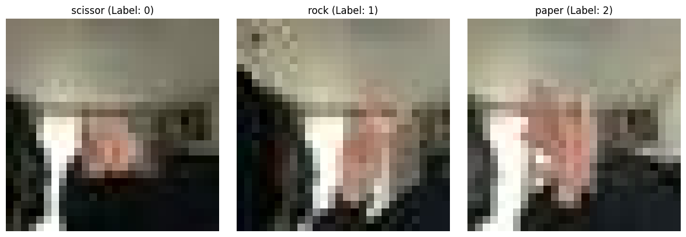

# 가위바위보 이미지 분류 미니 프로젝트

> 직접 촬영한 손동작 이미지 600장을 활용해 `가위`, `바위`, `보` 3개 클래스를 분류하는 CNN을 구현하고,  
> 촬영 조건 변화에 따라 모델의 일반화 성능이 어떻게 달라지는지 확인한 미니 프로젝트

---

## 프로젝트 개요

이 프로젝트는 단순히 가위바위보를 맞히는 분류기를 만드는 데서 끝나지 않고,  
**작은 데이터셋으로 학습한 이미지 분류 모델이 실제로 얼마나 잘 일반화되는지**를 확인하는 데 목적이 있다.

직접 촬영한 이미지로 간단한 CNN을 구성해 학습한 뒤,

- 촬영 조건이 다른 데이터로 평가했을 때 성능이 얼마나 무너지는지
- 전체 데이터를 섞어 랜덤 분할했을 때 왜 높은 정확도가 나오는지

를 비교하면서, **정확도 수치만으로 모델 성능을 판단하면 위험할 수 있다**는 점을 확인했다.

---

## 데이터셋 구성

이미지는 [Google Teachable Machine](https://teachablemachine.withgoogle.com/)을 활용해 수집했고,  
클래스별로 `가위`, `바위`, `보` 이미지를 각각 100장씩 확보했다.

### 1차 데이터셋

- 총 300장
- `scissor`, `rock`, `paper` 각 100장
- 어두운 환경에서 촬영
- 왼손 사용



### 2차 데이터셋

- 총 300장
- `scissor2`, `rock2`, `paper2` 각 100장
- 밝은 환경에서 촬영
- 오른손 사용


### 전처리

- 모든 이미지를 `28 x 28` 크기의 RGB 이미지로 리사이즈
- 사용자 정의 `load_data()` 함수로 클래스별 이미지 로드
- 픽셀 값은 후속 실험에서 `0~1` 범위로 정규화

---

## 실험 설계

이 프로젝트에서는 두 가지 관점으로 실험을 정리했다.

### 실험 1. 촬영 조건을 분리한 평가

- 1차 데이터와 2차 데이터를 서로 다른 도메인으로 간주
- 손 방향, 조명, 배경 조건이 달라졌을 때 모델이 얼마나 버티는지 확인
- 기존 실험 기록 기준, 이 경우 **Test accuracy가 약 0.08** 수준까지 떨어졌다

이 결과는 모델이 손 모양 자체보다도  
**촬영 환경, 손 방향, 배경 같은 부수적 특징에 과하게 적응했을 가능성**을 보여준다.

### 실험 2. 전체 600장을 섞은 뒤 랜덤 분할 평가

노트북에서는 두 데이터셋을 합친 뒤 `train_test_split`으로 다시 분할해 학습했다.

- 전체 데이터: `(600, 28, 28, 3)`
- 전체 레이블: `(600,)`
- 클래스 분포: 가위 200장, 바위 200장, 보 200장
- 분할 비율: `80 : 20`
- `stratify=y_total`로 클래스 비율 유지

분할 결과는 다음과 같다.

| 구분 | 데이터 크기 | 클래스 분포 |
|---|---:|---|
| Train | `(480, 28, 28, 3)` | 가위 160, 바위 160, 보 160 |
| Test | `(120, 28, 28, 3)` | 가위 40, 바위 40, 보 40 |

이 실험은 랜덤 분할 환경에서 모델이 얼마나 쉽게 높은 정확도를 얻는지 확인하기 위한 비교 실험이다.

---

## 모델 구조

모델은 TensorFlow/Keras의 `Sequential` API로 구성한 간단한 CNN이다.

| Layer | Output Shape | Param # |
|---|---|---:|
| `Conv2D(16, 3x3, relu)` | `(26, 26, 16)` | 448 |
| `MaxPool2D(2, 2)` | `(13, 13, 16)` | 0 |
| `Conv2D(32, 3x3, relu)` | `(11, 11, 32)` | 4,640 |
| `MaxPool2D(2, 2)` | `(5, 5, 32)` | 0 |
| `Flatten()` | `(800)` | 0 |
| `Dense(32, relu)` | `(32)` | 25,632 |
| `Dense(3, softmax)` | `(3)` | 99 |

- 총 파라미터 수: `30,819`
- Optimizer: `Adam`
- Loss: `sparse_categorical_crossentropy`
- Metric: `accuracy`
- Epochs: `5`

---

## 학습 및 평가 결과

### 1. 단일 조건에 가까운 학습 구간

노트북 중간 실험에서는 학습 accuracy가 빠르게 상승해 마지막 epoch에서 `1.0000`까지 도달했다.

```text
Epoch 1/5 - loss: 33.3097 - accuracy: 0.4133
Epoch 2/5 - loss: 0.9074  - accuracy: 0.8733
Epoch 3/5 - loss: 0.1873  - accuracy: 0.9667
Epoch 4/5 - loss: 0.0398  - accuracy: 0.9933
Epoch 5/5 - loss: 0.0001  - accuracy: 1.0000
```

이처럼 작은 데이터셋에서는 모델이 매우 빠르게 훈련 데이터를 외워버릴 수 있다.

### 2. 전체 600장 랜덤 분할 실험

랜덤 분할 실험의 최종 결과는 다음과 같다.

```text
Epoch 1/5 - loss: 1.0635 - accuracy: 0.5708
Epoch 2/5 - loss: 1.0062 - accuracy: 0.7083
Epoch 3/5 - loss: 0.9116 - accuracy: 0.8687
Epoch 4/5 - loss: 0.7756 - accuracy: 0.9458
Epoch 5/5 - loss: 0.6321 - accuracy: 0.9646

test_loss : 0.6109186410903931
Test accuracy: 0.9916666746139526
```

### 결과 비교

| 실험 | 데이터 구성 | Test Accuracy | 해석 |
|---|---|---:|---|
| 촬영 조건 분리 평가 | 서로 다른 촬영 조건의 데이터셋을 분리해 검증 | 약 `0.08` | 조명, 손 방향, 배경 변화에 매우 취약 |
| 전체 600장 랜덤 분할 | 두 데이터셋을 합쳐 `80:20` 분할 | `0.9917` | 비슷한 분포의 샘플이 Train/Test에 함께 포함되어 높은 수치가 나옴 |

---

## 해석 및 배운 점

### 1. 높은 정확도가 곧 좋은 일반화 성능은 아니다

전체 데이터를 섞어 랜덤 분할하면 학습 데이터와 테스트 데이터가 매우 비슷해진다.  
그 결과 `0.99` 이상의 높은 정확도가 나오더라도, 실제로는 **새로운 촬영 조건에 대응하지 못할 수 있다**.

### 2. 작은 이미지 분류 문제일수록 데이터 다양성이 중요하다

손 방향, 밝기, 배경, 거리 같은 요소가 조금만 바뀌어도 성능이 크게 흔들렸다.  
즉, 분류하고 싶은 핵심 패턴 외의 요소까지 모델이 함께 학습하고 있었던 셈이다.

### 3. 평가 셋은 실제 사용 환경을 반영해야 한다

랜덤 분할 실험은 모델이 잘 동작하는 것처럼 보이지만,  
실제 사용 환경에서는 도메인 차이 때문에 성능이 급격히 낮아질 수 있다.  
이 프로젝트를 통해 **평가 데이터셋을 어떻게 구성하느냐가 모델 성능 해석에 직접적인 영향을 준다**는 점을 배웠다.

---

## 한계

- 데이터 수가 총 600장으로 매우 적다
- 촬영자는 사실상 동일 인물이라 사용자 다양성이 부족하다
- 손 방향과 조명 외에도 배경, 거리, 카메라 각도 차이가 성능에 영향을 줄 수 있다
- 데이터 증강, dropout, batch normalization 같은 일반화 기법을 충분히 적용하지 않았다

---

## 개선 아이디어

- 다양한 사람의 손 이미지 추가 수집
- 밝기, 회전, 좌우 반전, 확대/축소 기반 데이터 증강 적용
- `train / validation / test`를 촬영 조건 기준으로 더 엄격하게 분리
- MobileNet이나 EfficientNet 계열의 경량 전이학습 모델과 비교
- Confusion Matrix를 추가해 어떤 클래스에서 실수가 많이 나는지 분석

---

## 디렉토리 구조

```text
RSP/
├── README.md
├── mini_project.ipynb      # 가위바위보 미니 프로젝트 본 실험
├── Node_Study.ipynb        # CNN 기초 실습 노트
├── Img/
│   ├── 1.png               # 1차 촬영 조건 예시
│   └── 2.png               # 2차 촬영 조건 예시
└── data/
    ├── scissor/            # 1차 데이터셋 - 가위
    ├── rock/               # 1차 데이터셋 - 바위
    ├── paper/              # 1차 데이터셋 - 보
    ├── scissor2/           # 2차 데이터셋 - 가위
    ├── rock2/              # 2차 데이터셋 - 바위
    └── paper2/             # 2차 데이터셋 - 보
```

---

## 사용 환경

- Python
- TensorFlow / Keras
- NumPy
- PIL
- Matplotlib
- scikit-learn

이 README는 [`mini_project.ipynb`](./mini_project.ipynb) 기준으로 정리했다.
