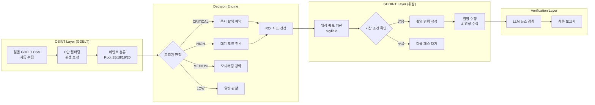

# 위성 촬영 자동 스케줄링 로직 설계서 v1.0

> **문서 목적**: GDELT 기반 갈등 탐지 파이프라인에서 산출된 전이 확률·휘발성·골든타임 파라미터가  
> 위성 궤도 계산 및 기상 조건과 결합되어 **최종 촬영 명령**으로 이어지는 전체 흐름을 설계한다.

---

## 1. 시스템 아키텍처 개요



---

## 2. 입력 파라미터 명세

모든 파라미터는 `pipeline_params.json`에서 기계적으로 읽어온다.

### 2.1 트리거 조건 (`trigger_conditions`)

| 파라미터 | 값 | 의미 | 사용 위치 |
|:---|:---:|:---|:---|
| `markov_19to19` | 0.8813 | Root 19 발생 후 다음에도 19가 이어질 확률 | **CRITICAL 트리거** |
| `markov_18to19` | 0.4993 | Root 18(폭행) → Root 19(무력 사용) 전이 확률 | HIGH 트리거 |
| `markov_15to19` | 0.4824 | Root 15(군사 태세) → Root 19 전이 확률 | HIGH 트리거 |
| `volatility_sigma_threshold` | 1.5 | 감성 휘발성 이상 판정 기준 (N주 이동평균 + Nσ) | 보조 트리거 |
| `tone_crisis_threshold` | -10.0 | AvgTone이 이 값 이하일 때 위기 상황 | 보조 트리거 |

### 2.2 타겟 지역 (`scheduling_targets`)

| 도시 | 좌표 (lat, lon) | 사건 수 | 중앙값 리드타임 | 3일 내 비율 |
|:---|:---:|---:|:---:|:---:|
| Tehran | 35.75, 51.51 | 102,451 | 3일 | 54.9% |
| Tel Aviv | 32.07, 34.77 | 55,868 | 2일 | 60.3% |
| Gaza | 31.42, 34.33 | 37,924 | 2일 | 64.9% |
| Baghdad | 33.34, 44.39 | 26,877 | 4일 | 49.7% |
| Damascus | 33.50, 36.30 | 24,124 | 4일 | 48.2% |

### 2.3 골든타임 (`golden_time`)

- **권장 윈도우**: 징후 포착 후 **3일 이내**
- **근거**: TOP5 지역 중앙값 리드타임이 2~4일이며, 가자·텔아비브는 2일 내 발생 비율이 60%를 초과

---

## 3. 트리거 판정 로직 (Decision Engine)

### 3.1 판정 흐름도

```
새 이벤트 수신
│
├─ EventRootCode == "19" (무력 사용)?
│   ├─ YES → 해당 지역의 직전 이벤트도 Root 19?
│   │   ├─ YES → ⚠️ CRITICAL (p=0.88, 연쇄 무력 사용)
│   │   └─ NO  → 🔶 HIGH (첫 무력 사용 탐지)
│   └─ NO
│
├─ EventRootCode == "18" (폭행)?
│   ├─ YES → 🔶 HIGH (p=0.50으로 19 전이 예상)
│   └─ NO
│
├─ EventRootCode == "15" (군사 태세)?
│   ├─ YES → 🔶 HIGH (p=0.48로 19 전이 예상)
│   └─ NO
│
├─ EventRootCode == "20" (대량 폭력)?
│   ├─ YES → ⚠️ CRITICAL (p=0.51로 19 전이)
│   └─ NO
│
└─ 기타 → 일반 관찰
```

### 3.2 보조 트리거 (복합 조건)

1차 트리거(Markov 기반)에 아래 조건이 **동시 충족**되면 우선도를 한 단계 상향한다:

| 보조 조건 | 기준 | 적용 효과 |
|:---|:---|:---|
| 감성 휘발성 피크 | 해당 지역의 주간 tone_std > (8주 이동평균 + 1.5σ) | HIGH → CRITICAL |
| 극단적 뉴스 톤 | AvgTone ≤ -10.0 | HIGH → CRITICAL |
| 뉴스 언급량 폭증 | NumMentions > 해당 지역 90th percentile | 보고서 우선 표시 |

### 3.3 의사 코드

```python
import json

def evaluate_trigger(event: dict, recent_events: list, params: dict) -> str:
    """
    단일 이벤트를 받아 트리거 레벨을 반환한다.
    
    Args:
        event: 새로 수신된 GDELT 이벤트 (dict)
        recent_events: 같은 지역의 최근 이벤트 리스트
        params: pipeline_params.json에서 로드한 파라미터
        
    Returns:
        "CRITICAL" | "HIGH" | "MEDIUM" | "LOW"
    """
    root = event["EventRootCode"]
    triggers = params["trigger_conditions"]
    
    # ── 1차 판정: Markov 전이 확률 기반 ──
    level = "LOW"
    
    if root == "19":
        prev_root = recent_events[-1]["EventRootCode"] if recent_events else None
        if prev_root == "19":
            level = "CRITICAL"   # 19→19 연쇄 (p=0.88)
        else:
            level = "HIGH"       # 첫 무력 사용 탐지
            
    elif root == "20":
        level = "CRITICAL"       # 대량 폭력 → 19 전이 (p=0.51)
        
    elif root in ("18", "15"):
        level = "HIGH"           # 폭행/군사태세 → 19 전이 (p≈0.49)
    
    # ── 2차 판정: 보조 트리거 (상향 조건) ──
    if level == "HIGH":
        # 감성 휘발성 확인
        if is_volatility_peak(event, params):
            level = "CRITICAL"
        # 극단적 뉴스 톤 확인
        elif event.get("AvgTone", 0) <= triggers["tone_crisis_threshold"]:
            level = "CRITICAL"
    
    return level


def is_volatility_peak(event: dict, params: dict) -> bool:
    """해당 지역의 현재 감성 휘발성이 임계치를 초과하는지 판별"""
    city = event.get("ActionGeo_FullName", "")
    
    # 타겟 지역 정보 조회
    target = next(
        (t for t in params["scheduling_targets"] if t["city"] in city),
        None
    )
    if not target:
        return False
    
    # 직전 N주 이동평균 + σ 기반 판정
    # (실제 구현에서는 누적 통계 모듈에서 실시간 계산)
    window_N = target["vol_window_N"]       # 8주
    sigma = target["vol_sigma"]             # 1.5
    
    current_weekly_std = get_current_weekly_tone_std(city)
    baseline_mean = get_rolling_mean(city, window_N)
    baseline_std = get_rolling_std(city, window_N)
    
    threshold = baseline_mean + sigma * baseline_std
    return current_weekly_std > threshold
```

---

## 4. ROI 선정 & 위성 궤도 연동

### 4.1 ROI 좌표 결정

트리거가 CRITICAL 또는 HIGH로 판정되면, `scheduling_targets`에서 해당 도시의 좌표를 가져온다.

```python
def get_roi(event: dict, params: dict) -> dict:
    """이벤트 발생 지역의 ROI 좌표를 반환"""
    city = event.get("ActionGeo_FullName", "")
    
    # 1순위: 등록된 타겟 도시와 매칭
    for target in params["scheduling_targets"]:
        if target["city"] in city:
            return {
                "lat": target["lat"],
                "lon": target["lon"],
                "city": target["city"],
                "golden_time_days": params["golden_time"]["recommended_window_days"]
            }
    
    # 2순위: 이벤트 자체의 좌표 사용 (미등록 지역)
    return {
        "lat": event.get("ActionGeo_Lat"),
        "lon": event.get("ActionGeo_Long"),
        "city": city,
        "golden_time_days": params["golden_time"]["recommended_window_days"]
    }
```

### 4.2 위성 통과 시간 계산 (skyfield)

> **향후 구현 예정** — Level 2a 단계에서 skyfield 라이브러리를 사용

```python
from skyfield.api import load, EarthSatellite

def find_next_passes(roi: dict, satellite_tle: str, window_days: int = 3):
    """
    ROI 상공을 통과하는 위성 패스를 골든타임 내에서 검색
    
    Args:
        roi: {"lat": float, "lon": float, "golden_time_days": int}
        satellite_tle: TLE 2줄 문자열
        window_days: 검색 범위 (기본 3일 = 골든타임)
    
    Returns:
        list of {"time": datetime, "elevation": float, "duration_sec": float}
    """
    ts = load.timescale()
    t0 = ts.now()
    t1 = ts.tt_jd(t0.tt + window_days)
    
    # TLE로 위성 객체 생성
    satellite = EarthSatellite(tle_line1, tle_line2, name, ts)
    
    # 관측점 설정
    from skyfield.api import wgs84
    observer = wgs84.latlon(roi["lat"], roi["lon"])
    
    # 통과 이벤트 검색
    t_events, events = satellite.find_events(observer, t0, t1, altitude_degrees=10.0)
    
    passes = []
    for ti, event_type in zip(t_events, events):
        if event_type == 1:  # 최대 고도 시점
            alt, az, distance = (satellite - observer).at(ti).altaz()
            passes.append({
                "time": ti.utc_datetime(),
                "elevation_deg": alt.degrees,
                "distance_km": distance.km
            })
    
    return passes
```

### 4.3 기상 조건 필터링

> **향후 구현 예정** — 촬영 당일 구름량 확인

```python
def check_weather(roi: dict, pass_time: datetime) -> bool:
    """
    촬영 시점의 구름량이 허용 범위(30% 이하) 내인지 확인
    
    옵션 1: Open-Meteo API (무료)
    옵션 2: ECMWF ERA5 재분석 데이터
    """
    # API 호출 예시 (Open-Meteo)
    url = f"https://api.open-meteo.com/v1/forecast"
    params = {
        "latitude": roi["lat"],
        "longitude": roi["lon"],
        "hourly": "cloud_cover",
        "start_date": pass_time.strftime("%Y-%m-%d"),
        "end_date": pass_time.strftime("%Y-%m-%d")
    }
    # response = requests.get(url, params=params).json()
    # cloud_cover = response["hourly"]["cloud_cover"][pass_time.hour]
    # return cloud_cover <= 30
    pass
```

---

## 5. 최종 출력: 촬영 명령 스키마

모든 판정이 완료되면 아래 스키마의 JSON으로 촬영 명령이 생성된다.

```json
{
  "command_id": "CMD-2026-0401-001",
  "generated_at": "2026-04-01T09:00:00Z",
  "trigger": {
    "level": "CRITICAL",
    "event_root_code": "19",
    "markov_probability": 0.8813,
    "volatility_alert": true,
    "avg_tone": -12.3,
    "source_event_id": 1234567890
  },
  "roi": {
    "city": "Tehran",
    "lat": 35.75,
    "lon": 51.51,
    "radius_km": 25
  },
  "satellite_pass": {
    "satellite_name": "Sentinel-2A",
    "pass_time_utc": "2026-04-02T07:23:00Z",
    "elevation_deg": 45.2,
    "cloud_cover_pct": 12
  },
  "golden_time": {
    "trigger_detected_at": "2026-04-01T09:00:00Z",
    "deadline": "2026-04-04T09:00:00Z",
    "remaining_hours": 70.4
  },
  "action": "CAPTURE",
  "priority": 1
}
```

---

## 6. 트리거 레벨 → 대응 행동 매핑

| 레벨 | 조건 | 대응 행동 | SLA |
|:---:|:---|:---|:---:|
| **CRITICAL** | Root 19→19 연쇄 또는 Root 20 발생 + 보조 조건 충족 | 즉시 가용 위성 패스 검색 → 촬영 명령 생성 | **6시간 이내** |
| **HIGH** | Root 15/18 탐지 (19 전이 확률 ≈ 50%) | 대기 모드: 다음 24시간 모니터링 강화, 위성 패스 예비 확보 | 24시간 이내 |
| **MEDIUM** | Root 20→18 등 간접 전이 (p ≈ 0.11) | 모니터링 빈도 상향 (1일 → 6시간 주기) | 48시간 이내 |
| **LOW** | 그 외 (소멸/완화 방향) | 일반 관찰, 주간 리포트에 포함 | 1주 |

---

## 7. 데이터 흐름 요약

```
[선우님 일별 수집기]
     ↓ daily CSV
[C안 필터 + 이벤트 분류]
     ↓ filtered events
[트리거 판정 엔진] ← pipeline_params.json
     ↓ CRITICAL/HIGH 이벤트
[ROI 좌표 선정] ← scheduling_targets
     ↓ (lat, lon, golden_time)
[위성 궤도 계산] ← TLE 데이터 (skyfield)
     ↓ pass_time, elevation
[기상 조건 확인] ← Open-Meteo API
     ↓ cloud_cover OK?
[촬영 명령 생성]
     ↓ command JSON
[LLM 뉴스 검증] ← gdelt_url (Level 3)
     ↓ verified?
[최종 보고서]
```

---

## 8. 팀 연동 인터페이스

### 승희님 → 찬규

| 인터페이스 | 형식 | 용도 |
|:---|:---|:---|
| `ground_truth/gt_events.csv` | SQLDATE, city, EventCode, URL, verified | 파이프라인 정확도 검증 |
| C안 Actor 재필터링 결과 | parquet 업데이트 | 전이 행렬 재보정 (필요시) |

### 찬규 → 선우님

| 인터페이스 | 형식 | 용도 |
|:---|:---|:---|
| `pipeline_params.json` | JSON (상단 명세 참조) | 트리거 판정 임계치 주입 |
| 이 설계 문서 | Markdown | 트리거 모듈 구현 가이드 |

### 선우님 → 전체

| 인터페이스 | 형식 | 용도 |
|:---|:---|:---|
| `daily_feed/YYYY-MM-DD.csv` | GDELT 일별 CSV | 실시간 파이프라인 입력 |
| `06_trigger_module.py` | Python 모듈 | evaluate_trigger() 함수 구현체 |

---

## 9. 미결 사항 & 추후 과제

| # | 항목 | 담당 | 상태 |
|:---:|:---|:---:|:---:|
| 1 | TLE 데이터 소스 선정 (CelesTrak vs Space-Track) | 찬규 | ⬜ |
| 2 | 기상 API 선정 (Open-Meteo vs ECMWF) | 찬규 | ⬜ |
| 3 | ROI 반경(radius_km) 기준 정립 | 승희 | ⬜ |
| 4 | 도시별 전이 확률 세분화 (정확도 개선 시) | 찬규 | ⬜ |
| 5 | 촬영 명령 큐 관리 (우선순위 충돌 해소) | 선우 | ⬜ |
| 6 | GT 사건 기반 시뮬레이션 정확도 벤치마크 | 전체 | ⬜ |
