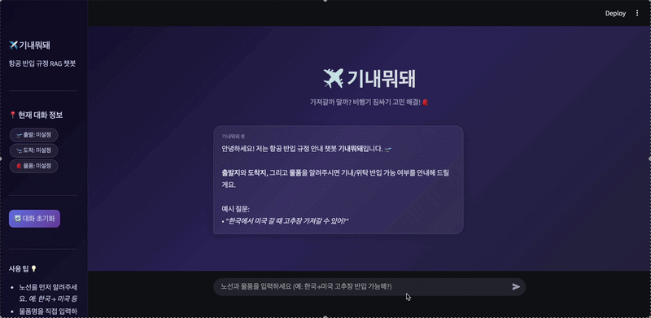
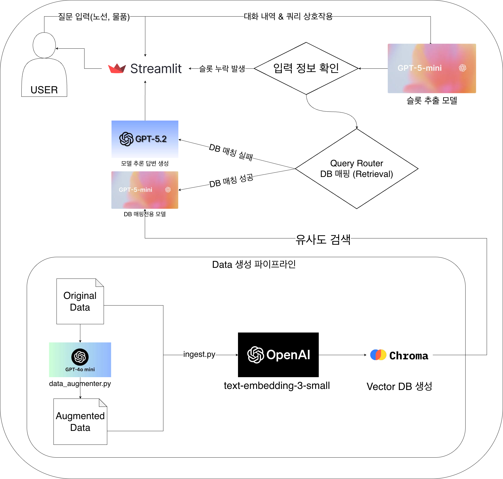

# ✈️ 기내뭐돼?

> 모두의연구소 데이터사이언티스트 7기 랭체인톤  
> **RAG 기반 국가/항공사별 수하물 반입 규정 AI 챗봇**

---

## 목차

1. [프로젝트 배경](#-프로젝트-배경)
2. [프로젝트 개요](#-프로젝트-개요)
3. [문제 정의 및 해결 전략](#-문제-정의-및-해결-전략)
4. [RAG 파이프라인](#-rag-파이프라인)
5. [레포지토리 구조](#-레포지토리-구조)
6. [기술 스택](#-기술-스택)
7. [팀원 소개](#-팀원-소개)

---

## 프로젝트 배경

### 1. 문제 정의
- 2024년 기준 해외여행객 **2,872만 명** 중 인천공항에서 반입금지 물품이 적발된 건수는 약 **500만 건**으로 알려짐
- 2026년 1월 국토교통부 안전 기준이 강화되어 보조배터리 규정이 업데이트 되었지만, 기존 서비스는 이를 반영하지 못함

### 2. 기존 서비스의 한계

| 서비스 | 장점 | 단점 |
|---|---|---|
| 대한항공 챗봇 | 빠른 응답 속도 | 외국 규정은 "직접 문의하세요" 로 회피, 대화 종료 시 정보 초기화 |
| Google Gemini | 쉬운 접근성 | 답변 길고 출처 불명확, 2026년 신규 규정 미반영 |

### 3. 기대효과

- 본 프로젝트를 통해 출발국·도착국 규정 간 교차 검증으로 답변 정확도를 향상
- DB 규정 업데이트를 통해 개정되는 규정을 신속하게 반영
- 위 2가지 장점을 이용해 비즈니스 문제 해결에 기여

---

## 프로젝트 개요

### 시연 영상


- 🟢 **반입 가능** / 🟡 **조건부 가능** / 🔴 **반입 불가** 로 직관적인 판정 제공
- 슬롯 필링 방식으로 **노선 → 물품** 순서로 대화 흐름을 관리하며, 누락된 정보애 대해서 재질문 
- 대화 중 노선 및 물품이 변경되어도 유연하게 대처
- 답변 내 하이퍼링크를 통해 챗봇의 답변 출처를 명확히 함으로써 답변 신뢰도 향상

---

## 문제 정의 및 해결 전략

### 1. 사용자 입력 물품명과 DB 규정 내 물품명 매핑 오류

- 흔히 사용하는 일상단어와 규정 내 법률용어의 차이로 Retrieval을 실패하는 경우가 빈번함
- 예 : "보조배터리"는 "리튬이온"으로, "미숫가루"는 "농산물/가공식품"으로 매핑되어야 하지만, 이를 자동으로 처리하지 못해 Retrieval을 실패하는 경우가 많았음
- GPT-4o-mini를 활용해 DB 내 문서당 동의어 혹은 키워드를 10~15개 생성해 Retrieval 적중률 대폭 상승

### 2. 챗봇 응답 속도가 너무 느림

- RAG 파이프라인 초기 구성단계에서 슬롯 추출과 DB 매핑과정에서 각각 API를 호출해 평균 응답 대기 시간이 50초로 매우 느림
- 슬롯 추출과 DB 매핑 로직을 하나의 프롬프트로 통합해 API 호출 횟수를 2회에서 1회로 단축
- GPT-5-mini의 `reasoning_effort` 파라미터를 `low`로 설정해 답변 품질 저하 없이 처리 속도 향상
- 결과적으로 평균 응답 시간을 **50초 → 15초**로 단축 (약 **3.3배** 향상)

### 3. 환각(Hallucination) 문제 대응

- LLM의 고질적인 문제인 환각 현상으로 인해 잘못된 정보를 제공하는 경우를 방지하고자 했음
- DB에 없는 물품 질문 시 성능이 더 좋은 **GPT-5.2로 Fallback**해 항공 일반 지식 기반으로 답변하고, 하단에 별도의 안내 문구 명시
- 신조어(ex. 두쫀쿠 등)에 대해 관련 정보를 알아보게끔 하고 DB에 없는 물품일 경우 통상 규정 기반으로 답변
---

## RAG 파이프라인



| 단계 | 이름 | 내용 |
|------|------|------|
| 0단계 | Data Augmentation | GPT-4o-mini로 규정 문서당 동의어·키워드 15개 이상 증강 (오프라인) |
| 1단계 | Data Ingestion | Augmented Data → text-embedding-3-small → ChromaDB |
| 2단계 | Router & Slot Filling | 슬롯 추출 + DB 매핑 One-shot 통합 처리 (API 1회) |
| 3단계 | Retriever | 메타데이터 필터 기반 유사도 검색 + Two-Track Fallback |
| 4단계 | Judge & Generator | 이모지 판정 + Bullet Point 형태 가이드 답변 생성 |

---

## 레포지토리 구조

```
LANGCHAINTON_RAG/
├── app.py                              # Streamlit 챗봇 UI
├── bot_logic.py                        # RAG 파이프라인 핵심 로직
│                                       # (슬롯 필링, 검색, 판정, 생성)
├── data_augmenter.py                   # 원본 데이터 키워드·동의어 증강 스크립트
├── ingest.py                           # 데이터 임베딩 스크립트 (최초 1회 실행)
├── requirements.txt                    # 의존성 패키지 목록
│
├── data/
│   ├── index_docstore_export.jsonl     # 항공 규정 원문 데이터 (84개 문서)
│   └── index_docstore_augmented.jsonl  # 키워드 증강된 데이터셋
│
├── docs/
│   ├── architecture.png                # RAG 아키텍처 다이어그램
│   └── demo.gif                        # 챗봇 시연 GIF
│
└── RAG_pipeline/
    └── schema.md                       # RAG 파이프라인 설계 계획서
```

---

## 🛠️ 기술 스택

| 분류 | 기술 | 선택 이유 |
|---|---|---|
| LLM (슬롯 추출·답변 생성) | GPT-5-mini | `reasoning_effort` 파라미터로 추론 깊이 조정이 가능해 속도 최적화에 유리 |
| LLM (Fallback) | GPT-5.2 | DB 미등재 물품에 대해 항공 일반 지식 기반의 깊이 있는 추론이 필요해 플래그십 모델 활용 |
| LLM (Data Augmentation) | GPT-4o-mini | 84개 문서에 반복적으로 키워드를 증강하는 오프라인 배치 작업으로, 비용 효율적인 모델 선택 |
| Embedding | text-embedding-3-small | OpenAI 임베딩 중 비용 대비 성능이 우수하며, 한국어·영어 혼용 규정 문서에 안정적 |
| Vector DB | ChromaDB | 로컬 환경에서 별도 서버 없이 메타데이터 필터 검색을 바로 쓸 수 있어 빠른 프로토타이핑에 적합 |
| Framework | LangChain | Retriever, Chain 등 RAG 구성 요소를 모듈 단위로 조합하기 쉬워 파이프라인 설계에 활용 |
| UI | Streamlit | 별도 프론트엔드 없이 Python만으로 챗봇 인터페이스를 빠르게 구성 가능 |

---

## 👥 팀원 소개

**팀명: LAGs (Liquids, Aerosols, and Gels)**

| 이름 | 역할 |
|---|---|
| 차병곤 | 시장 분석, 서비스 정책, UI/UX|
| 손승희 | 데이터 수집, 데이터 전처리, 프롬프트 테스트 |
| 상은영 | 데이터 수집, 데이터 전처리, 프롬프트 테스트 |
| 이찬규 | RAG 파이프라인 구축 (슬롯 필링·검색·판정·생성), 프롬프트 엔지니어링, 발표 |
| 김선우 | 협업 환경 구축, RAG 파이프라인 구축, 로그 설계, 발표 자료 준비 |