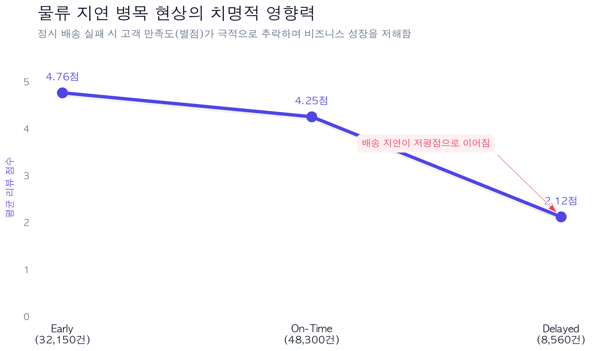
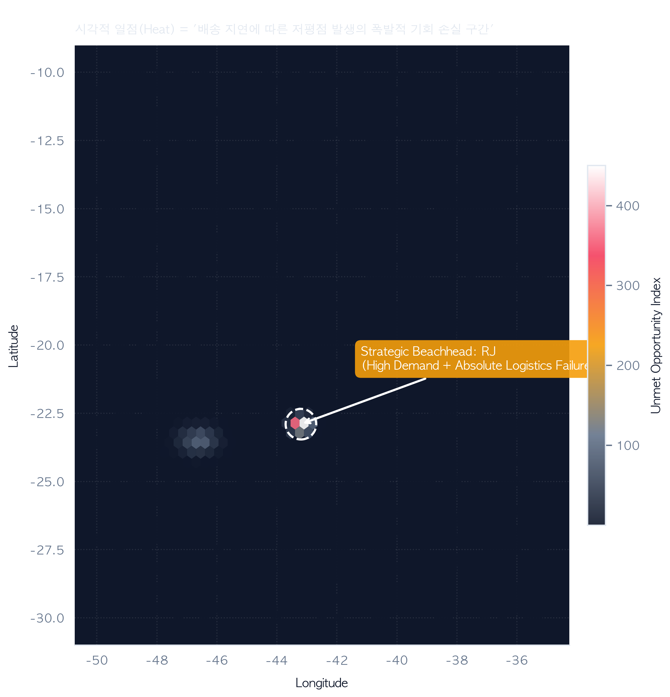
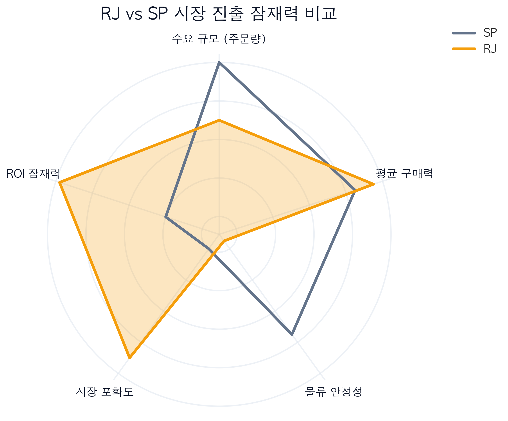
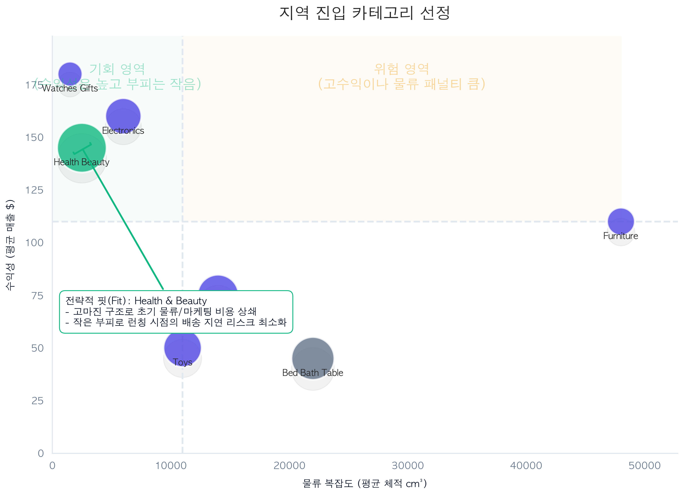
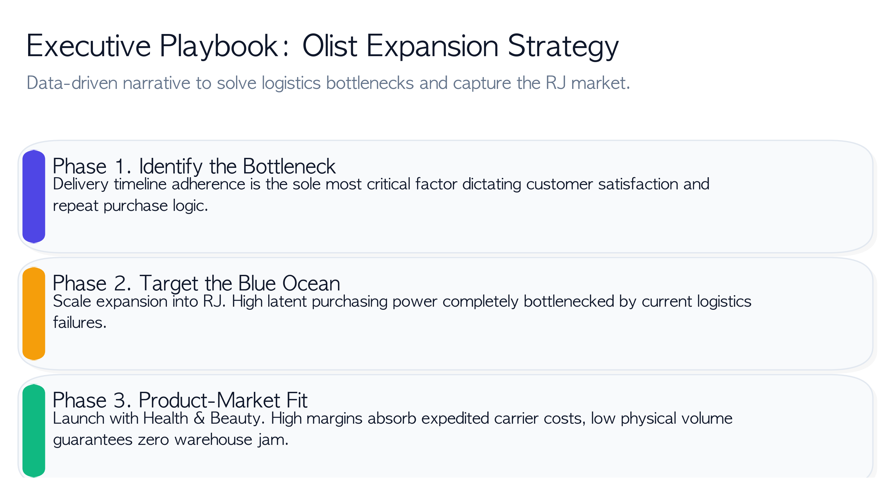

# [완료] 브라질 이커머스(Olist) 물류 데이터 기반 핵심 시장(Beachhead) 발굴 전략
### 데이터 기반 고객 리스크 파악 및 신규 런칭 마켓/품목 최적화

### 1. 프로젝트 개요 및 문제 정의 (Problem Definition)
* **상황 (Situation):** 당사는 기존 시장의 운영 노하우와 유의미한 **배송비 경쟁력**을 갖춘 쇼핑몰이나, 지역 편차가 극심한 브라질 시장 초기 진입 시 **단기 매출보다는 인지도 확보와 고객 만족도(배송 경험) 형성**이 최우선 목표임
* **제약 (Constraint):** 모든 카테고리 상품을 브라질 전 지역에 동시 런칭하는 확장 전략은 막대한 운영 비용과 배송 실패 리스크를 초래함
* **목표 (Objective):** 브라질 Olist의 10만 건 이상의 관계형 데이터를 분석하여, 단순히 “어떤 제품을 팔 것인가”가 아닌 **“어느 지역에서, 어느 카테고리를 '먼저' 팔 것인가?”**에 대한 최적의 1차 시장 진입 전략(Market Entry Point) 도출

### 2. 의사결정 프레임워크 (Decision Framework)
* 단일 지표에 의존하지 않고, **지역 특성(6개 지표)과 상품 특성(4개 지표)을 독립적으로 분리하여 평가한 후 결합**하는 전략적 프레임워크 설계
* **품목 가중치:** 초기 진입 시 품질 인식, 필수 소비재 여부, 수요 구조를 중점 평가하여 단기 매출보다는 **반복 구매 가능성과 안정적인 성과 창출력**에 배점 부여
* **지역 가중치:** 배송비 구조, 배송 안정성, 그리고 **'수요 대비 배송 만족도의 격차'**에 초점을 맞추어 배송 경쟁력이 실제 차별화 요소로 작용할 기회 요인 식별

### 3. 데이터 전처리 및 물류 임팩트 분석
* Olist의 8개 개별 테이블(주문, 리뷰, 위치, 상품 등)을 병합 및 변환 파이프라인으로 구축하고, 결측치 및 무효 데이터를 배제하는 정제 수행
* 단순 배송일 집계를 넘어, '예정일 대비 실제 배송일 차이'를 계산하여 지연 발생 시 고객 이탈과 직결되는 악성 리뷰(1~2점) 비율이 65% 이상으로 폭증하는 치명적 임계점(Delivery Impact Slope)을 시각적 규명

> **[이미지 삽입 위치 제안 1]**
> 

### 4. 타겟 시장 선정 (Regional Opportunity Scoring)
* 지역 지표 가중치 산출 결과, 단순 판매량(Volume)이 아닌 '주문 수요'와 '배송 지연 저평점 리스크'를 결합한 기회점수에서 **리우데자네이루(RJ) 지역이 압도적인 1위** 기록
* 렌더링 부하를 낮추기 위해 적용한 우편번호 중심 좌표(Centering) 기반의 헥스빈(Hexbin Density) 맵을 통해, 잠재 수요 대비 물류 만족도가 무너져 내린 RJ를 우선 공략해야 할 블루오션으로 시각화

> **[이미지 삽입 위치 제안 2]**
> 

* 상파울루(SP)와 확장을 노리는 RJ의 종합 지표 비교를 레이더 차트로 구현, 물류 효율 측면에서 우리 기업이 초기 시장 안착을 도모하기에 유리함을 사업적으로 입증

> **[이미지 삽입 위치 제안 3]**
> 

### 5. 매트릭스 기반 진입 카테고리 확정
* 품목 지표 가중치 평가 결과, **Health & Beauty 카테고리가 여러 평가 기준에서 상위를 유지하며 압도적 1위** 기록
* 부피가 커 배송 난이도가 높은 상품은 초기 런칭 시 물류 리스크를 치명적으로 증폭시키므로, '물류 복잡도'와 '수익성' 코어 메타데이터를 추출해 4분면 평가(BCG Matrix 응용) 수행
* 부피는 작아 운송이 용이하면서도 마진율이 높은 Health & Beauty 카테고리가 기업의 상품 경쟁력을 초기 가설로 검증하기에 완벽한 **최적의 초기 진입(Star) 품목**임을 데이터로 입증

> **[이미지 삽입 위치 제안 4]**
> 

### 6. 경쟁자 분석을 통한 교차 검증 (Cross-Validation)
* 도출된 **`RJ 지역 × Health & Beauty`** 조합이 내부 가중치 결과에 그치지 않고 시장 구조적으로 타당한지 검증하기 위해 **수요(order_count) 대비 경쟁 강도(seller_count)** 모델링
* 셀러 1인당 평균 주문 수(`orders_per_seller`)를 분석한 결과, **특정 지역에서 기반 셀러 레이어가 '0'이 되어 외부 지역 셀러에게 의존(독점 공급 공백)하는 구조적 기회** 발견
* **교차 검증 결과:** RJ 지역은 품목에 제약받지 않는 **안정적인 수요 밀도**를 보여주며, Health & Beauty 카테고리는 여러 지역에서 **공급이 제한되어 진입 장벽이 낮은 상태(신규 진입자에게 파이 확장 여지)**로 판별됨. 즉, 확립된 전략은 외부 시장 구조 체계와도 완벽히 부합함을 검증 완료

### 7. 결론 및 경영진 요약 (Executive Playbook)
> **[이미지 삽입 위치 제안 5]**
> 

* 모든 자원(마케팅, 운영, 풀필먼트)을 분산하는 대신, 성과 달성 확률이 검증된 **"RJ 지역 × Health & Beauty 카테고리" 단일 세그먼트에 역량을 집중 투입**하여 초기 성공 확률 극대화 유도
* 1차 성공 검증 이후에는 구축해 놓은 본 데이터 분석 프레임워크를 그대로 활용하여 **2·3순위 지역 및 카테고리로 데이터 기반 확장을 점진적으로 스케일업(Scale-up)** 할 예정

### 8. 배운 점 및 한계점 (Lessons Learned & Challenges)
* **프레임워크 적용 중심의 지표 설계:** 'RJ에 화장품을 팔자'는 직관적 결론을 내는 것은 쉽지만, '지역 특성'과 '상품 특성'을 독립적으로 쪼개어 의사결정 프레임을 구축하고 지표 가중치를 결합하는 기획 과정에서 논리적 사고의 중요성을 깨달았습니다. 데이터를 단편적인 통계가 아닌 문제 해결을 위한 '비즈니스 언어'로 재구성하는 방법을 터득했습니다.
* **노이즈 제어와 데이터 스토리텔링:** 공간 데이터(위/경도) 렌더링 부하를 제어하기 위한 중심 좌표 클러스터링(Centering) 등 엔지니어링적 난관도 컸으나, 가장 치열했던 것은 수집된 인사이트를 교차 검증(경쟁 분석: orders_per_seller)으로 단단하게 여미고 '데이터 기반의 스토리텔링 리포트'로 시각화해내는 과정이었습니다. 코딩 기술을 넘어 기획 모델링과 하이엔드 차트 매핑 기술의 융합 시너지를 경험했습니다.
