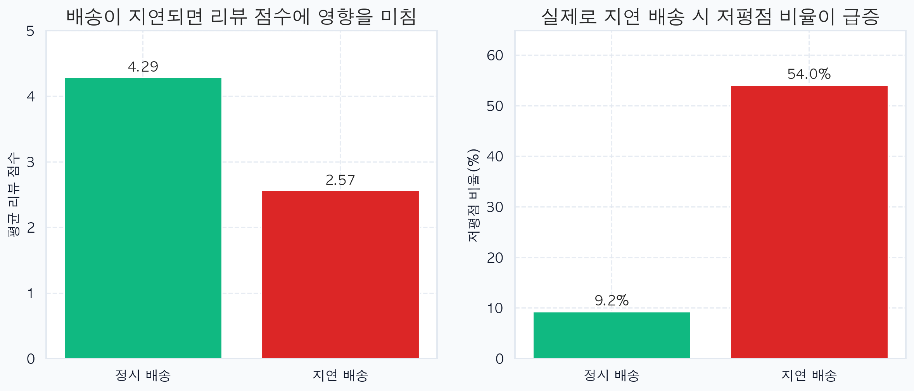
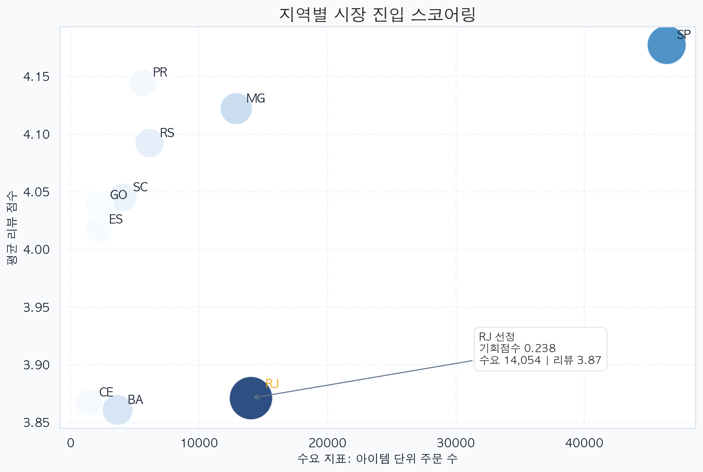
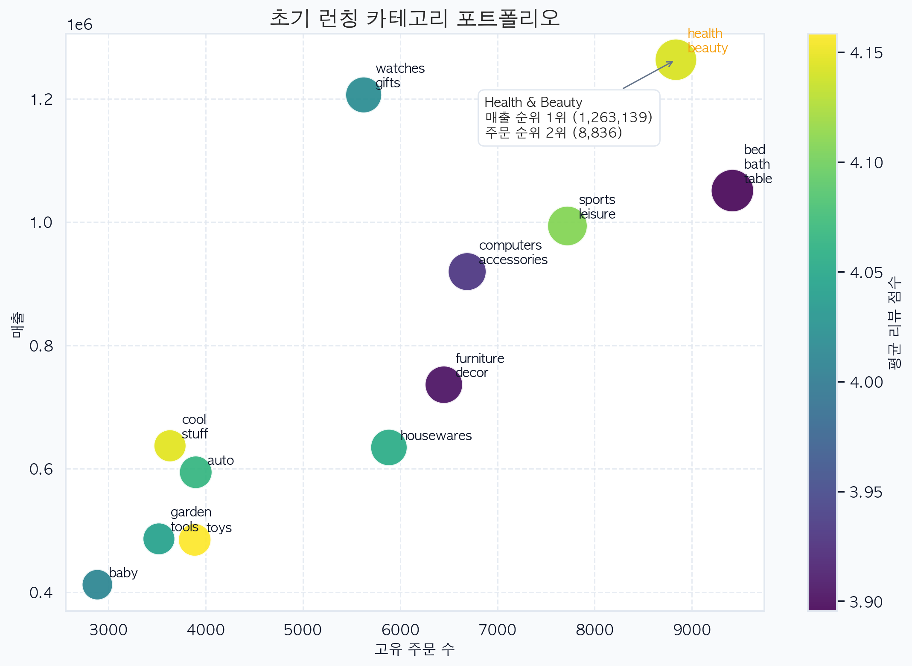

# 브라질 이커머스 데이터 기반 초기 시장 진입 전략 수립

브라질 Olist 주문·리뷰·물류 데이터를 통합 분석하여, 신규 판매자가 어느 지역에서 어떤 카테고리로 시작해야 안정적으로 시장에 안착할 수 있는지 도출한 프로젝트입니다. 단순 매출 상위 지역을 찾는 분석이 아니라, 수요와 만족도 개선 여지, 물류 리스크를 함께 반영해 실제 진입 전략으로 연결하는 데 목적을 두었습니다.

## 프로젝트 요약
- **핵심 질문:** 초기 진입 지역과 런칭 카테고리를 어떻게 선정할 것인가
- **분석 대상:** 주문 99,441건, 주문상품 112,650건, 리뷰 99,224건, 고객 99,441건
- **핵심 지표:** `opportunity_score`, `freight_ratio`, `arrival_diff`
- **최종 전략:** `RJ`를 1차 진입 거점으로, `Health & Beauty`를 초기 런칭 카테고리로 선정

## 문제 정의
브라질 이커머스 시장은 지역별 물류 인프라와 배송 품질 편차가 크기 때문에, 동일한 전략을 전국에 일괄 적용하기 어렵습니다. 신규 판매자가 전국 동시 진출을 시도할 경우 배송 지연, 물류비 부담, 초기 리뷰 악화로 이어질 가능성이 높습니다.

이 프로젝트는 다음 두 가지 질문에 답하는 것을 목표로 하였습니다.

- 어느 지역을 초기 진입 거점으로 설정해야 하는가
- 어떤 카테고리로 시작해야 수요와 수익성을 동시에 확보할 수 있는가

## 데이터 및 전처리
원본 데이터는 주문, 주문상품, 고객, 리뷰, 상품, 판매자 테이블로 분산되어 있어 단일 테이블 분석만으로는 전략 수립이 어렵다고 판단하였습니다. 이에 따라 주문 ID, 고객 ID, 상품 ID를 기준으로 데이터를 통합하여 지역, 상품, 배송, 만족도 정보를 함께 다룰 수 있는 분석용 마스터 테이블을 구성하였습니다.

전처리 단계에서는 다음 기준을 적용하였습니다.

- 실제 배송 완료일, 예정 배송일, 리뷰 점수가 모두 존재하는 주문만 사용
- 미배송 및 취소 주문을 제외하고 95,830건의 유효 주문 확보
- 우편번호별 평균 위·경도 좌표를 생성하여 지도 시각화의 중복 좌표와 이상치 완화

## 분석 방법
### 1. 지역 우선순위 평가
단순 주문량만으로는 초기 진입 우선순위를 판단하기 어렵다고 보아, 지역별 주문량과 평균 리뷰 점수를 정규화해 결합한 `기회점수(opportunity_score)`를 설계하였습니다. 해당 지표는 주문량은 충분하지만 고객 경험 개선 여지가 큰 지역을 식별하기 위한 기준으로 활용하였습니다.

### 2. 물류 리스크 진단
배송비 비율(`freight_ratio`)과 배송 예정일 대비 실제 도착 편차(`arrival_diff`)를 활용하여 지역별 물류 부담과 배송 지연 리스크를 진단하였습니다. 이를 통해 단순 수요가 아닌 실제 운영 난이도까지 함께 고려할 수 있도록 하였습니다.

### 3. 카테고리 선정
카테고리 분석에서는 주문 수, 매출, 평균 리뷰를 함께 비교하여, 단순 판매량 상위 카테고리가 아니라 초기 안착 가능성이 높은 상품군을 식별하였습니다.

## 핵심 결과
### 1. RJ가 가장 유력한 초기 진입 지역
- `opportunity_score` 기준 상위 지역은 `RJ`, `SP`, `MG`, `BA`, `RS` 순으로 도출되었습니다.
- `RJ`는 주문 수 14,468건, 평균 리뷰 점수 3.81점, 기회점수 0.1959로 가장 높은 개선 여지를 가진 지역으로 확인되었습니다.
- `SP`는 주문 수가 더 많았지만 평균 리뷰가 상대적으로 안정적이어서, 초기 진입 관점에서는 `RJ`가 더 적합하다고 판단하였습니다.

### 2. 배송 지연은 리뷰를 크게 훼손
- 정시 도착 주문의 평균 리뷰 점수는 4.29점이었으나, 지연 주문은 2.57점까지 하락하였습니다.
- 저평점 비율 역시 9.2%에서 54.0%로 급증하였습니다.
- 특히 `RJ`의 지연 주문 저평점 비율은 66.9%로 나타나, 해당 지역에서는 배송 약속 관리가 핵심 운영 전략임을 확인하였습니다.

### 3. Health & Beauty가 초기 런칭 카테고리로 적합
- `Health & Beauty`는 주문 수 8,836건으로 전체 2위, 매출 1,258,681.34로 전체 1위를 기록하였습니다.
- 시장성과 수익성이 동시에 검증된 카테고리였으며, `RJ` 내부에서도 평균 리뷰 4.06으로 안정성이 우수하였습니다.

## 주요 시각화
시각화는 `문제 제기 -> 원인 검증 -> 전략 도출`의 흐름으로 구성하였습니다. 단순 결과 나열이 아니라, 왜 해당 변수를 핵심으로 보았는지와 그 결과 어떤 전략적 결론에 도달했는지를 한 흐름 안에서 설명하는 데 목적을 두었습니다.

### 배송 지연이 리뷰를 훼손하는지 검증


정시 배송과 지연 배송의 평균 리뷰 점수 및 저평점 비율을 비교하여, 물류 품질이 고객 만족도에 직접 영향을 준다는 점을 확인하였습니다.

### 지역별 시장 진입 스코어링


지역별 수요와 평균 리뷰를 결합한 기회점수를 기반으로 초기 진입 우선순위를 평가하였고, `RJ`가 가장 전략적인 진입 후보로 도출되었습니다.

### 초기 런칭 카테고리 포트폴리오


주문 수와 매출을 함께 비교하여, `Health & Beauty`가 초기 런칭 카테고리로 가장 적합하다는 점을 확인하였습니다.

## 최종 전략
본 프로젝트의 최종 결론은 다음과 같습니다.

- `RJ`를 1차 진입 거점으로 설정
- `Health & Beauty`를 초기 런칭 카테고리로 선정
- 배송 약속 관리와 커뮤니케이션 전략을 핵심 운영 과제로 병행

> 단순 수요 상위 지역을 공략하는 것이 아니라, **수요 규모와 개선 여지를 동시에 가진 지역을 선별하고, 리뷰 안정성이 확보된 카테고리로 진입하는 전략**을 제안

## 디렉토리 구조
```bash
DATATON_Olist/
├── Assets/
│   ├── html_maps/
│   └── images/
├── Code/
│   ├── .vendor/
│   ├── archive/
│   └── src_code/
├── Data/
├── Docs/
├── Outputs/
│   ├── figures/
│   └── tables/
└── README.md
```
