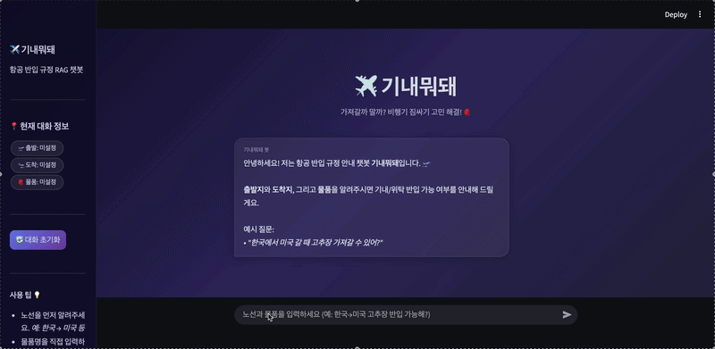
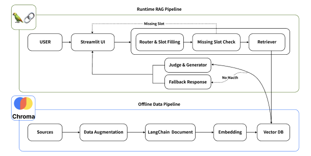

# ✈️ 기내뭐돼?

> 모두의연구소 데이터사이언티스트 7기 랭체인톤  
> **RAG 기반 국가별 수하물 반입 규정 AI 챗봇**

--- 

## 담당 역할

- RAG 파이프라인 핵심 로직 구현
- Router & Slot Filling 프롬프트 설계
- 사용자 입력 물품명과 DB 규정 항목 매핑 구조 설계
- ChromaDB metadata filter 기반 Retriever 구현
- 검색 실패 및 미지원 노선에 대한 Fallback 응답 설계
- 최종 발표 및 서비스 흐름 설명

---

## 목차

1. [프로젝트 배경](#-프로젝트-배경)
2. [프로젝트 개요](#-프로젝트-개요)
3. [문제 정의 및 해결 전략](#-문제-정의-및-해결-전략)
4. [RAG 파이프라인](#-rag-파이프라인)
5. [레포지토리 구조](#-레포지토리-구조)
6. [기술 스택](#-기술-스택)
7. [팀원 소개](#-팀원-소개)

---

## 프로젝트 배경

### 1. 문제 정의
- 2024년 기준 해외여행객 **2,872만 명** 중 인천공항에서 반입금지 물품이 적발된 건수는 약 **500만 건**으로 알려짐
- 2026년 1월 국토교통부 안전 기준이 강화되어 보조배터리 규정이 업데이트 되었지만, 기존 서비스는 이를 반영하지 못함

### 2. 기존 서비스의 한계

| 서비스 | 장점 | 단점 |
|---|---|---|
| 대한항공 챗봇 | 빠른 응답 속도 | 외국 규정은 "직접 문의하세요" 로 회피, 대화 종료 시 정보 초기화 |
| Google Gemini | 쉬운 접근성 | 답변 길고 출처 불명확, 2026년 신규 규정 미반영 |

### 3. 기대효과

- 본 프로젝트를 통해 출발국·도착국 규정 간 교차 검증으로 답변 정확도를 향상
- DB 규정 업데이트를 통해 개정되는 규정을 신속하게 반영
- 위 2가지 장점을 이용해 비즈니스 문제 해결에 기여

---

## 프로젝트 개요

### 시연 영상


- 🟢 **반입 가능** / 🟡 **조건부 가능** / 🔴 **반입 불가** 로 직관적인 판정 제공
- 슬롯 필링 방식으로 **노선 → 물품** 순서로 대화 흐름을 관리하며, 누락된 정보애 대해서 재질문 
- 대화 중 노선 및 물품이 변경되어도 유연하게 대처
- 답변 내 하이퍼링크를 통해 챗봇의 답변 출처를 명확히 함으로써 답변 신뢰도 향상

---

## 문제 정의 및 해결 전략

### 1. 사용자 입력 물품명과 DB 규정 내 물품명 매핑 오류
   
흔히 사용하는 일상단어와 규정 내 법률용어의 차이로 Retrieval을 실패하는 경우가 빈번함
예 : "보조배터리"는 "리튬이온", "미숫가루"는 "농산물/가공식품"처럼 실제 규정 DB의 상위 항목으로 매핑되어야 하지만, 이를 자동으로 처리하지 못해 Retrieval을 실패하는 경우가 많았음
Gemini API를 활용해 사용자 입력에서 출발국, 도착국, 물품명을 추출하고, 동시에 DB 규정 항목으로 매핑하는 One-shot Slot Filling & Mapping 구조를 설계함

### 2. 챗봇 응답 속도가 너무 느림
RAG 파이프라인 초기 구성 단계에서 슬롯 추출과 DB 매핑 과정이 분리되어 평균 응답 대기 시간이 길어지는 문제가 있었음
슬롯 추출과 DB 매핑 로직을 하나의 프롬프트로 통합해 API 호출 횟수를 줄이고, 검색 범위 필터링과 질의 구조화를 통해 검색 효율을 개선함
Gemini API 기반 파이프라인으로 전환한 뒤, 오타·줄임말·조사 생략 등 비정형 입력 100개 기준 평균 파이프라인 레이턴시를 3.53초로 측정함

### 3. 환각(Hallucination) 문제 대응
LLM의 고질적인 문제인 환각 현상으로 인해 잘못된 정보를 제공하는 경우를 방지하고자 했음
국가·물품 metadata 기반 검색 결과를 우선 사용하고, DB에 없는 물품이나 미지원 노선에 대해서는 Fallback 응답과 별도 안내 문구를 제공하도록 설계함
검색 결과가 부족한 경우에도 규정 근거가 불명확한 내용을 단정하지 않도록, 답변 하단에 “일반 안내이며 항공사·세관 확인이 필요하다”는 안전장치를 추가함
---

## RAG 파이프라인



| 단계 | 이름 | 내용 |
|------|------|------|
| 0단계 | Data Augmentation | 규정 문서별 동의어·하위 품목 키워드 증강 |
| 1단계 | Data Ingestion | Augmented Data → Google Generative AI Embeddings → ChromaDB |
| 2단계 | Router & Slot Filling | Gemini API 기반 슬롯 추출 + DB 매핑 One-shot 통합 처리 |
| 3단계 | Retriever | 메타데이터 필터 기반 유사도 검색 + Two-Track Fallback |
| 4단계 | Judge & Generator | Gemini API 기반 이모지 판정 + Bullet Point 형태 가이드 답변 생성 |

---

## 레포지토리 구조

```
LANGCHAINTON_RAG/
├── app.py                              # Streamlit 챗봇 UI
├── bot_logic.py                        # RAG 파이프라인 핵심 로직
│                                       # (슬롯 필링, 검색, 판정, 생성)
├── data_augmenter.py                   # 원본 데이터 키워드·동의어 증강 스크립트
├── ingest.py                           # 데이터 임베딩 스크립트 (최초 1회 실행)
├── requirements.txt                    # 의존성 패키지 목록
│
├── data/
│   ├── index_docstore_export.jsonl     # 항공 규정 원문 데이터 (84개 문서)
│   └── index_docstore_augmented.jsonl  # 키워드 증강된 데이터셋
│
└── docs/
    ├── architecture.png                # RAG 아키텍처 다이어그램
    └── demo.gif                        # 챗봇 시연 GIF
```
---

## 한계 및 개선 방향

* 오타, 줄임말, 조사 생략, 띄어쓰기 오류, 한영 혼합 입력을 포함한 100개 Robustness 평가셋을 구축해 RAG 파이프라인 앞단을 검증했다.
* 평가 결과 Departure/Arrival Accuracy 100%, Item Accuracy 91.0%, Mapping Hit 97.7%, Retrieval Hit 98.9%, 평균 Pipeline Latency 3.53초를 기록했다.
* 다만 복수 물품 질문에서는 현재 단일 item 슬롯 구조로 인해 일부 물품만 추출되는 한계가 있었다.
* 일부 물품은 사용자의 실제 표현보다 상위 카테고리로 정규화되었으며, 향후 별칭 사전과 category-level 평가 기준을 도입할 필요가 있다.
* 향후 개선한다면 item 슬롯을 list 구조로 확장하고, 최종 답변의 판정 정확성·근거 일치성·환각 여부까지 별도 평가할 계획이다.

---

## 기술 스택

| 분류 | 기술 | 선택 이유 |
|---|---|---|
| LLM (슬롯 추출·답변 생성) | Gemini API | 슬롯 추출, 물품명 정규화, DB 항목 매핑, 답변 생성을 하나의 RAG 파이프라인에서 처리하기 위해 활용 |
| LLM (Fallback) | Gemini API | DB 미등재 물품이나 미지원 노선에서 일반 항공 규정 기반의 보조 답변을 생성하기 위해 활용 |
| LLM (Data Augmentation) | Google Generative AI Embeddings | 한국어·영어 혼용 규정 문서와 사용자 질문을 벡터화해 ChromaDB 검색에 활용 |
| Embedding | Google Generative AI Embeddings | OpenAI 임베딩 중 비용 대비 성능이 우수하며, 한국어·영어 혼용 규정 문서에 안정적 |
| Vector DB | ChromaDB | 로컬 환경에서 별도 서버 없이 메타데이터 필터 검색을 바로 쓸 수 있어 빠른 프로토타이핑에 적합 |
| Framework | LangChain | LLM 호출, Embedding, Retriever 등 RAG 구성 요소를 모듈 단위로 조합하기 쉬워 파이프라인 설계에 활용 |
| UI | Streamlit | 별도 프론트엔드 없이 Python만으로 챗봇 인터페이스를 빠르게 구성 가능 |

---

## 팀원 소개

**팀명: LAGs (Liquids, Aerosols, and Gels)**

| 이름 | 역할 |
|---|---|
| 차병곤 | 시장 분석, 서비스 정책, UI/UX|
| 손승희 | 데이터 수집, 데이터 전처리, 프롬프트 테스트 |
| 상은영 | 데이터 수집, 데이터 전처리, 프롬프트 테스트 |
| 이찬규 | RAG 파이프라인 구축 (슬롯 필링·검색·판정·생성), 프롬프트 엔지니어링, 발표 |
| 김선우 | 협업 환경 구축, RAG 파이프라인 구축, 로그 설계, 발표 자료 준비 |
