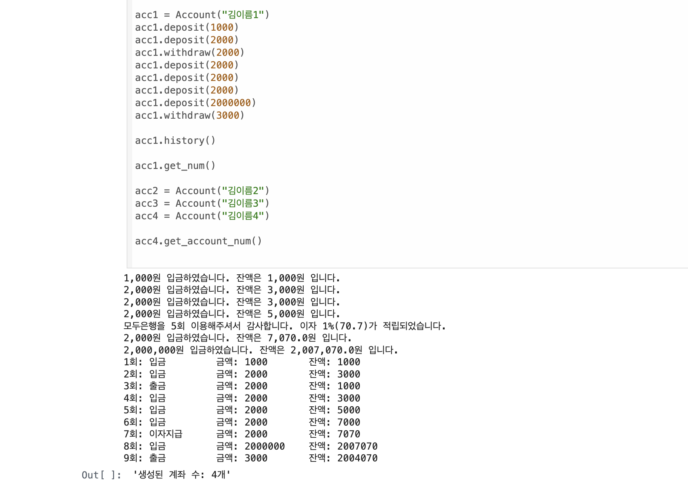
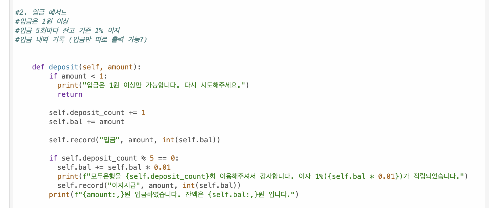

# AIFFEL Campus Online Code Peer Review Templete
- 코더 : 이찬규
- 리뷰어 : 차병곤

# PRT(Peer Review Template)
- [X]  **1. 주어진 문제를 해결하는 완성된 코드가 제출되었나요?**
    - 팀원들과 함께 롤을 정하여 작업하신 거 같았고, 전체 코드가 조건을 완벽하게 수행하고 있습니다.
    - 특히 맡아주신 입금 부분은 조건문을 통해 1원 이하일 경우는 작동하지 않게 해주셨습니다!
    - 
    
- [X]  **2. 전체 코드에서 가장 핵심적이거나 가장 복잡하고 이해하기 어려운 부분에 작성된 주석 또는 doc string을 보고 해당 코드가 잘 이해되었나요?**
    - 주석을 통해 맡으신 로직에서 구현해야 되는 조건을 남겨주셨습니다.
    - 
        
- [X]  **3. 에러가 난 부분을 디버깅하여 문제를 해결한 기록을 남겼거나 새로운 시도 또는 추가 실험을 수행해봤나요?**
    - 아쉬웠던 점(출력금액에 , 표시 등)을 구체적으로 말씀주셔서 다양한 고민을 해볼 수 있게 해주셔서 좋았습니다.
        
- [X]  **4. 회고를 잘 작성했나요?**
    - 팀과 문제를 함께 풀어가는 과정에서 롤 설정을 잘하신 거 같았습니다.
    - 맡으신 로직 부분에 집중해서 설명해주셔서 좋았습니다.
        
- [X]  **5. 코드가 간결하고 효율적인가요?**
    - 전체적으로 파이썬 스타일 가이드를 준수하고 계십니다(들여쓰기 등)

