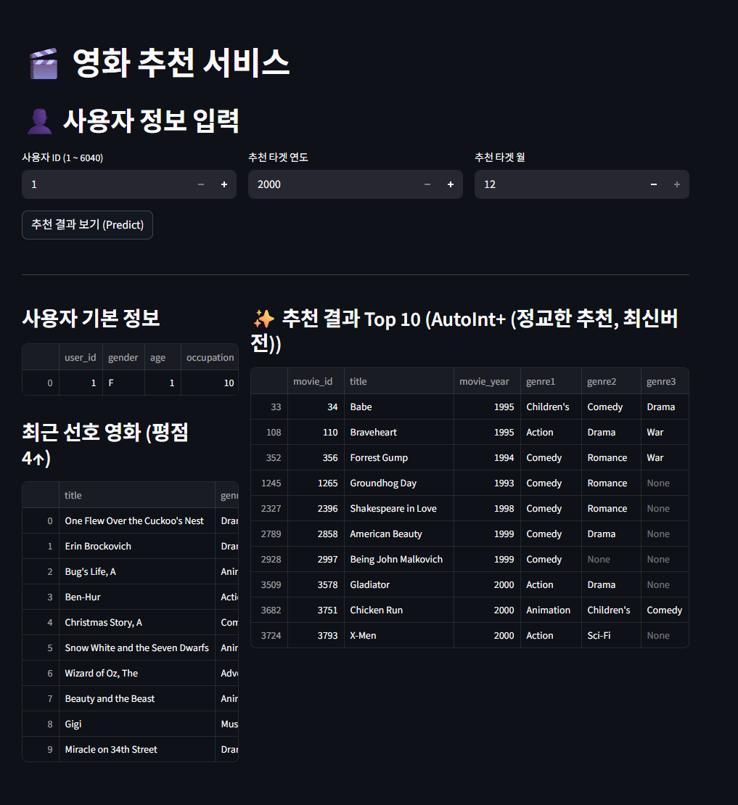

# 🎬 MovieLens 1M 기반 영화 추천 시스템 (AutoInt / AutoInt+)



MovieLens 1M 데이터셋과 AutoInt 모델을 활용한 영화 추천 시스템입니다.  
멀티헤드 셀프 어텐션 기반의 피처 상호작용 학습을 통해 사용자 맞춤 영화를 추천합니다.

---

## 📁 프로젝트 구조

```
RecSys_Movie/
├── data_preprocessing.ipynb  # 데이터 분석 및 전처리
├── build_v3_data.py          # v3 데이터 생성 (피처 엔지니어링 + Hard Negative Sampling)
├── AutoInt.ipynb             # AutoInt 모델 학습 및 평가
├── AutoIntplus.ipynb         # AutoInt+ 모델 학습 및 평가
├── ml-1m/                    # MovieLens 1M 원본 + 전처리 데이터
│   ├── users.dat / movies.dat / ratings.dat    # 원본 데이터
│   ├── *_prepro.csv                            # 전처리된 데이터
│   ├── movielens_rcmm_v2.csv                   # v2 학습 데이터
│   └── movielens_rcmm_v3.csv                   # v3 학습 데이터 (피처 엔지니어링 적용)
├── save_repo/                # 학습된 모델 가중치 및 인코더 저장
├── autoint/                  # Streamlit 앱 (추천 서비스)
│   ├── autoint.py            # AutoInt 모델 정의
│   ├── show_st.py            # Streamlit 앱
│   ├── data/                 # 앱용 데이터
│   └── model/                # 앱용 모델 가중치
└── README.md
```

---

## 🔄 워크플로우

### Step 1. 데이터 분석 및 전처리
> 📓 `data_preprocessing.ipynb`

- MovieLens 1M 원본 데이터 로드 (`users.dat`, `movies.dat`, `ratings.dat`)
- EDA: 장르별/연도별 영화 수, 평점 분포, 장르별 평점 분석
- 피처 추출: 영화 연도, 년대, 장르 분리, 평점 시간 변환
- Negative Sampling: 선호(rating ≥ 4) / 비선호 라벨 생성
- 출력: `movielens_rcmm_v2.csv`

### Step 2. 피처 엔지니어링 + Hard Negative Sampling (선택)
> 🐍 `build_v3_data.py`

```bash
python build_v3_data.py
```

| 신규 피처 | 설명 |
|-----------|------|
| `user_avg_rating` | 사용자 평균 평점 (5구간) |
| `user_rating_count` | 사용자 활동량 (5구간) |
| `movie_popularity_bin` | 영화 인기도 (5구간) |

- Hard Negative Sampling: 인기 영화 가중치 기반 비선호 데이터 샘플링
- 출력: `movielens_rcmm_v3.csv`

### Step 3. 모델 학습 및 평가
> 📓 `AutoInt.ipynb` 또는 `AutoIntplus.ipynb`

| 모델 | 구조 | 특징 |
|------|------|------|
| **AutoInt** | 임베딩 → 멀티헤드 셀프 어텐션 → 출력 | 명시적 피처 상호작용 |
| **AutoInt+** | 임베딩 → 어텐션 + 병렬 DNN → Concat → 출력 | 명시적 + 암묵적 상호작용 |

- 평가 지표: **NDCG@10**, **Hit Rate@10**

### Step 4. Streamlit 앱 실행
```bash
cd autoint
streamlit run show_st.py
```
- 사용자 ID, 타겟 연도/월을 입력하면 영화 추천 결과를 확인할 수 있습니다.

---

## 📈 성능 개선 기록 (AutoInt+)

| 버전 | 변경 사항 | NDCG@10 | Hit Rate@10 |
|------|-----------|---------|-------------|
| 1차 | 기본 모델 | 0.66168 | 0.63032 |
| 2차 | 하이퍼파라미터 튜닝 (embed=32, lr=0.001, dropout=0.3) | 0.66587 | 0.63557 |
| 3차 | EarlyStopping + ReduceLROnPlateau, DNN (512→256→128) | 0.67087 | 0.63697 |
| 4차 | att_head_num=4, att_layer_num=4 | - | - |
| 5차 | 피처 엔지니어링 + Hard Negative Sampling (v3) | - | - |

---

## ⚙️ 환경 설정

```bash
# 가상환경 생성 및 활성화
python -m venv .venv
.venv\Scripts\activate

# 패키지 설치
pip install pandas numpy seaborn matplotlib plotly nbformat
pip install scikit-learn tensorflow tqdm
pip install streamlit joblib
```

---

## 📊 데이터셋 정보

**MovieLens 1M** (GroupLens Research)
- 6,040명의 사용자, 약 3,900편의 영화, 1,000,209개의 평점
- 평점: 1~5 (정수), 각 사용자 최소 20개 이상 평점 보유

> F. Maxwell Harper and Joseph A. Konstan. 2015. The MovieLens Datasets: History and Context. ACM TiiS 5(4), Article 19.
